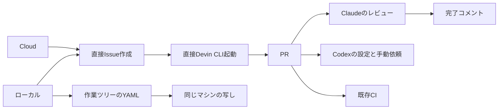
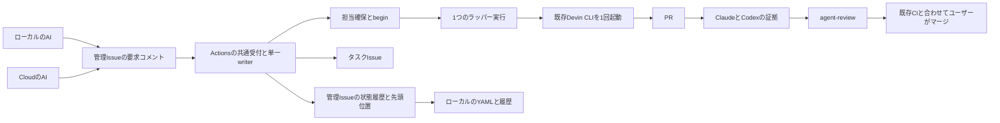
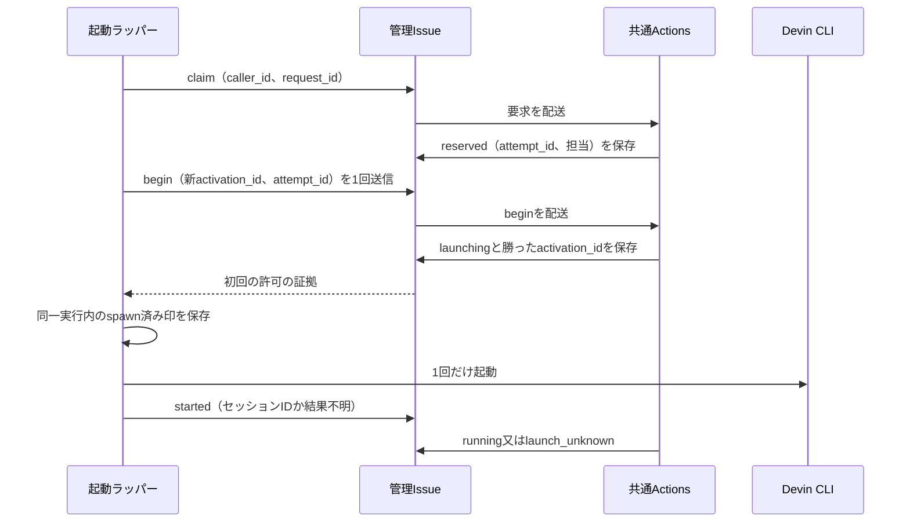
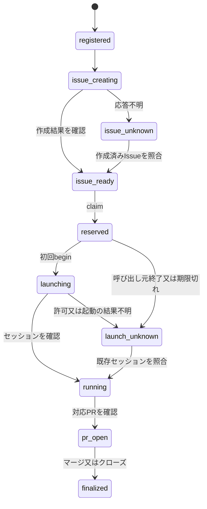

# 設計書: delegation-review-reliability

- ステータス: confirmed（2026-10-09のチャットで次工程を承認。設計PR #186は2026-10-09にマージ済み）
- レベル: L3 / ユーザー承認: 必要
- 関連: [要件](../requirements/delegation-review-reliability.md) / [ADR-0007](../decisions/ADR-0007-github-delegation-and-review-state.md) / [論点の記録](../discussions/delegation-review-reliability.md)

## この設計を一言で

委譲の要求と進行状況をGitHubの管理Issueに集め、Actionsが順に処理する。同じ作業の起票とDevin起動を重ねず、最終版の両レビューが揃うまでagent-reviewでマージを止める。起動したか分からない場合は、再起動せず照合待ちにする。

## 背景

現行の[委譲状態の設計](devin-delegation-status.md)は同じマシンのworktree間で写しを共有する方式で、Cloudとの排他はない。Issue作成と起動は別の操作で、記録の`newRecord`にセッションの対応がない（`.claude/scripts/delegation.mjs:184`、`.claude/skills/review-devin-pr/SKILL.md:39`）。

レビューの状態判定は短縮SHAの前方一致で、Codex完了を必須にしていない（`.claude/scripts/delegation-status.mjs:75`）。現在のmainルールセットProtect-main（ID23977008）の必須チェックはquality・build・api-db。調査時点の設定は[ログ](../../logs/2026-10-09.md)と論点の記録にある。

## 目的

ローカルとCloudから同じ仕事を照合し、ユーザーがPRの最終版に対するレビューの証拠を確認できるようにする。Issue本文の条件付き更新や、Devin起動のexactly-onceを仮定しない。

## 要件

要件書の共有状態、要求の保持、起票・起動の重複防止、両レビューと対象指摘の確認を満たす。共有状態を読めないときは書き込みと成功判定を止め、履歴の表示だけに縮退する。

## 対象範囲

共通受付、公開メタデータの保存、既存CLIを呼ぶラッパー、YAMLとの接続、agent-review、導入手順。初回の候補ファイルは「バックエンド設計」に示す。

## 対象外

アプリのコード、新しいDB・サービス、新しいDevin APIキー、後続Issueの完全自動起動、Merge Queue、全Issueの依存関係の移行。起動設定の既定を変える判断も含めない。

## 現状構成

## 変更後構成

### 共有状態の保存先

固定の管理Issue番号と先頭位置コメントIDを設定に保存する。Issue本文は説明用で、状態判定には使わない。要求は認証した担当者のコメント、状態は制御workflowが追記するbotコメントに分ける。各タスクIssueの表示は写しであり、表示更新の失敗で共有状態を戻さない。

管理コメントはGraphQLで本文とauthor／editor／lastEditedAtを同時に取得する。要求と追記した履歴は未編集だけを採用する。更新する先頭位置はActions作者かつ未編集、又は最終editorが同じActionsの場合だけ採用する。RESTの作成・更新時刻が同じでも未編集の証拠にはしない。未許可作者の印は解析前に除外し、許可作者の不正要求は拒否結果を保存して後続の処理枠を塞がない。

管理Issueを人が作った後、管理Issue番号とcontrollerのworkflow IDを設定PRで固定する。main限定の手動dispatch `initialize`が固定担当者を確認し、Actions作者の初期先頭コメントを作る。人が作ったコメントをActionsが更新しても元作者は変わらないため、先頭コメントを人が代わりに作らない。既存の先頭コメントは全件照合し、1件なら再利用し、複数や作成結果不明なら再POSTせず手動照合する。得られたコメントIDを設定PRに保存してから通常の受付を始める。

状態コメントは`schema_version=1`のJSONを1つだけ持つ。`seq`、`prev_hash`、`hash`、`source_run_id`、`source_run_attempt`、`request_comment_id`、`request_id`、`operation`、変更したタスク／レビュー状態、処理結果を含める。hashはhash自身を除くJSONのUTF-8をSHA-256で計算する。オブジェクトのキーは再帰的に辞書順、配列は仕様で定める順にし、整数以外の数値を許可しない。

先頭位置コメントは`last_seq`・`last_event_id`・`last_hash`を持つ。writerは履歴を検証し、イベントを追記してから先頭位置を更新し、双方を読み直す。外部の起票・起動許可はこの確認後だけ行う。途中で止まった場合は、次のwriterが連続した末尾イベントを検証して先頭位置を進める。欠落・分岐・同じseqの異なるhash・先頭位置の不一致では自動復旧しない。

bot IDだけを信頼しない。各source_run_idをGitHubから読み、repository.idとhead_repository.id、固定workflow_idとpath、許可したevent、head_branchがmainであることを照合する。head_shaは保護されたmainの履歴にある制御コードの版として確認する。run_attemptも一致させる。再実行の履歴は別attemptとして区別する。

この照合は別workflowやPRブランチの実行を除外するためのもの。run IDの記載だけは署名ではなく、管理者や同じ書き込み資格情報の侵害への保証はしない。制御以外のworkflowに管理Issueの更新権限を与えない運用を導入条件にする。履歴と先頭位置を同時に過去へ書き換える破壊は、単独Issueのhash連鎖だけで検出できるとは限らない。通常の欠落・不一致・取得不能は止め、手動照合で復旧する。

### 共通窓口と起票・起動の流れ

要求コメントには公開計画のパス、完全な計画コミット、タスク名、作業本文digestを載せる。raw promptは呼び出し元に留める。パスは`docs/implementation-plans/<feature>.md`に限定する。計画に`<!-- delegation-task:<stable-task> -->`から`<!-- /delegation-task -->`までの一意なタスク本文を置き、mainの履歴にある承認済み版からデータとして読み、digestを検証して起票する。計画の承認は論点の記録／承認PRで確認する。

`task_key`は`<feature>:<stable-task>`、各要素は小文字英数字とハイフンで1〜64字。波と計画コミットは別項目。task digestは波・表示上の順番を除く作業本文のLF文字列をSHA-256で計算する。既存キーとdigestが違えば`content_conflict`にし、登録・claimを許可しない。取り下げ済みキーも自動再利用しない。

共通workflowは固定グループ`tomotabi-delegation-control`、`queue:max`、`cancel-in-progress:false`で更新を直列化する。100件の待ち上限を受付保証にしない。要求コメントを消さず、workflow_dispatchの`reconcile`で未処理コメントをID順に読み直す。1回の実行は最大20要求を処理し、残りは未処理と表示する。再配送も同じrequest_idで照合する。

要求IDの重複は内容hashも確認する。同じ内容は履歴の処理結果を返し、外部操作を繰り返さない。ただしbeginの再配送では許可を再発行せず、`already_begun`という照合結果だけを返す。別内容は`request_conflict`。起票前に`issue_creating`と試行IDを保存し、Issue本文にtask_key・digest・試行IDの機械用の印を付ける。応答不明では印を全状態のIssueから照合し、0件でも自動再作成しない。2件以上なら競合として止める。

## データフロー

## API 設計

アプリAPIは対象外。要求コメントは専用の印とJSONを持ち、任意の文章やコードブロック内の引用を命令として読まない。

| 操作 | 入力と契約 |
| --- | --- |
| register | request_id（UUID）、task_key、plan_path、plan_sha（40桁）、task_digest（64桁）、wave（任意）、start_conditions_confirmed（既定false）。移行完了前の新規登録は禁止 |
| claim | request_id、task_key、caller_id（UUID）、runner（local/cloud）、requested_model、task_digest。既存Issueと開始条件を確認し、attempt_idを1つ確保 |
| begin | request_id、attempt_id、caller_id、新activation_id（UUID）。reservedの担当と一致する初回だけlaunchingにし、初回許可を発行 |
| started | request_id、attempt_id、activation_id、session_id／session_url、observed_model又はunknown。勝った担当の照合済み報告だけ反映 |
| link-pr | request_id、task_key、pr。Issueとの対応をGitHubから確認。候補が複数なら勝手に最小番号を選ばない |
| import | request_id、既存Issue／PR／セッションの対応。固定担当者だけが公開メタデータを登録する。APIで確認したIssue／PRと申告したセッション・状態は分け、起動許可や予約を作らない。既存タスクへの別要求による上書きは拒否する |
| reconcile | 起票・起動結果、未処理要求を読み直す。unknownを単なる時間経過で解除しない |
| review-refresh | PR番号。現在の証拠を読み直し、agent-reviewを再判定する |

状態にはtask_key、digest、plan参照、Issue番号、attempt_id、caller_id、activation_id、runner、requested_model、observed_model、セッションとPRのID／URL、状態、予約日時、最終更新のseqを持つ。予約の目安は15分で、超過は照合待ちへの変更だけ。新しい担当への自動譲渡には使わない。

開始条件は、初回は固定担当者が公開計画を確認し、start_conditions_confirmedで明示する。falseのタスクはclaimできない。任意の計画本文から依存関係を自動推測せず、GitHubのIssue依存関係による実行制御は後続で設計する。

CLI案は`delegation.mjs request --request-file <公開JSON>`、`status [--json] [--refresh]`、`import --request-file <JSON>`と、`delegation-launch.mjs <task_key> --runner <local|cloud> --model <model> --prompt-file <非公開ファイル>`。終了コードは0=確認済み、2=入力／内容競合、3=未処理、4=結果不明、5=通信／状態破損。既存init/review/finalizeの終了コードは維持する。

GitHub通信は同じJSONと処理結果をgh又は接続済みGitHub MCPで運ぶ。MCPが送れるのは共通窓口への要求で、直接の起票・起動許可にはしない。ラッパーが受領と状態を照合できない環境では起動しない。使用するMCPの具体ツール名と認証方式は実在する接続で確認し、未接続時の代替を作らない。

### beginの許可を再利用しない

ラッパーはプロセスを起動するたびにactivation_idを新しく作る。同じcallerからのclaim再送は同じattemptを返すが、起動許可は返さない。beginはreservedからの1回だけで、launching以降へのbeginと配送の再実行は`already_begun`を返す。以前の許可を再発行しない。

実行中のラッパーだけが、送信を1回行って受領IDを得たbeginの初回結果を待てる。結果には要求コメントID・制御run／attempt・attempt_id・activation_idを結び、全て一致する初回結果だけを消費する。送信の応答喪失、再送結果、再実行したプロセスへの古い結果は許可にしない。

CLI起動直前に、メモリのspawnガードと状態ディレクトリの`<activation_id>.spent`を排他的な新規作成で確保する。記録に失敗したら起動しない。spentを先に作るため、直後のクラッシュは実際に起動していなくてもunknownとして止まる。spentやactivation_idを削除・再利用して再開しない。

別プロセスのactivation_idは既存launchingの所有者になれない。期限切れ、ラッパー終了、通信の復旧だけでattemptを作り直さない。既存セッション／プロセスの照合は読み取りで行い、未起動と断定できない場合はユーザーへ渡す。停止・再起動の復旧判断は初回の自動処理に含めない。

## DB 設計

対象外。管理Issueの履歴から状態を組み立てる。ローカルYAMLと写しはキャッシュと集計用の履歴として維持し、共有状態のseqと取得日時を任意項目で追加する。

## フロントエンド設計

アプリ画面は対象外。管理Issue、各Issue、agent-reviewのDetailsとCLIに「未処理」「起票結果不明」「起動結果不明」「レビュー待ち」「古い版」「指摘の再確認が必要」を表示する。証拠URLと完全SHAを表示し、公開欄に指摘の本文を複製しない。

## バックエンド設計

### レビューの判定

固定contextは`agent-review`。対象は、作者のIDがDevinアプリ、headブランチが`devin/`で始まる、又は共有状態／既存委譲記録にPRが登録されている、のいずれか。基準はORで、ブランチ名だけで対象を外せない。一度対象として保存したPRはfinalizedまで対象のままにする。

チェックはPR別ではなくcommit SHA単位で共有される。判定するSHAと同じheadを持つ、このrepoのOPEN PRを全ページ列挙する。集合の対象PR全件について、そのPR自身のレビュー証拠が成立した場合だけsuccessを出す。対象PRが0件なら対象外としてsuccess。対象外の人／Codex PRも、同じSHAに対象PRがあればその全件を待つ。external_idのPR番号では判定を分けられない。Draftの対象PRが含まれればin_progressにする。本文に外すための印を書いても対象を変えない。

OPEN PR集合の取得失敗・上限到達、対象判定に必要な取得失敗はunknownで成功にしない。共有状態にPR番号と前回headを保持し、head更新・close／reopenで旧SHAと新SHAの集合を再判定する。対象PRの追加・削除も集合の変更として扱う。

2026-10-09にAPIで確認した作者IDは、Claude担当109064833（oze-xxbumpxx）、Codex bot199175422、Devin bot158243242、Actions bot41898282。repository.idは1359576461。設定に数値を固定し、loginは表示用。新しい担当を加える場合は設定のPRで変更する。

ClaudeはPRに専用の完了JSONを付ける。schema_version、pr、完全head_sha、verdict（merge/fix/escalate）、codex_evidence_hash、確認したCodex証拠ID／URL、reviewed_atを必須にする。取得したコメント／formal review自身の作者ID・証拠URLも保存する。引用された印、旧形式、短縮SHAは成功証拠にしない。固定作者の新規完了投稿を作成日時順に選び、初回は編集された完了をすべて無効とする。本人の修正でも新規投稿を要求する。

IssueComment・PullRequestReview・PullRequestReviewCommentの証拠はGraphQLでauthor、editor、lastEditedAt、updatedAtを取得する。Actorの数値IDは`... on User { databaseId }`／`... on Bot { databaseId }`で取得し、固定設定と照合する。Claude完了はlastEditedAtとeditorがともにnullの場合だけ採用する。Codexの完了と指摘は未編集、又はlastEditedAtがありeditorが固定Codex botの場合だけ採用する。他作者の編集、非User／Bot、情報欠落・不整合・取得失敗はunknown。write権限者による編集でも元のauthorが変わらないため、authorだけで成功にしない。

Codexはsubmitted済みformal reviewのcommit_id、又は明示的な完了summaryの対象SHAを使う。summaryの短縮値はGitHubのcommit取得で完全SHAへ解決し、PRのコミットとして一意に確認する。解決不能・曖昧・形式変更はunknown。開始の目の反応、依頼コメント、指摘が無いという推測だけでは完了にしない。

codex_evidence_hashは、現在headのCodex完了ID／SHA／本文hashと、Codexによる対象指摘のID／本文hash／スレッドID／解決状態を、ID順に正規化した集合のSHA-256。各証拠のauthor ID／editor ID／lastEditedAt／updatedAtも含める。指摘本文はメモリでhashにし、共有Issueには保存しない。新規・編集・再開・削除の指摘と完了証拠の変更で集合を変える。

対象指摘はPR全体のCodexスレッドと、まだ確認済みの解決記録がない行外のCodex指摘。古いheadで付いた未解決スレッドも含む。outdatedは解決の代わりにしない。行外の指摘はGitHubでresolveできないため、Claudeの完了JSONに確認済み指摘IDを含め、集合の全件を確認する。

成功には、Codexが現在headで完了、対象指摘のスレッドが解決済み、Claudeが現在headでverdict=merge、Claudeのcodex_evidence_hashが現在の集合と一致、が必要。Claude完了後にCodex指摘が増えれば再確認する。Claudeのfix/escalateは成功にしない。公開状態には詳細な拒否理由やsecurityの有無を載せず、一般的な「確認が必要」と証拠リンクだけを出す。

checkはChecks APIで明示作成し、head_shaはPRの完全headにする。controllerの単一writerがSHAごとに1つの`agent-review`のcheck IDを共有状態で保持して更新する。自動job名は`agent-review`にしない。共有状態の未確認時はstate=in_progress／conclusion=nullとし、GitHubの明示checkはcompleted/action_requiredでマージを止める。成功はcompleted/success、不足・破損はcompleted/failureを使う。実行開始時に同じSHAの以前の成功をcompleted/action_requiredへ明示更新し、全証拠を取得してから最終結果を書き込む。statusだけの変更で古いconclusionが消えるとは仮定しない。書き込み直前にOPEN PR全ページを再取得し、同じSHAのPR番号／head／対象判定の集合と、各対象PRのClaude完了・Codex証拠集合を再確認する。変化・取得失敗ならsuccessを出さない。証拠の編集・削除・dismissも再判定する。

チェック更新のPATCHが失敗すると、共有状態は確認中でもGitHubに以前の成功が残り得る。書き込み不能時に古い成功を物理的に失効させる保証はできない。前回の成功を確認中へ戻せない場合は、保存可能ならstale_successを共有状態へ記録し、statusに「GitHubの成功表示は古い。マージしない」と出す。再照合が通れば警告を解除する。controllerのI/O中断は非ゼロ終了で表示し、不正要求の予定どおりの拒否とは分ける。マージ前はreview-refreshの完了後にstatusを再取得し、共有状態と同じcheck ID／external ID／headのChecks APIがともに成功している場合だけ照合済みとする。GitHubの成功表示だけでマージ判断をしない。

workflow_dispatch等の自動job checkが必須チェックを満たすとは扱わない。明示作成したcheckが実PRに結び付き、head更新とfailureでルールセットがマージを止めることを実機で検証する。未確認なら必須化しない。同名check／commit statusを重ねて作らず、Checks APIで成立しない場合は設計を見直す。別workflowの同名checkは必須設定だけでは区別できず、Actions appの指定もその真正性の保証にはならない。

quality・build・api-dbは独立した既存必須チェックとして維持する。agent-reviewはCI全部成功を待たず、既存スキルでCIを確認する際もagent-reviewを除外する。CIはPRに対応するmerge commitの検証として扱い、workflowのGITHUB_SHAとPR headの単純一致を要求しない。E2Eのpaths条件も変えない。

### workflowと候補ファイル

特権処理は`.github/workflows/delegation-control.yml`の1つに集める。default branchで動くissue_comment（created/edited/deleted）、workflow_dispatch（main限定）、schedule、workflow_run（completed）を受ける。PRのmerge refを使うイベントを、このwriterで直接扱わない。共有履歴のsource_run_idはcontroller自身のrunで、通知元のPRブランチrunとは区別する。

読み取り専用の`.github/workflows/delegation-events.yml`はpull_request（opened/reopened/synchronize/ready_for_review/converted_to_draft/edited/closed）、pull_request_review（submitted/edited/dismissed）、pull_request_review_commentを受ける。checkoutせず、PR番号・イベント名・run IDのJSONだけを固定名artifactに保存する。controllerはこのworkflow_runからサイズ制限した通知JSONを読み、GitHubの現在状態を取得する。通知の判定結果やコードは使わず、通知元がPRのrefでもwriterのmain判定には使わない。初回はpull_request_targetを採用しない。

workflow_runは通知workflowだけに絞り、自分自身や既存ci/e2eの完了では動かさない。レビュー判定はCI結果に依存せず、quality・build・api-dbのゲートは独立して維持する。通常のissue_commentはwriterのjobを省略し、管理Issueの要求marker、PRのCodex作者のコメント、Claude／Codex完了markerが現在本文か編集前本文にある場合だけ動かす。要求の作者認証や証拠の編集者照合は制御コードで引き続き行う。受信runのrepo／workflowをAPIで確認し、通知artifactは8KiB以下の指定JSONだけを読む。zip内の任意パスへ展開しない。欠落・空のPR対応は未確認として止める。スレッドの解決／再開専用のActions eventは使わず、明示review-refreshと毎時のscheduleで再照合する。scheduleは未処理要求のdrainも行うが、Devinの後続起動は行わない。

controllerのcheckoutは常に保護されたdefault branchの制御コード。PR head、Issue添付、要求に指定したrefのコードを実行しない。アプリのbuildやnpmスクリプトも実行しない。PR番号は通知のデータから取り、GitHub APIで所属repoと現在状態を再確認する。任意のシェル文字列は受け取らない。default branchのhead_branch／head_shaを取得できることを各controllerイベントの実機試験で確認し、不一致は状態を書かない。

controllerのpermissionsはcontents:read、issues:write、pull-requests:read、checks:write、actions:read。listenerには書き込み権限を与えない。受信時の作者IDを認証してから要求を処理する。botの表示コメントは要求として再処理せず、check自身の更新でも再帰起動しない。GITHUB_TOKENによる状態更新は同じ実行内で次の状態を処理し、取りこぼしは明示workflow_dispatch／定期drainで読み直す。コメント更新による別workflowの自動連鎖を前提にしない。

| 初回の実装候補 | 変更 |
| --- | --- |
| `.claude/config/delegation-review.json` | 管理Issue／先頭コメント／repo／writer workflow／作者ID、上限、移行状態の設定 |
| `.claude/scripts/delegation-shared.mjs` | 純粋な要求・状態遷移、hash、履歴検証とGitHub I/O |
| `.claude/scripts/delegation-github.mjs` | 共通のREST・GraphQL通信、ページ送り、タイムアウト、読み取りの再試行と呼び出し上限 |
| `.claude/scripts/delegation-control.mjs` | Actionsの単一writer。受付・起票・状態履歴・check更新を順に処理する |
| `.claude/scripts/delegation-launch.mjs` | claim/begin/startedと1回のCLI起動。raw promptと生ログは手元だけ |
| `.claude/scripts/agent-review.mjs` | 証拠集合、対象判定、完了JSON作成、check更新 |
| `.claude/scripts/delegation.mjs`・`delegation-status.mjs` | 共有状態優先、request/import、既存YAMLの互換・写し・履歴 |
| `.claude/scripts/wait-for-pr*.mjs`・`wait-for-devin-pr.mjs` | 登録済みPRと共有状態を利用し、曖昧な候補を成功扱いしない |
| `.github/workflows/delegation-control.yml` | 共通受付、直列更新、再判定、再配送 |
| `.github/workflows/delegation-events.yml` | PR/reviewイベントの読み取り専用通知。writerとPRの実行refを分ける |
| `.claude/tests/delegation-shared.test.mjs`・`delegation-launch.test.mjs`・`agent-review.test.mjs` | 境界・競合・途中失敗の試験。既存試験も必要な差分を更新 |
| `.claude/tests/delegation-github.test.mjs`・`delegation-control.test.mjs` | 通信・ページ送り・唯一のwriterの多段処理と途中失敗を検証する |
| `review-devin-pr`・`close-session`のSKILL、`.agents/skills/devin-workflow/SKILL.md`、委譲README、AGENTS.md | 共通受付、完全SHAの証拠、Codex再依頼、履歴の運用を一致させる |

既存のreviews配列を消さない。共有状態の版を優先し、review数による選択は旧記録同士の互換処理に限る。旧initは履歴作成に残しても、未登録タスクの起票・起動を許可する操作にはしない。

## エラー処理

- リトライ: 読み取りは最大3回、1秒・2秒・4秒を上限としたバックオフ。Retry-Afterは上限30秒で尊重する。POSTは応答不明で自動再送せず、要求IDと履歴を照合する。
- タイムアウト: GitHub呼び出しは1回10秒、制御jobは5分、要求待ちは2分。期限後も要求を消さず未処理／unknownにする。Devinの実装はjob外で動く。
- 冪等性: request_id＋内容hash、task_key＋digest、attempt_id＋activation_idを別々に照合する。begin再送は古い許可を再発行しない。外部起動のexactly-onceは保証しない。
- 部分失敗: 履歴追記と先頭位置の確認後に外部操作する。Issue作成／CLI起動後の保存失敗はunknownで止め、外部で作ったものを自動削除しない。表示用コメントの失敗は警告だけ。
- フォールバック: 読めない共有状態は古い写しで表示できるが、未確認と明示する。起票・起動・review成功のための代替経路は作らない。check更新不能は成功と報告しない。

## ログと監視

管理Issueには要求ID、task_key、digest、状態、証拠ID／URL、制御run、版を残す。CLIは未配送／未処理／結果不明と次の照合操作を出す。ローカルの生ログは既存devin-watchの場所で保持し、共有のコメントや日次ログに秘密を写さない。

statusは共有状態の取得日時とseqを出す。締めのPRには既存どおり完了したYAMLと日次ログを入れる。共有状態から作った写しの変更を、別worktreeの記録へ無条件で上書きしない。共有フィールドは新しいseqから読み、別途追記したreviews・follow_up_of・escalations・完了履歴は両記録から残す。同じroundの内容や対応タスク、後続の対応・完了状態が競合する場合は写しを更新せず、手動で照合する。

## セキュリティ

publicの管理Issueに保存するのは公開計画参照と必要なメタデータだけ。Claude/Codexの指摘本文、securityの有無、raw prompt、CLI生ログ、トークン、起動許可の秘密を保存しない。公開されるattempt_idとactivation_idは秘密の認証情報ではなく、固定作者IDと状態遷移も必ず確認する。

要求は固定担当者109064833を初期許可者とし、権限追加は設定PRで行う。入力のpathはリポジトリ内の公開実装計画に限定し、URL・コマンド・コードを実行しない。review完了を表す印の引用や別作者の本文、信頼できない編集を証拠にしない。通常の版欠損・hash不一致では止め、復旧はユーザーの手動照合にする。管理権限者による履歴全体の改変・削除を完全に検出する保証は対象外。

## 性能

ページサイズは100。repoのOPEN PRは最大1,000件／10ページ、管理Issueは最大1,000コメント／10ページ、各PRはコメント1,000件・formal review1,000件・スレッド1,000件。スレッド内コメントも続きを取得し、PR全体で最大5,000件。任意の1ページが未取得なら判定を終えない。上限到達はunknownとし、途中の集合で成功にしない。

初回はtaskを100件、要求JSONを8KiB、状態コメントを48KiBに制限する。管理Issueが上限に近づいたらログで知らせ、新規処理を止める。履歴の自動削除・新しい管理Issueへの自動移動は作らない。後続設計で検証済みの履歴を移す。

1jobのAPI呼び出しは再試行も含め最大200回。run ID等の繰り返し取得はjob内でキャッシュし、ETagは読み取りにだけ使う。上限超過は未処理／unknownに残す。標準的な7タスクで20〜60秒を目安とするが、未計測のため導入時に確認する。負荷試験は二重配送100件と、ページ上限付近の履歴で行う。

## テスト方針

`node --test .claude/tests/*.test.mjs`で純粋な状態遷移とI/Oの差し替え試験を行う。アプリのテストを新設しない。次を実装計画と試験計画で引き継ぐ。

| 観点 | 確認すること |
| --- | --- |
| 正常 | register→起票→claim→begin→started→PR→両レビュー→finalize。対象外PRのcontextも出る |
| 二重送信 | 同じrequest／task／callerと異なるactivationを並行配送して、起票・spawnが各1回以下 |
| 途中失敗 | 履歴追記後、先頭更新後、起票後、begin送信後、spent作成後、spawn後の各クラッシュで自動再起動しない |
| 破損と上限 | hash不一致、途中／末尾の欠落、偽run、別workflow、ページ途中の失敗、1,001件、API上限で成功しない |
| レビュー | 指摘なし完了、古いhead、短縮値の解決不能、未submitted、目の反応だけ、偽作者／引用の印を区別する |
| 編集者 | 元作者がClaudeのまま他者がhead／verdict／Codex hashを編集、本人の編集、Codex bot自身／他者のsummary編集、GraphQL情報欠落を区別する |
| 同じSHA | 対象／対象外PR、対象PR2件、別baseのPRが同じheadを使っても対象外successで迂回できない。追加・close・head移動・集合の取得失敗を再判定する |
| 再確認 | Claude完了後のCodex指摘追加／編集／再開／削除、head更新、証拠dismissで成功を無効にする |
| CIと権限 | merge SHAとheadを区別、checkの自己依存なし、PRコードを特権jobで実行しない |
| 互換 | 旧YAML・旧短縮SHA・IssueなしPR・gh無しの縮退、Cloud model unknown、進行中タスクのimport |

実機はユーザー管理の確認PRで、Codexの手動依頼、指摘なし完了、修正push後の再依頼、不足証拠のfailure、両レビュー後のsuccessを確認する。テスト用のDevin起動は行わず、ラッパーの子プロセスをスタブにして二重起動を検証する。

## 移行とリリース

1. ユーザーが設計PRを承認する。実装PRでコードと手順を揃え、ハーネス試験を通す。実装PRのマージもユーザーが行う。
2. 管理Issueを作り、writer workflow ID等を実環境で固定する。手動dispatchのinitializeでActions作者の先頭コメントを作り、コメントIDを設定PRに保存する。最初はagent-reviewを必須にしない。
3. 進行中の計画、Issue、PR、Cloud／Localセッションを照合してimportする。未確認はunknownのまま残し、migration_completeを確認後に設定する。
4. 既存の直接起票・直接起動の手順を止め、共通窓口へ移す。runner/modelは明示し、Cloudの実値が不明ならunknownにする。
5. 確認PRで明示checkのPRへの関連付け、成功・不足証拠・head更新・同じSHAのPR集約、編集者の照合、必須設定によるマージ停止を確認する。controller全イベントのmain実行元とlistenerの通知、CLI内部の起動POST再試行設定も確認する。Codexの設定はユーザーがAll PRsとpushイベントを確認するまで、ユーザーからの明示的な依頼を使う。
6. 動作確認後、Protect-main（ID23977008）のquality・build・api-dbを保ち、agent-reviewを追加する。設定変更は導入作業としてユーザー承認の範囲で行う。

Codex botへの自動依頼は初回の成立条件に含めない。statusとレビュー手順が現在headへの再依頼を示す。botからの依頼と設定の実機確認が済むまでは、その動作を保証しない。

## リスク

未知の起動結果を止めるため、実際には未起動でも人の照合が必要になる。ラッパーの1回spawnはCLI内部の再送や外部セッションのexactly-onceを保証しない。共有Issueの履歴は有限で、上限到達時は追加設計が要る。Codex summaryの形式変更はunknownとして止まる。同じSHAを共有する対象外PRも対象PRの確認を待つ。

GitHubイベントは非同期。同じheadに新しいレビューが付いてから古いcheckをpendingに戻すまで配送遅延があり、その瞬間のマージを原子的には防げない。マージ直前に`review-refresh`で最新の証拠を確認し、未処理通知がないことを確かめる。head更新は別SHAのcontextにし、古いSHAのsuccessを新しい版へ引き継がない。

書き込み資格情報や管理者の侵害、同じ資格情報を持つ別workflowによる巧妙な偽造はhash／run照合だけで完全には防げない。必要なwriter以外の更新権限を与えない運用と、保護されたmainのコードを導入条件にする。

## 決めたこと（問いと答え）

[論点の記録](../discussions/delegation-review-reliability.md)。

## 未決事項

論点の記録の回答待ち・仮決定は0件。Codex設定、Cloud CLIのセッションID取得形式、MCPの接続と特権workflowの実行ポリシーは導入時の確認事項で、未確認を保証として扱わない。
