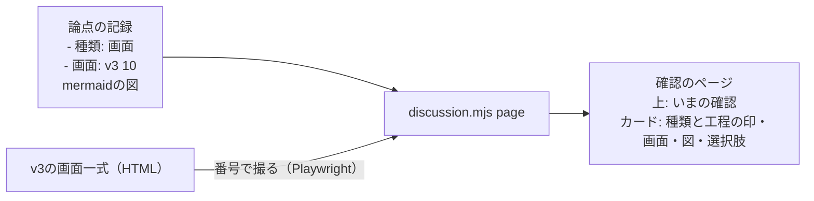
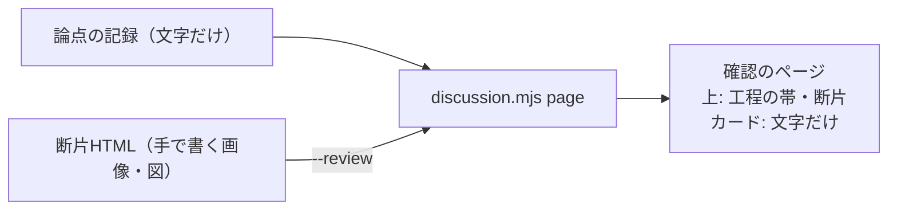
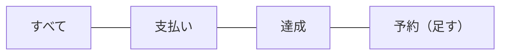
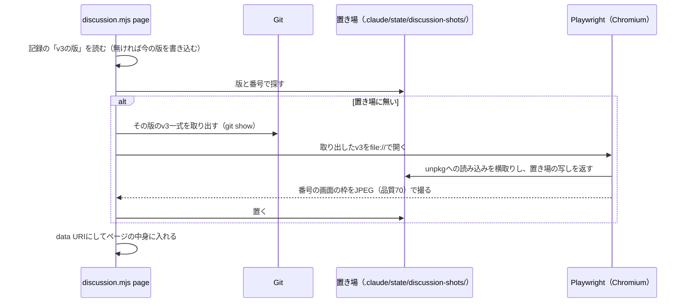
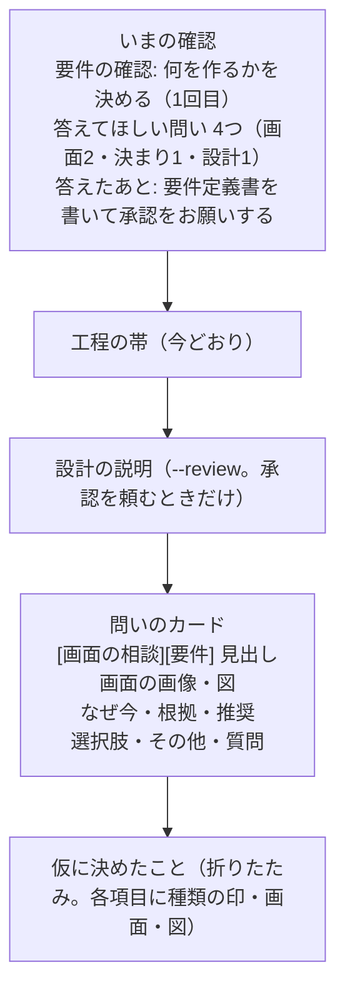

# 設計書: discussion-page-v2（確認のページを、画面と図で相談できるようにする）

- ステータス: approved（PR #137）
- レベル: L2
- 関連: 論点の記録 `docs/discussions/discussion-page-v2.md`、元の設計 `docs/designs/discussion-workflow.md`

## この設計を一言で

論点の記録の問いに「相談の種類」「v3の画面の番号」「mermaidの図」を書けるようにし、確認のページは問いのカードの中にそれらを出す。ページの上には「いまの確認」の欄を置き、どの工程の、何を決める確認かを出す。



## 背景

2026-10-04、記録と4画面の完成の問いを確認のページで出したあと、ユーザーから3つの要望があった。

- 画面デザインや図を使って、もっとわかりやすく問いを出してほしい。
- 画面の相談なのか、APIや設計の相談なのかを分かるようにしてほしい。
- 今の工程のどこの確認なのかを分かるようにしてほしい。

今のページは、問いのカードが文字だけで、画像と図は`--review`で渡すHTMLの断片として上にまとめて載せるしかない。断片は毎回手で書き、記録に残らない。

## 目的

- ページを開いてすぐ、どの工程の、何を決める確認か、答えたら次に何が起きるかが分かる。
- 問いごとに、画面・アプリの決まり・API・設計のどの相談かが印で分かる。
- 問いのカードの中で、関係する画面と図を見ながら選べる。
- どの問いでどの画面と図を見たかが、論点の記録に残る。記録だけでページを作り直せる。

## 要件

| ID   | 要件                                                                                                                                                                             |
| ---- | -------------------------------------------------------------------------------------------------------------------------------------------------------------------------------- |
| R-1  | 問いに`- 種類: 画面                                                                                                                                                              | アプリの決まり | API | 設計`を書ける。回答待ちの問いには必須 |
| R-2  | 問いに`- 画面: v3 09, v3 10`のようにv3の画面の番号を書ける。番号はv3の画面一式の画面の番号（09、14eなど）                                                                        |
| R-3  | 問いの中にmermaidの図（```mermaid のコードブロック）を書ける。いくつでもよい                                                                                                     |
| R-4  | `discussion.mjs page`は、記録に書いた画面をv3から撮り、ページに埋め込む。v3に無い番号は形の確認で誤りにする                                                                      |
| R-5  | 回答待ちと仮決定のカードに、種類の印・工程の印・画面・図を出す。図は選択肢の上に置く                                                                                             |
| R-6  | ページの上に「いまの確認」の欄を出す（機能の名前・レベル・回、いまの工程と状態、その工程で決めること、問いの数と種類の内訳、答えたあと何が起きるか）                             |
| R-7  | `--review`の断片は今どおり使える（承認を頼むときの全体の説明）                                                                                                                   |
| R-8  | 種類・画面・図の無い今までの記録も、書き直さずに読めて、ページを作れる。ただし、問いを「回答待ち」に変えるときは、その問いに種類を書き足す（選択肢と推奨を書き足すのと同じとき） |
| R-9  | 記録に、撮ったv3の版（コミット）を残す。作り直すときはその版から撮り、決めたときと同じ画面を出す                                                                                 |
| R-10 | v3が描画に読み込む外の部品は、一度取れば手元の写しを使い、ネットにつながらない環境でも撮れる。取れないときは画面なしでページを作る                                               |

## 対象範囲

- `.claude/scripts/discussion.mjs`（読み解き・形の確認・ページの中身・画面を撮る処理）
- `.claude/scripts/discussion-page.html`（ひな形）
- `.claude/tests/discussion.test.mjs`
- `.claude/skills/ask-questions/SKILL.md`・`template.md`、`docs/discussions/README.md`

## 対象外

- 答え方・答えの保存先・答えの読み方（今のまま）。
- アプリの今の画面（作ったあとの画面）を撮って載せること（論点の記録で「後の工程へ」）。
- v3に無い画面の見本を自動で描くこと（今どおり、断片に手で描く）。
- アプリのコード。

## 現状構成



## 変更後構成

### 論点の記録に書くこと

````markdown
- v3の版: 9db5634a（記録の頭。スクリプトが書き込む）

### 記録の一覧の絞り込みに「予約」を足すか

<!-- id: records-filter -->

- 工程: 要件
- 種類: 画面
- 優先度: 高
- 状態: 回答待ち
- 画面: v3 10
- なぜ今: ...
- 根拠: ...



- 選択肢:
  - A) ...
````

- `種類`は4つ。画面は見た目と画面の流れ。アプリの決まりは何ができて何ができないか。APIは返す形・エラー・再送。設計はDB・内部の作り・作る範囲と進め方。
- 回答待ちの問いに種類が無ければ、形の確認で誤りにする。仮決定・後の工程へ・決定では無くてよい（今までの記録を壊さない）。
- 「後の工程へ」の問いを、その工程になって「回答待ち」に変えるときは、種類も書き足す。今でも、回答待ちには選択肢2つ以上と推奨が要るので、「後の工程へ」の問い（選択肢を書いていない）を変えるときは必ず書き足している。そのときに種類も足す。誤りの文にも「回答待ちに変えるときは、種類（画面・アプリの決まり・API・設計）を書き足す」と出す。問いを出すスキル（`ask-questions`）の手順4にも同じことを書く。
- `画面`の値は`v3 <番号>`をカンマで並べる。番号は英小文字つきも可（14e）。
- mermaidの図は、問いの見出しの下ならどこに書いてもよい。GitHubで記録を開いても図として見える。

### 画面を撮る



- v3は`docs/design/handoff-v3/Tomotabi 画面一式 v3.dc.html`。画面の番号は、枠の上の番号の欄から読む（今は37画面）。画面の名前（「記録の一覧」など）も同じ欄から読み、画像の下に出す。
- **v3の版を記録に残す。** 論点の記録の頭に`- v3の版: <コミット>`（`docs/design/handoff-v3/`を最後に変えたコミット）を書く。画面の番号を初めて書いたページ作りのとき、スクリプトが今の版を書き込む。作り直すときはその版のv3を`git show`で取り出して撮るので、v3があとで変わっても、決めたときと同じ画面になる。v3の新しい版で見せ直したいときは、`page --v3-latest`で版を書き換える（記録の差分に出る）。
- v3に、コミットしていない変更があるときは撮らずに止める（どの版を見たかを残せないため）。
- **v3が読み込む外の部品を手元に置く。** v3は描画にReact 18.3.1・ReactDOM 18.3.1・Babel 7.29.0をunpkg.comから読み込み、読み込めないと画面を出さない。Playwrightでこの3つのURLへの読み込みを横取りし、置き場の写し（`.claude/state/discussion-shots/vendor/`）を返す。写しが無いときだけunpkg.comから取り、版の入ったURLのまま置く。一度取れば、ネットにつながらない環境でも撮れる。
- 写しが無く、ネットにもつながらないときは、画面を撮らずに番号と名前だけをカードに出してページを作り、「画面を撮れなかった（v3の部品を取れない）」と出す（`--no-screens`と同じ）。
- 撮った画面は置き場に版と番号の名前で置き、同じ版なら撮り直さない（Gitの管理外）。
- Playwrightは`e2e`のworkspaceの依存として入っている。見つからなければ「`npm install`してから」と出して止める。画面の無い記録では読み込まない。
- 1画面およそ30KB。1ページに10画面で300KB前後になり、ページの上限（16MB）より十分小さい。

### ページの作り



- 「いまの確認」の文は、進み具合のいまの工程（完了・省略していない最初の工程）とその状態から作る。

| 工程                             | 決めること               | 回答待ちのとき、答えたあと                           | 承認待ちのとき                           |
| -------------------------------- | ------------------------ | ---------------------------------------------------- | ---------------------------------------- |
| 要件                             | 何を作るか               | 答えを記録に写し、要件定義書を書いて承認をお願いする | PRのマージで承認。次は設計               |
| 設計                             | どう作るか               | 答えを記録に写し、設計書を書いて承認をお願いする     | PRのマージで承認。次は実装計画と試験観点 |
| 実装計画・試験観点               | どの順で作り、何を試すか | 答えを記録に写し、計画を直す                         | 今どおり進める                           |
| 実装・レビュー・マージ・振り返り | 作りながら出た問い       | 答えを記録に写し、作業を続ける                       | 今どおり進める                           |

- 種類の印の色は、v3の色の役割に合わせる。画面は青（お知らせ）、アプリの決まりは緑（達成）、APIは黄（注意）、設計は灰。色だけで分けず、印に文字を書く。
- 工程の印は灰の枠だけ。

## データフロー

記録 → `parseRecord`（種類・画面・図を読む）→ `checkRecord`（種類の必須・画面の番号の形）→ `buildPageState`（いまの確認・カードの中身）→ 画面を撮って埋める → `renderPage` → Artifactで出す。答えの流れは今のまま。

## API 設計

対象外（アプリのAPIは変えない）。`discussion.mjs`のコマンドは足さない。`page`の動きに画面を撮る処理が加わるだけ。

## DB 設計

対象外。

## フロントエンド設計

ひな形（`discussion-page.html`）を変える。

- 「いまの確認」の欄を、題名の下・工程の帯の上に置く。
- カードと仮に決めたことの項目に、種類と工程の印、画面（横に並べ、狭い画面では折り返す）、図（`<pre class="mermaid">`）を出す。
- 図はclaude.aiが描く。描かれずに文字のまま残ったときは、今の設計の説明と同じく、cdnjsのmermaidで描く（対象を`#review`だけからページ全体に広げる）。
- 文字はすべて`textContent`で入れる。画像の`src`は`data:image/jpeg;base64,`で始まるものだけを入れる。

## バックエンド設計

`discussion.mjs`に足すもの。

- `parseRecord`: `種類`・`画面`を項目として読む。問いの中の`mermaid 〜 `を`figures`に入れる（中の行は項目として読まない）。
- `checkRecord`: 回答待ちに種類が無い、種類が4つ以外、画面の値が`v3 <番号>`の形でない、を誤りにする。番号がv3にあるかは、撮るときに確かめる（形の確認ではv3を開かない）。
- `buildPageState`: `now`（いまの確認）と、カードの`kind`・`phase`・`screens`（番号と名前）・`figures`を足す。
- `captureScreens`（新規、`.claude/scripts/lib/v3-screens.mjs`）: 番号の一覧を受け取り、置き場を見て、無ければPlaywrightで撮る。純粋な部分（置き場の名前の決め方、番号の読み方）は分けてテストする。

## エラー処理

- v3にコミットしていない変更がある: 「v3の変更をコミットしてから」と出してページを作らない。
- 記録のv3の版がGitに無い（履歴を書き換えたなど）: 「v3の版 <コミット> が無い。`--v3-latest`で今の版にする」と出して止める。
- v3の部品（React・ReactDOM・Babel）の写しが無く、ネットにもつながらない: 画面なしでページを作り、そのことを出す。

- v3に無い番号: 「v3に画面 <番号> が無い（あるのは 01〜24 の37画面）」と出してページを作らない。
- Playwrightが無い・Chromiumが無い: 「`npm install`と`npx playwright install chromium`をしてから」と出して止める。
- 図のmermaidが描けない: ページでは文字のまま出す（今の設計の説明と同じ）。

## ログと監視

対象外。

## セキュリティ

- 外へ出るのは、v3の部品の写しが無いときにunpkg.comから版の決まった3つのファイルを取るときだけ。それ以外の外への読み込みはPlaywrightで止める。

- ページは今どおり非公開。画像はv3（リポジトリの中のデザイン）から撮るだけで、外のサイトを開かない。
- Playwrightで開くのはリポジトリの中のv3のファイルだけ。
- 記録の文字はページで`textContent`で入れる。図は`<pre>`の`textContent`に入れ、mermaidの`securityLevel: 'strict'`で描く。

## 性能

画面を撮るのは置き場に無いときだけ。Chromiumの起動に2〜3秒、1画面0.2秒ほど。10画面のページで5秒以内。

## テスト方針

`node --test .claude/tests/discussion.test.mjs`に足す。

- 種類・画面・図を読む。図の中の`- `で始まる行を項目として読まない。
- 回答待ちに種類が無いと誤り。仮決定・決定では誤りにしない（今までの記録がそのまま通る）。
- 画面の値の形の誤り。
- いまの確認の文が、工程と状態ごとに表のとおりになる。
- カードの中身に種類・工程・画面・図が入る。
- 置き場の名前がv3の版（コミット）と番号で決まる。記録にv3の版が無ければ書き込み、あれば変えない（`--v3-latest`のときだけ変える）。
- unpkg.comの3つのURLを置き場の写しの名前に対応させる（横取りする対象がこの3つだけになる）。
- Playwrightで実際に撮る試験は、ハーネスの試験に入れない（Chromiumが要るため）。手元で記録と4画面の完成の記録を使ってページを作り、目で確かめる。ネットを切った状態でも、写しがあれば撮れることを手元で確かめる。

## 移行とリリース

- 今までの記録（discussion-workflow・records-and-home）はそのまま通る。records-and-homeは承認待ちなので書き直さない。records-and-homeの「後の工程へ」3件を設計の工程で回答待ちにするときは、選択肢・推奨と一緒に種類を書き足す。
- 次に問いを出すとき（記録と4画面の完成の設計）から使う。

## リスク

- v3の画面の番号の欄の作りが変わると、撮れなくなる。撮れないときは誤りを出して止まるので、気づける。
- 画面を撮るのにChromiumが要る。Codexやクラウドのセッションに無い場合は、画面の無い記録としてページを作る（`--no-screens`で撮らずに番号と名前だけ出す）。
- v3の部品の写しは、最初の1回だけネットから取る。ネットにつながらない環境で写しも無ければ、画面なしのページになる。
- unpkg.comが版の決まったファイルの中身を変えることは考えていない（版の入ったURLの中身は変わらない前提）。

## 決めたこと（問いと答え）

`docs/discussions/discussion-page-v2.md`

## 未決事項

論点の記録の「仮決定」1件（いまの確認の欄の出し方）は、この設計書の承認（PRのマージ）までに異議が無ければ決定にする。「後の工程へ」1件（アプリの今の画面を載せるか）は、使ってみてから決める。
