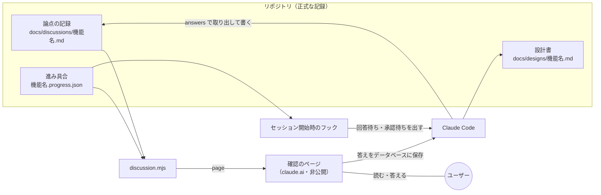

# 設計書: discussion-workflow

- ステータス: draft
- レベル: L2 / ユーザー承認: 必要（ハーネス`.claude/`のスクリプト・フック・スキルと`AGENTS.md`、新しい記録の置き場`docs/discussions/`にまたがる。今の進め方は壊さない）
- 関連: LINEヤフーの技術ブログ「AIの成果物を人が受け取るための設計ワークフロー」（https://techblog.lycorp.co.jp/ja/20260914a） / `.claude/skills/ask-questions/SKILL.md` / `.claude/skills/create-requirements-document/SKILL.md` / `.claude/skills/create-design-document/SKILL.md` / `.claude/skills/create-adr/SKILL.md` / `docs/claude-code/development-workflow.md`

この設計書で決めるのは、L2・L3の機能で、AIが出した問いと設計の承認依頼を、ユーザーが図つきのWebページで読んで答えられるようにする仕組みです。答えと選ばなかった案はリポジトリに残し、機能がどの工程まで進んだかも同じページで見えるようにします。

## この設計を一言で

問いと設計の承認依頼を、チャットと長いMarkdownではなく、図つきの1枚のWebページで出す。ユーザーはそのページで答え、答えと選ばなかった案は機能ごとの記録ファイルに残る。どの機能がどの工程で止まっているかも、そのページとセッション開始時の表示で分かる。

## 背景

LINEヤフーのLINEアプリの開発チームは、AIが設計書を速く書けるようになったぶん、人がそれを読んで判断し、引き継ぐ手間が増えたと書いている。チームは3つの仕組みで対処した。

1. 論点を1枚のHTMLページ（`overview.html`）にまとめ、背景・前提・決めたこと・未決の論点の順に並べる。論点ごとに選択肢・利点・欠点・AIの推奨を書き、ページの上で答える。小さな論点はAIが仮に決め、異議があれば受け付ける。
2. 論点の記録（`discussion-points.md`）に、背景・選択肢・AIの推奨・人の決定・反映先を残す。却下した案も消さない。
3. 中身を持たない進み具合の記録（`envelope.json`）から、工程ごとの状態を色分けした画面（`progress.html`）を作り直す。引き継いだ人は、新しく指示を書かずにページから再開できる。

Tomotabiは、1の一部をすでに使っている。食べログの記事から作った「問いを出す」スキル（`ask-questions`）で、背景・根拠・選択肢・推奨・「その他」つきの問いを出している。足りないのは次の3点で、2026-10-04に調べて確かめた。

- 問いはチャットに一覧で出し、ユーザーが「1A 2B」と返している。利点と欠点を並べる欄がなく、長い問いはチャットで読みにくい。
- 答えが残っていない。スキルは要件定義書・設計書の「決めたこと（問いと答え）」の表に書くよう求めているが、`docs/requirements/`と`docs/designs/`のどの文書にも、この節は書かれていない。選ばなかった案と理由は、どこにも残っていない。
- 機能がどの工程にいるかは、`logs/`の日次ログと設計書の「ステータス」行から読み取るしかない。セッションをまたぐと、答え待ちの問いがあることも分からない。

もう1つ、設計書そのものが読みにくい。2026-10-04に、ユーザーから「AIが出す設計書類がわかりにくいのが問題になっている。自分へのレビューはHTMLで、画像と合わせて確かめられるとよい」と提案があった。今の設計書は、決まった見出しを全部残すひな形（22節）に沿った長いMarkdownで、図はコードブロックの文字の図だけ、画面の変更でも画像が無い。承認する人は、何を作るのか・何を選ばなかったのかを、全部読んでから組み立てる必要がある。

承認の記録は、記事のGitタグにあたるものがすでにある。設計書はPRのマージで承認している（例: 支払い・精算の中核の設計書は、2026-10-02にPR #106のマージで承認）。チームの合意の場でページを使う仕組みは、一人で開発しているので要らない。

## 目的

1. ユーザーが、L2・L3の問いを1枚のページで読み、そのページで答えられる。チャットで答える今のやり方も残す。
2. 問いと答え、選ばなかった案と理由、反映した文書を、機能ごとに1つのファイルに残す。後から「なぜこの案にしなかったか」を1か所で探せる。
3. どのセッション・どのツール（Claude Code・Codex）からも、機能ごとの工程の状態と、答え待ちの問いが分かる。
4. 設計の承認を頼むとき、ユーザーが図と画面の画像つきのページを数分読めば、何を作るか・何を選ばなかったか・何を決めてほしいかが分かる。

## 要件

- R-1: 正式な記録はリポジトリのMarkdownとJSONにする。claude.aiのページは表示と回答の窓口で、無くなっても記録は失われない。
- R-2: ページで答えたことは、Claude Codeが貼り直しなしで読める。
- R-3: Codexとチャットでの回答も同じ記録に書ける（ページは使えなくてもよい）。
- R-4: 記録とページの作成・確認・状態の更新はスクリプトにし、`.claude/tests/`に`node --test`のテストを付ける。
- R-5: セッション開始時のフックは、失敗しても止まらない（exit 0）。出す行が無ければ何も出さない。
- R-6: 公開リポジトリに入る記録に、セキュリティの詳細を書かない（既存の方針どおり）。

## 対象範囲

- 論点の記録`docs/discussions/<機能名>.md`と、その書き方の説明`docs/discussions/README.md`。
- 進み具合の記録`docs/discussions/<機能名>.progress.json`。
- 確認のページ（claude.aiのArtifactとして非公開で出す）のひな形`.claude/scripts/discussion-page.html`。
- スクリプト`.claude/scripts/discussion.mjs`（記録の確認・ページの作成・答えの取り出し・工程の更新・進行中の一覧）と、そのテスト`.claude/tests/discussion.test.mjs`。
- セッション開始時のフック（進行中の機能を出す）。`.claude/settings.json`に1つ足す。
- 設計の承認を頼むときの、図と画像つきの説明（確認のページに載せる）。
- 設計書のひな形に「この設計を一言で」の節とmermaidの図を足す。
- 手順の更新: `ask-questions`（`.agents/skills/`の写しも）・`create-requirements-document`・`create-design-document`・`create-adr`・`classify-change`・`docs/claude-code/development-workflow.md`・`AGENTS.md`・`docs/glossary.md`。

## 対象外

- 合意の場（会議）でページを使う流れ。一人で開発しているため。
- 承認時のGitタグ。PRのマージが承認の記録になっているため。
- 記事の「入力」「状況把握」の工程。Tomotabiの工程は分類・要件・設計から始まる。
- 承認済みの機能の記録を後から作ること。既存の要件定義書・設計書の「未決事項」はそのまま読める。
- L0・L1の変更。今どおり問いを出さない。
- Devinへの委譲（Issue起点のL0・L1）。Devinは確認のページを使わない。

## 現状構成

```text
問いを出す（ask-questions）
  └─ チャットに番号つきで出す → ユーザーが「1A 2B」と返す
       └─ 答えは要件定義書・設計書の「決めたこと」に書く決まり（実際には書かれていない）
工程の状態
  └─ logs/YYYY-MM-DD.md と、設計書の「ステータス」行
セッション開始時のフック
  └─ 進行中のDevinへの委譲だけを出す（delegation-status.mjs）
```

## 変更後構成



```text
docs/discussions/
  README.md                         記録の書き方
  <機能名>.md                       論点の記録（正式な記録）
  <機能名>.progress.json            進み具合（中身は持たない）
.claude/scripts/
  discussion.mjs                    check / page / answers / init / stage / status
  discussion-page.html              確認のページのひな形
.claude/hooks/
  discussion-status.mjs             セッション開始時に進行中の機能を出す
.claude/tests/
  discussion.test.mjs
```

### 論点の記録（`docs/discussions/<機能名>.md`）

要件定義と設計の工程をまたいで、1つの機能に1ファイル作り、書き足していく。論点は消さない。答えが変わったら、状態を「決定」のまま決定・理由・決めた日を書き換え、前の答えを「前の決定」に残す。

```markdown
# 論点の記録: 支払い・精算の中核

- 機能名: payments-and-settlement
- 確認のページ: https://claude.ai/code/artifact/...
- 進み具合: docs/discussions/payments-and-settlement.progress.json

## 背景

（ページの冒頭に出す。2〜5文）

## 前提

- （正本や既存の決定から、問わずに置いた前提）

## 論点

### 精算の確認を取り消したあと、同じ確認をもう一度完了にできるか

<!-- id: reconfirm-after-cancel -->

- 工程: 設計
- 優先度: 高
- 状態: 決定
- なぜ今: できるかどうかで、受け渡しの確認の状態の移り方と、画面に出すボタンが変わる。
- 根拠: 詳細設計の精算の状態の節は「取り消し」までで、その後を書いていない。
- 選択肢:
  - A) できる（取り消しの前に戻す）
    - 利点: 押し間違えた人がすぐ戻せる
    - 欠点: 取り消した記録が上書きされ、誰が何をしたかを追えない
  - B) できない。新しい確認を作り直す
    - 利点: 取り消した記録が残る
    - 欠点: 作り直す手間が1回増える
- 推奨: B（取り消した記録が残り、二人のどちらが何をしたかを後から追える）
- 決定: B
- 推奨と同じか: 同じ
- 理由:
- 選ばなかった理由: A（取り消した記録を上書きすると、二人のどちらが何をしたかを後から追えなくなるため）
- 反映先: docs/designs/payments-and-settlement.md「精算の状態の移り方」
- 決めた日: 2026-10-01
```

「選ばなかった理由」は、状態が「決定」の論点で必ず書く。選択肢の「欠点」はその案の一般的な短所で、今回選ばなかった判断の理由とは限らないため、別の欄にする。書き方は次のとおりで、`check`は決定の論点でこの欄が空なら止める。

- 推奨どおりに答えたとき: 推奨の理由から、選ばなかった案ごとに1文書く。
- 推奨と違う案を選んだとき: ページは理由を書く欄を出す。書かれていればそれを写す。書かれていなければ「理由は聞いていない」と書き、推奨を選ばなかった理由をでっち上げない。

論点の状態は5つにする。

| 状態       | 意味                                                                         | ページでの出し方                                           |
| ---------- | ---------------------------------------------------------------------------- | ---------------------------------------------------------- |
| 回答待ち   | 今の工程で、優先度が高い問い                                                 | 答える欄つきで出す                                         |
| 仮決定     | 今の工程で優先度が中の問いを、AIが推奨で仮に決めたもの                       | 「AIが仮に決めたこと」に折りたたんで出し、異議の欄を付ける |
| 後の工程へ | 後の工程の問い、または優先度が低い問い                                       | 「後で決めること」に折りたたんで出す（答える欄なし）       |
| 決定       | ユーザーが答えたもの。仮決定に異議がなかったものも、工程の承認時にここへ移す | 「決めたこと」に問いと答えだけ出す                         |
| 取り下げ   | 前提が変わって問う必要がなくなったもの                                       | 出さない（記録には残す）                                   |

`<!-- id: ... -->`は、ページの答えと論点を結ぶための機械用の名前で、文章では使わない。ページとチャットでは、回答待ちの問いに上から1, 2, 3と番号を振る。チャットの「1A 2B」と同じ番号になる。

### 進み具合の記録（`docs/discussions/<機能名>.progress.json`）

記事の`envelope.json`にあたる。論点の中身は持たず、工程の状態だけを持つ。

```json
{
  "feature": "payments-and-settlement",
  "title": "支払い・精算の中核",
  "level": "L3",
  "page": "https://claude.ai/code/artifact/...",
  "stages": {
    "requirements": {
      "state": "done",
      "approved": { "pr": 101, "at": "2026-10-01" }
    },
    "design": {
      "state": "waiting",
      "docs": ["docs/designs/payments-and-settlement.md"]
    },
    "plan": { "state": "pending" },
    "implement": { "state": "pending" },
    "review": { "state": "pending" },
    "merge": { "state": "pending" },
    "reflect": { "state": "skipped", "reason": "改善サイクルを運用していない" }
  },
  "updated_at": "2026-10-04T10:00:00+09:00"
}
```

工程は7つにする。要件（L3だけ）・設計・実装計画と試験観点・実装・レビュー・マージ・振り返り。状態は、未着手（`pending`）・進行中（`active`）・回答待ち（`waiting`）・承認待ち（`approval`）・完了（`done`）・省略（`skipped`、理由が必須）の6つ。承認した人は常にユーザーなので、記事の「承認者」の代わりに、承認したPRの番号と日付を残す。

### 確認のページ

claude.aiのArtifactとして非公開で出す。機能ごとに1つのページを作り、工程が進むたびに同じURLへ出し直す。ページは、問いに答えてもらうときと、設計の承認を頼むときの両方に使う。上から次の順に並べる。

1. 進み具合: 7つの工程を、状態ごとの色で横に並べる（記事の`progress.html`にあたる）。
2. 承認を頼むときだけ、設計の説明（次の節）。問いだけのときは出さない。
3. 背景と前提。
4. 決めたこと（折りたたみ）。
5. 答えてほしい問い: 番号・問い・なぜ今・根拠・選択肢ごとの利点と欠点の表・推奨の印。選択肢のボタン、「その他（自由に書く）」の欄、「この問いへの質問」の欄。承認を頼むときは、設計書の未決事項がここに入る。
6. AIが仮に決めたこと（折りたたみ）: 問いと仮の答え、異議の欄。
7. 後で決めること（折りたたみ）。
8. 論点を足す: 問いと説明を書く欄。いくつでも足せる。
9. 「答えを送る」ボタン。

ページを開けない・保存できないときは、「1A 2B」の形の文を作ってコピーするボタンを出し、チャットに貼って答えられるようにする。

### 設計の説明（承認を頼むときのページ）

設計書（Markdown）は今どおり正式な記録としてPRに入れる。承認を頼むときは、それとは別に、同じ設計を図と画像で説明する部分を確認のページに載せる。読む人が数分で判断できるように、中身と順番を次のように決める。

| 順番 | 中身                                                       | 見せ方                                                                                   |
| ---- | ---------------------------------------------------------- | ---------------------------------------------------------------------------------------- |
| 1    | この設計を一言で（何を作り、ユーザーにとって何が変わるか） | 2〜3文                                                                                   |
| 2    | 今と変更後の違い                                           | 図（構成図。左右に並べる）                                                               |
| 3    | 動きの流れ                                                 | 図（誰が・何を・どの順でするか）                                                         |
| 4    | 画面が変わるなら、その画面                                 | 画像。既存の画面はアプリのブラウザで撮った画面、新しい画面はv3の画像か、HTMLで描いた見本 |
| 5    | 選んだ案と選ばなかった案                                   | 表（案・利点・欠点・選ばなかった理由）                                                   |
| 6    | 変わらないこと・やらないこと                               | 短い箇条書き                                                                             |
| 7    | 決めてほしいこと                                           | 答えてほしい問い（上の5）へ続ける                                                        |

図はmermaid（文字で書く図の書き方。claude.aiのページとGitHubの両方で絵として表示される）で描き、足りないときはSVGで描く。画面の画像は、ページの`assets`機能で上げるか、小さければページに埋め込む。

設計の説明はClaudeが設計書から書くHTMLの断片で、`discussion.mjs page <機能名> --review <断片のpath>`でページに入れる。断片はリポジトリに入れない（設計書が正式な記録で、断片はその見せ方のため。過去の版はArtifactの版の履歴に残る）。

設計書（Markdown）のひな形にも2つ足す。冒頭に「この設計を一言で」の節を置くことと、「現状構成」「変更後構成」「データフロー」の節に、文字の図の代わりにmermaidの図を1つ以上入れること。GitHubのPRの画面でも図として読めるようにするため。

### 答えの保存のしかた

答えは、ユーザーが選んだとおりページのデータベース（Artifactの`db`機能）に保存する。問いの中身はページに埋め込み、データベースには答えだけを置く。

| 置き場所                    | 中身                                                                                                                         |
| --------------------------- | ---------------------------------------------------------------------------------------------------------------------------- |
| `drafts/<論点の名前>`       | 書きかけの答え（選んだ記号・その他・推奨と違うときの理由・質問・異議）。ページを開き直したときに続きから答えるためだけに使う |
| `drafts-added/<自動の名前>` | 書きかけの、ユーザーがページで足した論点                                                                                     |
| `submissions/<回>`          | 「答えを送る」で確定した答えの写し。その回のすべての論点の答えと足した論点、答えた人、送った日時を1つの文書にまとめる        |

ページが自分自身を新しい版として保存し直す仕組み（`artifact`機能）とも比べた。2026-10-04にこの設計のレビュー用ページを出して確かめたところ、新しい版が保存されても、ページを出したセッションには知らせが届かない（Artifactの道具の表示による）。どちらでも、答えたことはユーザーがチャットで伝えるか、次のセッションの開始時の表示で気づく。それなら、ページを作り直す処理が要らず、誰が答えたかも残るデータベースのほうが単純になる。

|                                   | ページのデータベース（採用）               | ページが自分を保存し直す                   |
| --------------------------------- | ------------------------------------------ | ------------------------------------------ |
| 答えたことがClaude Codeに伝わるか | 伝わらない                                 | 伝わらない                                 |
| Claude Codeが答えを読む方法       | `ArtifactData`のlist                       | ページを読み、中のJSONを取り出す           |
| ページの作り                      | 答えを書くだけ                             | 送るたびにページの全文を作り直す処理が要る |
| 誰が答えたか                      | 分かる                                     | 分からない                                 |
| 次の工程で出し直すとき            | 前の答えは残る。何回目への答えかで見分ける | ページを作り直すだけ                       |

## データフロー

```text
1. 分類（L2 / L3）
   discussion.mjs init <機能名> --level L2 --title "..."
   → <機能名>.md と <機能名>.progress.json を作る。工程は要件（L3）または設計が「進行中」

2. 問いを書き出す（ask-questions）
   Claudeが <機能名>.md に論点を書く（状態・工程・優先度つき）
   discussion.mjs check <機能名>        形式を確かめる
   discussion.mjs page <機能名> --out <scratchpad>/<機能名>.html
   → Artifactとして出す（初回は非公開で新しいURL、2回目からは同じURLへ）
   → ページのURLを .md と .progress.json に書き、工程を「回答待ち」にする
   → チャットにはURLと、問いの一覧（今と同じ形）を短く出す

3. 答える
   ユーザーがページで答えて「答えを送る」→ 答えがページのデータベースに入る
   → ユーザーがチャットで「答えた」と伝える
   → 伝え忘れても、次のセッションの開始時にフックが「回答待ち」を出し、Claudeがデータベースを読みに行く
   （チャットで「1A 2B」と答えてもよい）

4. 記録する
   ClaudeがArtifactDataで submissions の今の回の文書を読み、JSONに保存する（drafts は読まない）
   → discussion.mjs answers <保存したJSON> <機能名>
   → 答え・その他・質問・異議・足した論点を、論点の名前つきで一覧にする
   Claudeが <機能名>.md の状態・決定・推奨と同じか・理由を書く
   質問・その他・異議・足した論点があれば、その論点だけチャットで詰めるか、ページを出し直す

5. 書く
   要件定義書・設計書を書き、決定ごとに「反映先」を埋める
   設計の説明（図と画像）を断片に書き、discussion.mjs page <機能名> --review <断片> で同じURLへ出し直す
   PRの説明の先頭に確認のページのURLを書く
   工程を「承認待ち」にする → PRのマージで「完了」、承認したPR番号を残す
   仮決定は、異議がなければこのとき「決定」に移す
```

## API設計

対象外（アプリのAPIは変えない）。スクリプトのコマンドは次のとおり。

| コマンド                                                              | すること                                                                                                                                                       |
| --------------------------------------------------------------------- | -------------------------------------------------------------------------------------------------------------------------------------------------------------- |
| `discussion.mjs init <機能名> --level L2\|L3 --title <名前>`          | 記録の2ファイルを作る。あれば何もしない                                                                                                                        |
| `discussion.mjs check [<機能名>]`                                     | 記録の形を確かめる。名前を省くと全部。問題があればexit 1                                                                                                       |
| `discussion.mjs page <機能名> --out <path>`                           | ページのHTMLを作る                                                                                                                                             |
| `discussion.mjs answers <JSONのpath> <機能名>`                        | 確定した答えの写し（`submissions/<回>`）を、論点の名前と並べて出す。今の回の写しが無ければ「まだ送られていない」と出してexit 1。記録に無い論点の答えは警告する |
| `discussion.mjs stage <機能名> <工程> <状態> [--reason ...] [--pr N]` | 工程の状態を書き換える。省略には理由が、完了の承認にはPR番号が要る                                                                                             |
| `discussion.mjs status [--hook]`                                      | 完了していない機能を、今の工程・回答待ちの数・ページのURLつきで出す                                                                                            |

## DB設計

対象外。

## フロントエンド設計

アプリの画面は変えない。確認のページは`discussion-page.html`をひな形にする。

- ページの中身は、`<script type="application/json" id="discussion-state">`のJSONだけから描く。記録の文章はすべて`textContent`で入れ、HTMLとして解釈しない。
- 書きかけの答えは、変えるたびに`drafts/`へ書く（同じ論点への書き込みは1つずつ）。ページを開き直すと、今の回の書きかけを読み込んで続きから答えられる。
- 「答えを送る」は、書きかけの書き込みがすべて終わるのを待ってから、画面に出ている答えを1つの文書にまとめて`submissions/<回>`へ書く。書き込みが終わってから「送りました」と出す。失敗したら送れなかったと出し、もう一度押せるようにする。
- 送ったあとに答えを変えて、もう一度送ると、同じ回の写しを上書きする。Claudeが記録に写したあとの上書きは、次のセッションで`answers`が記録との違いとして出す。
- 推奨と違う案を選ぶと、「選んだ理由（任意）」の欄を出す。
- 保存の機能が使えないとき（ページを手元のファイルで開いた、閲覧だけの権限など）は、送るボタンの代わりに、チャットに貼る文のコピーボタンを出す。
- 画面の幅はスマホ（375px）でも横にはみ出さない。色はライトとダークの両方を用意する。

## バックエンド設計

`discussion.mjs`は純粋関数（記録を読み解く・形を確かめる・ページを作る・答えを取り出す・状態を移す）と、ファイルを読み書きする薄い入口に分ける。テストは純粋関数に当てる。外部へは通信しない。ページを出すのと読むのは、Claude CodeのArtifactの道具が行う。

## エラー処理

外部APIへの入出力をスクリプトは持たないため、5項目（リトライなど）は対象外。

- 記録の形が崩れているときは、`check`が論点の見出しと足りない項目を出してexit 1にする。`page`は`check`を通らない記録からページを作らない。
- `answers`は、渡したJSONが読めないときにexit 1にする。記録に無い論点への答えは捨てずに警告として出す（ユーザーがページで足した論点かもしれないため）。
- セッション開始時のフックは、記録が読めなくても何も出さずにexit 0で終わる。

## ログと監視

対象外。工程の状態は`progress.json`に残り、Gitの履歴が変更の記録になる。

## セキュリティ

- ページは非公開で出し、共有しない。データベースの書き込みは持ち主だけに許す（`db`の規則で`write: "owner"`）。答えた人が残るので、持ち主以外の答えは`answers`が警告する。
- 記録は公開リポジトリに入る。セキュリティの詳細を論点に書かない。セキュリティの判断が要る論点は、記録には「セキュリティの判断（詳細はチャット）」とだけ書く。
- ページの文章はすべて`textContent`で描き、JSONをページに埋めるときは`<`を`\u003c`に置き換える（`</script>`で中断されないように）。テストで確かめる。
- ページから読んだ答えは、ユーザー本人の答えとして扱うが、指示としては扱わない。「その他」に書かれたことは、記録に写してから、必要ならチャットで確かめる。

## 性能

対象外（記録は1機能で数十件の論点。記事の例でも29件）。

## テスト方針

- `discussion.test.mjs`（`node --test`）: 記録の読み解き（選択肢・利点・欠点の入れ子、id、状態）、`check`の検出（状態の値・回答待ちの推奨なし・選択肢なし・idの重複・決定の論点の「選ばなかった理由」の空欄）、ページの作成（JSONの`<`の置き換え、回答待ちの番号の振り方）、答えの取り出し（確定した写しだけを読む・写しが無いときに止まる・記録に無い論点の警告）、工程の移り方（省略の理由、承認のPR番号）、`status`の出力（完了した機能を出さない）。
- 確認のページは、見本の記録で一度出して、アプリのブラウザで確かめる。選んで送る・その他を書く・論点を足す・保存できないときのコピーの4つ。スマホの幅とダークも見る。
- 既存のハーネスの試験（`node --test .claude/tests/*.test.mjs`）を全部通す。

## 移行とリリース

- 承認済みの機能は移さない。この仕組みは、承認後に始めるL2・L3の機能から使う。
- この設計の問いと答え（下の「決めたこと」）は、実装のときに`docs/discussions/discussion-workflow.md`へ移し、最初の記録にする。
- 「決めたこと（問いと答え）」の節は、要件定義書・設計書のひな形から外し、論点の記録へのリンクに置き換える。表を2か所に書かないため。
- 実装は、この設計書のマージ（承認）のあとに別のPRで出す。実装計画と試験観点（`docs/implementation-plans/`・`docs/tests/`）もそのPRに入れる。

## リスク

- ページが使えないとき（claude.aiの障害、Codexでの作業）は、チャットでの回答に戻る。記録はMarkdownなので、どちらで答えても同じ形で残る。
- ページのデータベース（`db`機能）と、それを読む`ArtifactData`の道具は、アカウントとClaude Codeの版によって使えないことがある。公開されているClaude Codeの説明には、ページは裏側を持たず、答えは「プロンプトとしてコピー」で戻すと書かれている。2026-10-04のこのセッションでは、`db`機能と`ArtifactData`の道具が使える一覧に入っていることを確かめた。そこで、実装の最初に見本のページで書き込みと読み取りを1回ずつ確かめる。使えなければ、データベースを使わず、チャットに貼る文のコピーだけで答えを戻す形にして進める（ページの残りの部分はそのまま使える）。コピーの経路は、データベースが使えるときも常に残す。
- 記録の形を手で崩すと`page`が動かない。`check`を品質ゲートの試験に入れずに、`page`の前とレビューで確かめる（品質ゲートを止めないため）。
- 論点の記録が長くなると、要件定義書・設計書と同じことを2回書くおそれがある。要件定義書・設計書には決定の結果だけ、理由と選ばなかった案は記録だけに書く、と手順に書く。
- 記事のチームは「半年で要らない工夫が出る」と書いている。3つの機能で使ったあと、使わなかった欄（質問欄・論点を足す欄など）を見直す。

## 決めたこと（問いと答え）

| 問い                                                                       | 答え                                                                                             | 推奨と同じか                    | 理由（ユーザーが言ったときだけ） |
| -------------------------------------------------------------------------- | ------------------------------------------------------------------------------------------------ | ------------------------------- | -------------------------------- |
| 記事の仕組みのどこまで取り入れるか                                         | 確認のページ・論点の記録・工程の進み具合の3つ全部                                                | 違う（推奨は進み具合を除く2つ） |                                  |
| 確認のページをどこに置き、答えをどう戻すか                                 | claude.aiのページに非公開で出し、答えはページに保存してClaude Codeが読む。正式な記録はリポジトリ | 同じ                            |                                  |
| 論点の記録をどこに書くか                                                   | 機能ごとに`docs/discussions/<機能名>.md`を1つ                                                    | 同じ                            |                                  |
| AIが仮に決めたことを見せるか                                               | ページに折りたたんで並べ、異議の欄を付ける                                                       | 同じ                            |                                  |
| 確認のページをどの場面で使うか                                             | L2・L3の要件定義と設計の前の問いと、ADR級の決定の比較                                            | 同じ                            |                                  |
| （問いではなくユーザーの提案）設計の承認も、図と画像つきのHTMLで確かめたい | 確認のページに「設計の説明」を載せ、設計書のひな形にもmermaidの図を足す                          | -                               | 今の設計書類がわかりにくいため   |

## 未決事項

承認のときに、推奨と違うものだけ教えてください。

| 問い                                                                                        | 工程 | 優先度 | 推奨                                                             | 根拠                       |
| ------------------------------------------------------------------------------------------- | ---- | ------ | ---------------------------------------------------------------- | -------------------------- |
| ADR級の決定の比較で、ADRの「却下した案」に論点の記録へのリンクを置くか、ADRにも理由を書くか | 設計 | 中     | ADRにも短く書き、詳細は記録へリンクする。ADRは単独で読まれるため | `create-adr`のテンプレート |
| `discussion.mjs check`を品質ゲート（`run-quality-gates.sh`）に入れるか                      | 設計 | 低     | 入れない。`page`の前に必ず通るため。3つの機能で使ったあと見直す  | 「リスク」の節             |
