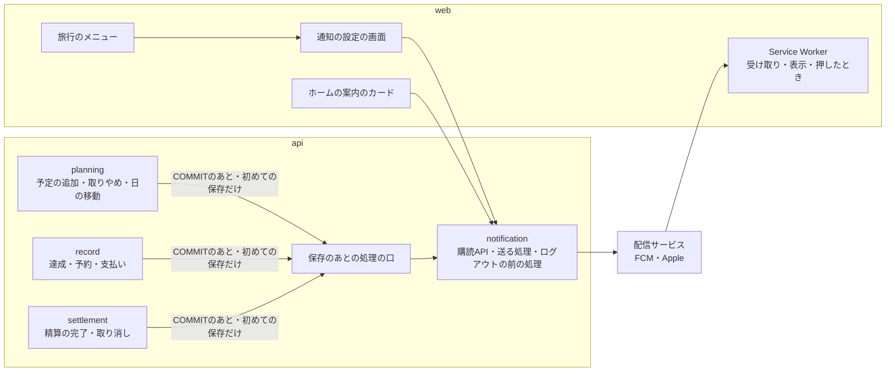
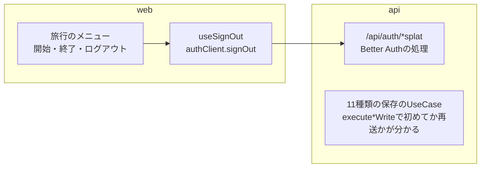
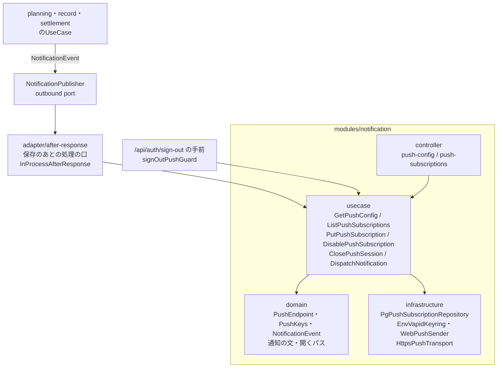
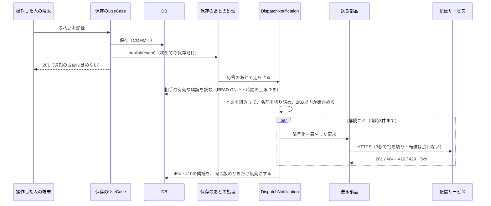
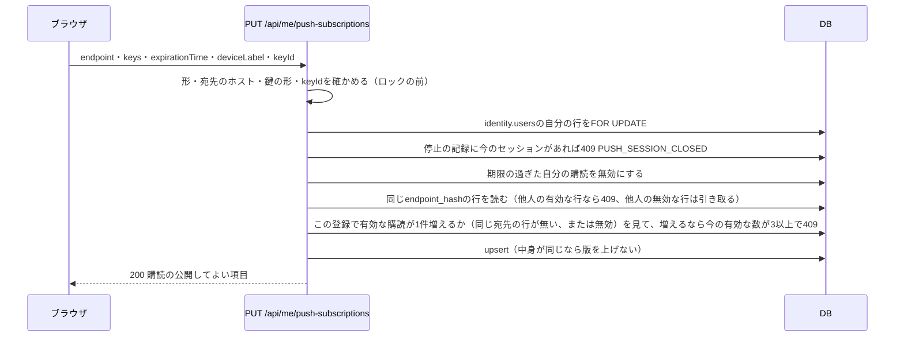
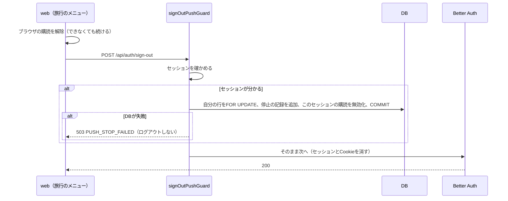

# 設計書: push-notifications（相手の操作を知らせる通知）

- ステータス: draft（承認待ち）
- レベル: L3
- 関連: docs/requirements/push-notifications.md（PR #167で承認）、ADR-0002（認証の統合）、ADR-0003（DBのロールとmigration）、ADR-0005（E2E）、論点の記録 docs/discussions/push-notifications.md

## この設計を一言で

APIに通知の`notification`モジュールを足し、購読の4つのAPI・ログアウトの前に通知を止める処理・保存のあとに相手へ送る処理を置く。11種類の保存のUseCaseは、初めて保存できたときだけ「保存のあとの処理」の口に通知のイベントを渡し、応答を返してから送る。webにはService Worker・ホーム画面に追加するための設定・通知の設定の画面・ホームの案内のカードを足す。



## 背景

要件定義のとおり。設計資料（詳細設計「Web Push通知」「認証とセッション」「画面状態と入力操作」「フロントとバックのアーキテクチャ」、`openapi.notifications.json`、`sql/05_push_notifications.sql`）が、DB・API・宛先の確かめ方・送り方・通知から開く画面・ログアウトの止め方まで決めている。この設計書は、それを今のコードのどこにどう置くかを決める。

## 目的

- 相手の11種類の操作を、保存の成否から切り離して、相手の有効な購読へ送る。
- 購読の登録・停止・ログアウトを、同じ利用者の行のロックで一列に並べ、端末の数の上限とログアウトの停止を破らない。
- 本番と試験で同じ宛先の決まりを使い、送る部品だけを試験で差し替えられるようにする。

## 要件

要件定義の機能要件（F-01〜F-85）、非機能要件（N-01〜N-06）、異常系（E-01〜E-12）、境界条件（B-01〜B-06）、受け入れ条件。この設計書でF-やE-の番号を引くときは、要件定義のその行を指す。設計の工程で要件は足していない。

用語（要件定義の「この文書の読み方」と同じ）:

- **購読**は、端末のブラウザがAPIに登録した「宛先と鍵の組」。DBでは`notification.push_subscriptions`の1行。
- **停止の記録**（`notification.closed_push_sessions`）は、ログアウトしたログイン（セッション）のIDの一覧。このIDからの購読の登録を断り、このIDで登録した購読には送らない。
- **版**（`revision`）は、購読の行が変わるたびに1つ上がる数。送っている間に登録し直された購読を、古い失敗で無効にしないために使う。
- **保存のあとの処理の口**は、UseCaseが応答を返したあとに走らせる処理を受け取る口（port）。手元ではNestJSの中で走らせ、公開用の環境では`waitUntil`に渡す。

## 対象範囲

- API: `notification`モジュール（購読の4つのAPI、送る処理、ログアウトの前の処理、VAPIDの鍵の読み込み、宛先の確かめ方）。11種類のUseCaseからのイベントの受け渡し。`SessionVerifier`の`authenticated`の結果と`SessionGuard`が、セッションのIDも渡すようにする。
- DB: `notification`スキーマと2つの表、アプリのロールへの権限（migrationを1つ）。
- 契約: `packages/contracts/openapi/notifications.json`（4つの操作）を足し、zodと型を生成する。
- web: Service Worker、manifestとアイコン、通知の設定の画面（`/settings/notifications`）、旅行のメニューの行、ホームの案内のカード、精算の画面の履歴の1件を目立たせる表示、ログアウトの流れの変更。
- 試験: 単体・実DB・HTTP・E2E（「テスト方針」）。
- 文書: `docs/tests/final-acceptance.md`に実機の確認の行を足す。`.env.example`にVAPIDの鍵の欄を足す。

## 対象外

要件定義の「対象外」のとおり。加えて、Vercelの`waitUntil`の実装（口の実装を足すのは結合検証の環境を作る回）。

## 現状構成



- 保存のUseCaseは、どれも`executeTripWrite`・`executePlanWrite`・`executePlanEventWrite`・`executeFinanceWrite`のどれかを通り、トランザクションのあとに`replayed`（同じキーの再送か）が分かる。取り消しの「すでに取り消し済みなので今ある取り消しを返す」は、再送でなくても200で返る。
- `SessionGuard`は`userId`と期限だけを要求に載せる。セッションのIDは載せない。
- Service Worker・manifestは無い。

## 変更後構成



- **イベントを渡す口**: 各モジュールの`adapter/outbound`に`NotificationPublisher`（`publish(event)`だけ）を置く。UseCaseは、トランザクションが成功し、再送でなく、状態が実際に変わったときだけ呼ぶ。`publish`は例外を投げない（中で受け止めてログに出す）。
- **保存のあとの処理の口**: `adapter/after-response`に`AfterResponse`（`schedule(name, task)`）を置く。手元の実装`InProcessAfterResponse`は、応答を返したあとにタスクを走らせ、走っているタスクを持っておき、例外をログに出す。試験は`drain()`で全部が終わるまで待つ。Vercelの実装（`waitUntil`に渡す）は結合検証の環境を作る回で足す。
- **送る部品**: `WebPushSender`は`web-push`の`generateRequestDetails`で暗号化と署名をした要求を作り（`TTL: 300`・`urgency: "normal"`・`contentEncoding: "aes128gcm"`を必ず指定する。F-36）、`PushTransport`（HTTPSで送る口）に渡す。本番の`HttpsPushTransport`はNodeの`https.request`で、`AbortSignal`による3秒の全体の打ち切りと、転送を追わない設定で送る。試験では`PushTransport`だけを偽物に差し替える。

## データフロー

### 保存のあとに送る流れ



- イベントは`eventId`（新しいUUID）・`action`・`tripId`・`targetKind`・`targetId`・`actorUserId`・`occurredAt`。追加と取り消しは別のイベント。
- 上限は「行があるか」ではなく「有効な購読が1件増えるか」で判定する。無効になっていた同じ宛先の行を有効に戻すときも、1件増えるものとして数える（B-01）。数える前に、期限の過ぎた購読と、登録したログインが期限切れか消えた購読を無効にする。後者は通知が届かないので、上限の数に入れず、一覧でも有効として出さない（2026-10-10 論点の記録「ログインが期限切れになった端末の購読を、端末の上限の数から外すか」）。
- 送る相手は、旅行の参加者から操作した人を除いた人で、`identity.allowed_google_accounts`の`enabled`が今もtrueの人（B-04）。その人の購読のうち、`enabled`で、期限が過ぎておらず、登録したセッションが停止の記録に無く、そのセッションが`identity.sessions`に残っていて期限が切れておらず、鍵が止めた鍵でないものだけ（F-23・F-24）。ログアウトを押さずにログインが期限切れになった端末にも送らないため、セッションの期限も見る（2026-10-10 論点の記録「ログインが期限切れになった端末にも通知を送るか」）。
- 本文に入れる相手の名前（`identity.users.name`）と旅行の名前は、送る処理の中でDBから読む。名前は20文字・旅行の名前は30文字で切り、超えたら末尾を「…」にする（論点の記録「通知に入れる名前を、何文字で切り詰めるか」の仮決定）。組み立てたJSONをUTF-8で測り、2KBを超えたら名前をさらに短くする（F-44・B-03）。

### どのUseCaseが、いつイベントを渡すか

| 操作               | UseCase                                                | 渡すとき                                       | action / targetKind                                           |
| ------------------ | ------------------------------------------------------ | ---------------------------------------------- | ------------------------------------------------------------- |
| 予定の追加         | `CreatePlanUseCase`                                    | 再送でない201                                  | `plan_added` / `plan`                                         |
| 予定の取りやめ     | `CancelPlanUseCase`                                    | 再送でなく、取りやめに変わったとき             | `plan_cancelled` / `plan`                                     |
| 予定の日の移動     | `MovePlanUseCase`                                      | 再送でなく、日付が変わったとき                 | `plan_moved` / `plan`                                         |
| 達成・予約の記録   | `CreatePlanEventUseCase`                               | 再送でない201                                  | `achievement_added`・`booking_added`                          |
| 達成・予約の取消   | `CancelPlanEventUseCase`                               | 再送でない201（既にあった取り消しの200は除く） | `achievement_cancelled`・`booking_cancelled`                  |
| 支払いの記録・取消 | `CreatePaymentUseCase`・`CancelPaymentUseCase`         | 再送でない201                                  | `payment_added`・`payment_cancelled` / `payment`              |
| 精算の完了・取消   | `CompleteSettlementUseCase`・`CancelSettlementUseCase` | 再送でない201                                  | `settlement_completed`・`settlement_cancelled` / `settlement` |

取り消しのイベントの`targetId`は元の記録・精算のID（F-51）。精算の完了で、同じ確認に別の要求が先に完了していて今ある精算を返す200は渡さない。

### 購読の登録



### ログアウト



- 停止の記録は`ON CONFLICT DO NOTHING`で、何度押しても同じ結果になる。
- ガードは`SessionVerifier`の4つの結果で分ける。`authenticated`は上の流れ。`unavailable`（認証の基盤の障害）は、止められたか分からないので503 `PUSH_STOP_FAILED`を返し、ログアウトしない。`forbidden`（利用許可を外された人）は、その人には送らない決まり（B-04）なので、DBに触れずBetter Authへ渡す。`unauthenticated`（期限切れ・Cookie無し）もDBに触れずBetter Authへ渡す。
- `unauthenticated`のときは、webは「通知を止めたとは言えない」案内を出す（F-65）。そのために、ガードは止めたかどうかを応答のヘッダー`X-Push-Stopped: true|false`で返す。

## API 設計

設計資料の`openapi.notifications.json`を`packages/contracts/openapi/notifications.json`に写し、パスに`/api`を付ける（今の契約と同じ書き方）。

| 操作                                     | 応答                                                                                             |
| ---------------------------------------- | ------------------------------------------------------------------------------------------------ |
| `GET /api/me/push-config`                | 200 `{ publicVapidKey, keyId, maxActiveSubscriptions }`（今の鍵。上限は3。設計資料の契約どおり） |
| `GET /api/me/push-subscriptions`         | 200 `{ items: [{ id, deviceLabel, enabled, vapidKeyState, isCurrentSession, updatedAt }] }`      |
| `PUT /api/me/push-subscriptions`         | 200 購読の公開してよい項目。400・409・422は「エラー処理」                                        |
| `DELETE /api/me/push-subscriptions/{id}` | 204（何度でも。他人の・無いIDも204）                                                             |

- 一覧に`vapidKeyState`（`current`・`retired`・`revoked`）と`isCurrentSession`（今のセッションで登録したか）を足す。設定の画面が「APIで無効になった」と「この端末」を出し分けるのに使う（F-02・F-09）。どちらも設計資料の契約に無い欄で、宛先と鍵は含まない。
- 4つとも`SessionGuard`と利用許可を通す。PUT・DELETEは`OriginGuard`を通す。Idempotency-Keyは使わない（宛先と持ち主で自然に何度送っても同じになる）。応答は`Cache-Control: private, no-store`。
- `POST /api/auth/sign-out`の契約に、503 `PUSH_STOP_FAILED`と応答ヘッダー`X-Push-Stopped`を足す。

## DB 設計

`apps/api/src/infrastructure/database/schema/notification.ts`に、設計資料の`sql/05_push_notifications.sql`の2つの表を写す。migrationは`0009_notification_tables.sql`（表）と`0010_notification_grants.sql`（権限）。

- `push_subscriptions.user_id`・`closed_push_sessions.user_id`は`identity.users(id)`を参照する。`registration_session_id`はBetter Authのセッションの表を参照しない（セッションを消しても購読の行を連鎖で消さないため）。
- 型・長さ・`endpoint_hash`の一意・鍵のバイト数はDBの制約で守る。P-256の曲線の上の点か、ハッシュとendpointの一致、宛先のホスト、持ち主、数の上限はUseCaseで確かめる。
- アプリのロールに、`notification`スキーマのUSAGEと、2つの表のSELECT・INSERT・UPDATEを与える。実DBの試験はアプリのロールで走らせ、権限の足りなさを見つける。DELETEは与えない（無効にするだけ）。`identity.users`の行のFOR UPDATEは、列の一部（`email_verified`・`updated_at`）へのUPDATEの権限で足りる（`0001_app_runtime_grants.sql`で与え済み）ので、identityの権限は変えない。

## フロントエンド設計

### 画面と経路

| 画面               | 経路                                            | 変えること                                                                     |
| ------------------ | ----------------------------------------------- | ------------------------------------------------------------------------------ |
| 通知の設定（新規） | `/settings/notifications?from=/trips/{id}/home` | この端末の状態と、自分の端末の一覧。`from`は許した旅行の中の経路だけ受け付ける |
| 旅行のメニュー     | （シート）                                      | 「この端末の通知」の行を、ログアウトの上に足す                                 |
| ホーム             | `/trips/{tripId}/home`                          | 上部に案内のカード                                                             |
| 精算               | `/trips/{tripId}/settlement?settlementId=`      | 履歴のその1件を目立たせ、そこまでスクロールする                                |

### 通知の設定の画面

確認のページに描いた見本のとおり。上に「この端末」のカード、下に「通知を受け取る端末（N / 3台）」の一覧（論点の記録「通知の設定の画面に、自分のほかの端末の一覧を出すか」の答え）。

| この端末の状態                    | 判定                                                                | 出すもの                             |
| --------------------------------- | ------------------------------------------------------------------- | ------------------------------------ |
| iPhoneでホーム画面への追加が要る  | iOSの画面で`navigator.standalone`がfalse、かつ`PushManager`が無い   | ホーム画面に追加する手順             |
| 使えない                          | `serviceWorker`・`PushManager`・`Notification`のどれかが無い        | 使えないことだけ                     |
| まだ許可していない                | `Notification.permission === "default"`                             | 墨の「通知を有効にする」             |
| 許可を断った                      | `"denied"`                                                          | ブラウザ・OSの設定から変える案内     |
| ブラウザでは登録したがAPIに未登録 | `getSubscription()`があり、一覧に`isCurrentSession`の有効な行が無い | 「登録し直す」                       |
| 有効                              | 一覧に今のendpointの有効な行がある                                  | 有効の印と「この端末の通知を止める」 |
| APIで無効になった                 | 行はあるが`enabled`がfalse、または`vapidKeyState`が`revoked`        | 登録し直す案内                       |

- 状態は表の上から順に判定し、最初に当てはまったものにする。ホーム画面に追加していないiPhoneは`PushManager`が無く「使えない」にも当てはまるので、iPhoneの判定を先に置く。
- 端末に「今のendpointに対応する購読のID」を覚えておく（`localStorage`。キーは利用者のIDを含める）。IDが無ければ、「登録し直す」を押したときに同じendpointのPUTで照合する。画面を開いただけでは登録しない（F-09）。
- 有効にする順番は、Service Workerの登録 → `Notification.requestPermission()` → `pushManager.getSubscription()` → 今の購読があり、その`options.applicationServerKey`が今の公開鍵と違えば`unsubscribe()` → `pushManager.subscribe({ userVisibleOnly: true, applicationServerKey })` → PUT → 一覧の取り直し（F-04）。ブラウザは、違う鍵の購読が残ったままでは新しい鍵で`subscribe`できないので、先に解除する（鍵の入れ替えのあとの登録し直し。F-73）。409 `PUSH_KEY_CHANGED`なら、ブラウザの購読を解除し、公開鍵を取り直して1回だけやり直す。
- 端末の名前はブラウザの情報から自動で付ける（「iPhone · Safari」。論点の記録「端末の名前をどう決めるか」の仮決定）。
- 別の人のログインへの切り替え（F-10）。ふつうはログアウトを通るので、前の人のこのセッションの購読はAPIで止まっている（F-60）。ログアウトを通らずに切り替わったとき（前の人のログインが期限切れで、次の人がログインした）は、前の人としてAPIを呼べない。そのときは次のようにする。
  - 有効にする前に、覚えた購読のIDの持ち主が今の利用者と違えば、ブラウザの購読を`unsubscribe()`する。解除できなかったら有効にせず、「前に使っていた人の通知が残っています。電波のある所でもう一度お試しください」と出す。解除できないまま登録すると、同じ宛先が前の人の購読として残り、前の人の通知がこの端末に出てしまうため。
  - 解除すると前の宛先は配信サービスで使えなくなり、前の人あての次の送信が404・410になって、APIでその購読が無効になる（F-34）。それまでは前の人の一覧に端末が残り、3台の数にも入る。前の人は、自分の設定の画面の一覧からその端末を止められる（論点の記録「通知の設定の画面に、自分のほかの端末の一覧を出すか」の答え）。

### ホームの案内のカード

- 出す条件は、使える環境で、許可を断っておらず、この端末が有効でなく、この端末・この人で閉じていないとき（F-15・F-18）。閉じたことは`localStorage`に利用者のIDつきで覚える。読めなければ出す。
- 「通知を有効にする」は、設定の画面と同じ順番をその場で走らせる。iPhoneでホーム画面への追加が要るときは、設定の画面へ移る（F-16）。

### Service Worker

- 書く場所は`apps/web/src/service-worker/`（TypeScript）。中身の確かめ方・本文・開くパスの組み立ては`apps/web/src/shared/push/`の純粋な関数にして、画面の試験と共有する。
- `esbuild`で1つのファイルにまとめ、`apps/web/public/sw.js`に出す。`dev`と`build`の前に走らせる（`predev`・`prebuild`）。出したファイルはgitに入れない。
- `push`: 中身を確かめ（項目・種類の組み合わせ・UUID・日時・文字の長さ）、`showNotification`する。形が違えば汎用の文と旅行一覧へのパス（F-45）。`tag`は`eventId`（F-46）。APIは読まない（F-47）。
- `notificationclick`: 通知を閉じ、同じオリジンのウィンドウがあれば`focus`して`navigate`、無ければ`openWindow`（F-54）。開くパスは種類とIDから組み立てたものだけ（F-53）。
- manifestは`apps/web/src/app/manifest.ts`（Next.jsの決まりでデフォルトエクスポートの例外）。名前は「tomotabi」、`display: "standalone"`、アイコンは今のアプリのアイコンからPNG（192・512）を作って置く。

### ログアウト

`useSignOut`を変える。サインアウトの前に、ブラウザの購読を解除する（失敗しても続ける）。応答が503 `PUSH_STOP_FAILED`なら「通知を止められませんでした。もう一度お試しください。この端末に通知が届かなくなった場合は、設定から有効にし直してください」と出し、ログアウトしない（F-62）。ブラウザの購読は先に解除しているので、ログインしたままこの端末に通知が届かなくなるため、戻し方も出す（2026-10-10 論点の記録「ログアウトに失敗したとき、この端末の通知が止まってしまう件をどうするか」）。`X-Push-Stopped: false`のときは、移った先のログインの画面に「この端末への通知が止まっていない場合は、ログインし直して設定から止めてください」と出す（F-65）。

### 精算の画面

`settlementId`を受け取り、履歴にあればその行に枠を付けてスクロールする。無ければふつうに出す（F-52）。IDの形が違えば無視する。

## バックエンド設計

### モジュールの置き場

`apps/api/src/modules/notification/`を足し、今のモジュールと同じ`controller`・`usecase`・`domain`・`adapter/inbound`・`adapter/outbound`・`infrastructure`に分ける。`composition/notification-composition.module.ts`で組み立てる。

- planning・record・settlementの各Compositionは、`NotificationPublisher`の実装として`notification`の`AfterResponseNotificationPublisher`を受け取る。notificationはほかのモジュールの中を見ない。送る相手と名前の読み取りは、notificationの`infrastructure`が`identity`・`planning`の表を読み取り専用で読む（ホームの読み取りと同じやり方）。

### 決まりの置き場

| 決まり                                                     | 置き場                                                          |
| ---------------------------------------------------------- | --------------------------------------------------------------- |
| 宛先のホスト・HTTPS・443・userinfo・fragment（N-01・B-06） | `domain/push-endpoint.ts`（登録と送信の両方で使う）             |
| 鍵の形・P-256の点（N-03）                                  | `domain/push-keys.ts`（Nodeの`crypto`で点を読み込んで確かめる） |
| 11種類のactionとtargetKindの組み合わせ                     | `packages/contracts`の通知の中身の型と、webの`shared/push`      |
| 本文の言葉・名前の切り詰め・2KB                            | `domain/notification-message.ts`                                |
| 応答ごとの扱い（F-34・F-35）                               | `usecase/dispatch-notification.usecase.ts`                      |
| 端末の数・停止の記録・持ち主                               | `usecase/put-push-subscription.usecase.ts`                      |

### VAPIDの鍵

環境変数`VAPID_KEYS`にJSONの配列で置く（論点の記録「VAPIDの鍵を、どの形でAPIに渡すか」の仮決定）。

```json
[
  {
    "keyId": "2026-10",
    "state": "current",
    "publicKey": "…",
    "privateKey": "…"
  },
  {
    "keyId": "2026-01",
    "state": "retired",
    "publicKey": "…",
    "privateKey": "…"
  },
  { "keyId": "2025-07", "state": "revoked" }
]
```

- `current`はちょうど1つ。`revoked`は秘密鍵を持たない。起動のときに形を確かめ、崩れていたら通知の機能だけを止めて（`GET /api/me/push-config`が503）、アプリのほかは動かす。
- 送るときは、購読に記録した`vapid_key_id`の鍵で署名する。`revoked`と、一覧に無い鍵の購読には送らない（F-72）。
- `VAPID_SUBJECT`（運用者の連絡先）は別の環境変数。手元の`.env.example`には検証用の値を書き、本番の値は結合検証の環境を作るときに決める（論点の記録「VAPIDの連絡先」は後の工程のまま）。
- 鍵を作るコマンドを`apps/api/src/cli/generate-vapid-key.ts`に置く（画面にもログにも秘密鍵を出さず、ファイルに書く）。

## エラー処理

外部（配信サービス）へのI/Oがあるので、5つの項目を書く。

- (a) 送り直し: しない（F-33）。購読の登録は、画面で「登録し直す」を押したときだけ。
- (b) 時間の上限: 購読あたり3秒（名前の解決・接続・応答の待ちまで含む）。同時3件。DBの宛先の読み取りと無効化は、`statement_timeout`と`lock_timeout`を2秒にしたトランザクションで行う。
- (c) 何度送っても同じになること: 保存の再送ではイベントを渡さない（F-22）。購読のPUTは宛先と持ち主で上書き、DELETEと停止の記録は何度でも同じ結果。
- (d) 途中の失敗: 送る処理は保存のトランザクションの外。送信・無効化が失敗しても、業務の保存は変わらない（F-31）。無効化は版が同じときだけ（F-35）。
- (e) 配信サービスが落ちているとき: その通知は届かないまま終える。アプリは開けば最新の状態を見られる。

| 場面                                         | 応答                                    |
| -------------------------------------------- | --------------------------------------- |
| 本文の形・大きさが違う                       | 400 `INVALID_REQUEST`                   |
| 許していないホストの宛先                     | 422 `UNSUPPORTED_PUSH_SERVICE`          |
| 鍵の形が違う・P-256の点でない                | 422 `INVALID_PUSH_SUBSCRIPTION`         |
| 別の人の宛先                                 | 409 `PUSH_ENDPOINT_OWNED_BY_OTHER`      |
| 4台目                                        | 409 `PUSH_LIMIT_REACHED`                |
| keyIdが今の鍵でない                          | 409 `PUSH_KEY_CHANGED`                  |
| ログアウトしたセッションからの登録           | 409 `PUSH_SESSION_CLOSED`               |
| 鍵の設定が崩れている                         | 503 `PUSH_UNAVAILABLE`（設定のAPIだけ） |
| ログアウトの前の処理が失敗・認証の基盤の障害 | 503 `PUSH_STOP_FAILED`                  |

別の人が同じendpointを同時に登録したときは、`endpoint_hash`の一意の制約で負けた側をロールバックし、409 `PUSH_ENDPOINT_OWNED_BY_OTHER`にする。

## ログと監視

- 送る処理は、購読ごとに1行: `eventId`・`subscriptionId`・結果の種類（`accepted`・`gone`・`config_error`・`dropped`）・HTTPの状態・かかった時間。endpoint・鍵・本文・名前は出さない（N-02）。Pinoの`redact`にも`endpoint`・`keys`・`p256dh`・`auth`を足す。
- 400・401・403（`config_error`）はwarn。鍵の設定を調べる合図にする。
- 購読のAPIは、今の1要求1行のログのまま。

## セキュリティ

- 宛先は許したホストだけ（N-01・B-06）。登録のときと送るときの両方で確かめる。転送は追わない。試験でも決まりは変えず、送る部品だけを差し替える（論点の記録「手元と試験で、通知を送るところまでをどう確かめるか」の答え）。
- 購読の持ち主はセッションから決める。本文の`userId`は受け取らない。DELETEは他人のIDも204で返し、あるかどうかを漏らさない。
- 宛先と鍵は一覧の応答・ログに出さない。DBではbyteaで持つ。
- VAPIDの秘密鍵は環境変数だけ（N-04）。鍵を作るコマンドは秘密鍵を標準出力に出さない。
- 通知の中身に入れるのは、名前2つとIDと種類だけ。開くパスは端末で種類とIDから組み立て、中身にURLを入れない。Service Workerは中身の形を確かめてから使う。
- 停止の記録と購読の登録は同じ行のロックで並べ、ログアウトの直前に送られた遅い登録も断る（F-61）。
- 通知の設定の画面の`from`は、許した旅行の中の経路だけ受け付ける（外の戻り先を受け付けない）。

## 性能

- 保存の応答は、送る処理を待たない（論点の記録「送る処理を、保存の応答のあとにどう走らせるか」の答え）。
- 送る処理のDBの読み取りは1回（相手の購読と、名前2つ）。購読は1人3台までなので、1つのイベントで送るのは3件まで。
- 手元のNestJSでは、送る処理が同じプロセスで走る。二人で使う間は1分に数件の見込みで、詰まることは無い。

## テスト方針

| 層       | 確かめること                                                                                                                                                                                                                                       |
| -------- | -------------------------------------------------------------------------------------------------------------------------------------------------------------------------------------------------------------------------------------------------- |
| 単体     | 送る要求の`TTL: 300`・`Urgency: normal`・`Content-Encoding: aes128gcm`のヘッダー、宛先の決まり（B-06の各例）、鍵の形とP-256、本文の言葉11種類と切り詰めと2KB（B-03）、応答ごとの扱い、Service Workerの中身の確かめ方と開くパス、鍵の設定の読み込み |
| 実DB     | 端末の上限（B-01、同時の登録を含む）、持ち主の衝突、停止の記録とPUTの競合、版が同じときだけ無効にする（F-35）、期限の過ぎた購読、送る相手の選び方（B-04・F-24）                                                                                    |
| HTTP     | 4つのAPIの応答とエラー、ログアウトの503と`X-Push-Stopped`、11種類の保存で送る・再送では送らない（偽物の送る部品が受け取った要求を数える。`drain()`で待つ）、通知の送信を失敗させても保存は201（E-01）                                              |
| 送る部品 | 本物の`HttpsPushTransport`を手元のHTTPサーバーに向け、3秒で打ち切ること・転送を追わないこと（宛先の決まりは通さず、部品だけを試す）                                                                                                                |
| E2E      | 設定の画面の状態（Chromiumで`Notification`と`PushManager`を差し替える）、旅行のメニューの行、ホームのカードの出し方と閉じ方、精算の画面の`settlementId`、通知から開くパス                                                                          |
| 手動     | 手元のPCのChromeで、片方で有効にし、もう片方の予定・記録・精算の操作で通知が出て、押すと対象が開く（受け入れ条件）                                                                                                                                 |

## 移行とリリース

- migrationを2つ足す（表と権限）。今ある表は変えない。管理者が明示して当てる（ADR-0003）。
- `VAPID_KEYS`が無い環境では、通知の機能だけが止まる（設定の画面は「使えない」）。今の手元の環境とCIはそれで動く。CIのE2Eは試験用の鍵を環境変数で渡す。
- ログアウトの流れが変わるが、購読が無い人では今と同じ。
- 公開用の環境は今回作らない。Vercelでの`waitUntil`の実装と実機の確認は、結合検証の環境を作る回（`docs/tests/final-acceptance.md`に行を足す）。

## リスク

| リスク                                                                         | 手当て                                                                                       |
| ------------------------------------------------------------------------------ | -------------------------------------------------------------------------------------------- |
| 応答のあとの処理が、プロセスの終了で途中で消える                               | 届かないことは許す決まり。手元では終了のときに`drain()`を待つ（最大5秒）                     |
| Better Authの経路の手前に置いたガードと、Better Authのセッションの見方がずれる | ガードは今の`SessionVerifier`を使い、ログアウトの試験でCookieの有り・無し・期限切れを通す    |
| iPhoneでの動き（ホーム画面に追加したアプリ）は今回確かめられない               | 実機の確認を結合検証の環境を作る回に回し、最後の受け入れの表に行を足す                       |
| `web-push`の最終更新が2024年1月                                                | 使うのは暗号化と署名（`generateRequestDetails`）だけで、送るところは自分で持つ。版を固定する |

## 決めたこと（問いと答え）

`docs/discussions/push-notifications.md`の「決定」（要件の6件、設計の3件）。

## 未決事項

`docs/discussions/push-notifications.md`の仮決定6件（通知のタイトル、アプリを開いているときの扱い、端末の名前、ログアウトの前の処理の置き場、VAPIDの鍵の渡し方、名前の切り詰め）は、この設計書のPRのマージで決定にする。後の工程の1件（VAPIDの連絡先）は、結合検証の環境を作る回で決める。
