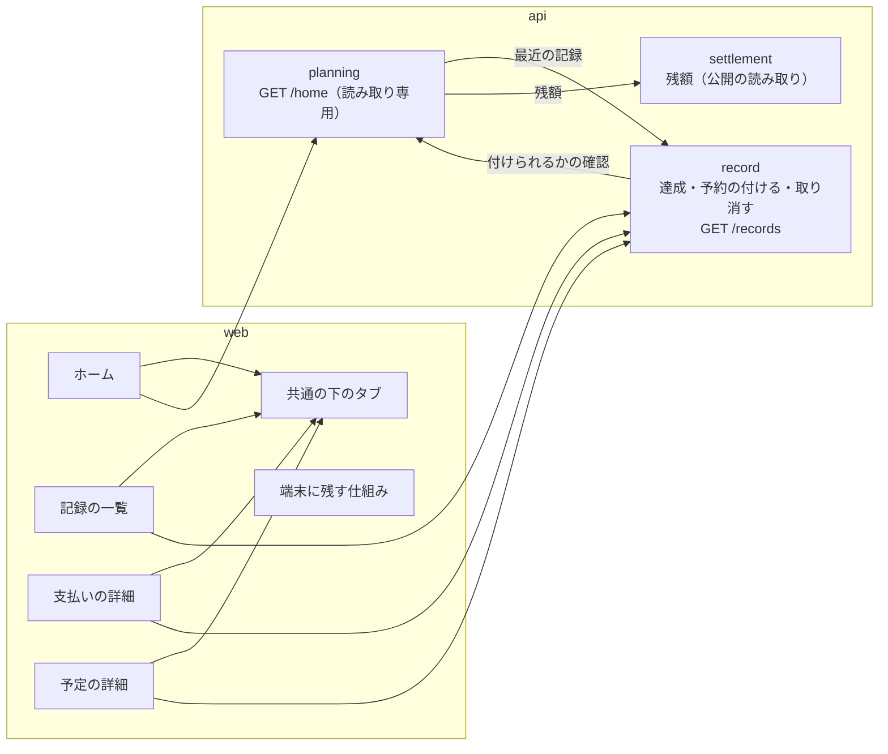
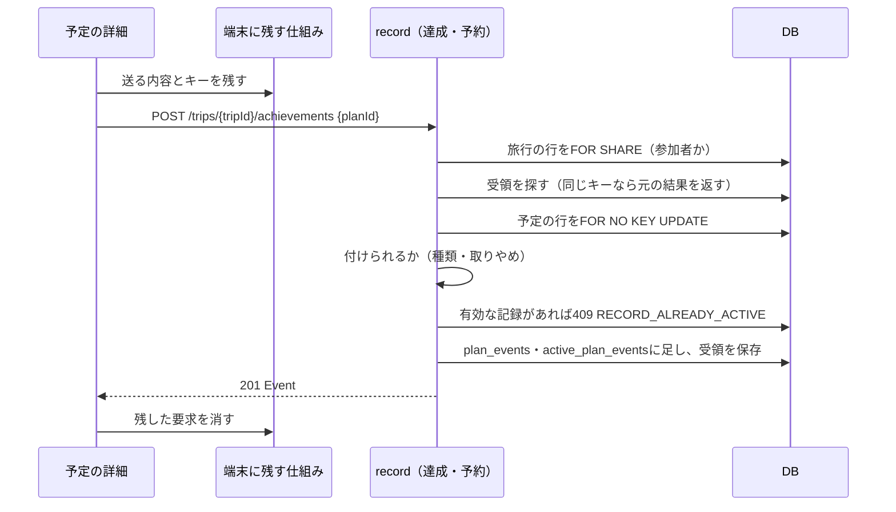

# 設計書: records-and-home（記録と4画面の完成）

- ステータス: draft（承認待ち）
- レベル: L3
- 関連: docs/requirements/records-and-home.md（PR #136で承認）、ADR-0003（DBのロールとmigration）、ADR-0004（webの取得状態とAPIの入力検証）、ADR-0006（結果不明の要求をIndexedDBに残す）、論点の記録 docs/discussions/records-and-home.md

## この設計を一言で

達成・予約の書き込みと記録の一覧はrecordモジュールに、ホームはplanningモジュールに読み取り専用の実装で足す。DBは表を足さず、達成・予約の表への書き込みの権限だけを足す。webは記録・ホーム・支払いの詳細の3画面と、共通の下のタブを足し、端末に残す仕組みを旅行・予定・達成・予約・支払いの取り消しに広げる。



## 背景

要件定義のとおり。支払い・精算の中核で作った書き込みの共通の流れ（旅行単位のロック・受領・ETag・エラー形式）と、端末に残す仕組み（ADR-0006）の上に、達成・予約・記録の一覧・ホームを作る。設計資料（詳細設計「予定・達成・予約」「旅行の作成・選択・開始／終了とホーム」「画面状態と入力操作」「フロントとバックのアーキテクチャ」）と、設計資料の契約（`openapi.planning.json`・`openapi.trips.json`）が、APIの形・ロックの順番・ホームの読み方まで決めている。この設計書は、それを今のコードのどこにどう置くかを決める。

## 目的

- 達成・予約を、決まり（同じ種類は1件だけ有効・取りやめた予定には達成できない・履歴があれば種類を変えられない）どおりに付けて取り消せる。
- 記録の一覧とホームを、1回の読み取りで同じ時点のデータから組み立てる。
- 4つの画面を共通の下のタブでつなぎ、保存できたか分からない要求を、今ある全部の書き込みで確かめ直せる。

## 要件

要件定義の機能要件（F-01〜F-73）、異常系（E-01〜E-12）、境界条件、受け入れ条件。この設計書でF-やE-の番号を引くときは、要件定義のその行を指す。

設計の工程で、要件に1つ足した（論点の記録「予定の詳細に関連する支払いを出すか」の答え）。

| ID   | 要件                                                                                                                                        |
| ---- | ------------------------------------------------------------------------------------------------------------------------------------------- |
| F-14 | 予定の詳細に、その予定に結びついた支払いを新しい順に最大3件と「記録で見る」（その予定で絞った記録の一覧）を出す。無ければ「まだありません」 |

用語（要件定義の「この文書の読み方」と同じ）:

- **有効な記録**は、取り消されていない達成・予約。DBでは`record.active_plan_events`に1行ある記録。
- **受領**（`infra.command_receipts`）は、同じ要求の再送を見分けるための保存の記録。同じキーで送り直すと、ここから元の結果を返す。
- **スナップショット**は、1つの読み取りのトランザクション（REPEATABLE READ・READ ONLY）の中で読んだデータ。その中のどのクエリも、トランザクションを始めた時点のデータを見る。

## 対象範囲

- API: 達成を付ける・取り消す、予約を付ける・取り消す、記録の一覧、ホーム（6つ）。
- DB: 達成・予約の表への書き込みの権限（migrationを1つ）。
- 画面: ホーム、記録の一覧（1件に絞った表示と、達成・予約の小さな詳細を含む）、支払いの詳細、取り消しの確認、予定の詳細の達成・予約のボタンと関連する支払い、受け渡しの確認の追加の案内と取り消しの了承、共通の下のタブ。
- 端末に残す仕組みを、旅行・予定・達成・予約・支払いの取り消しの保存に広げる。
- ログインのあと前回の旅行のホームを開く。

## 対象外

要件定義の「対象外」のとおり（通知、持ち物・思い出・電波がないときのしおり・ダークモード、精算の履歴を記録の一覧に混ぜること、予定の通常の編集の履歴、部分額の受け渡し、旅行の終了を戻す・削除・参加者の変更）。

## 現状構成

- DB: `record.plan_events`（達成・予約の履歴）、`record.plan_event_cancellations`（取り消し）、`record.active_plan_events`（有効な記録。予定と種類で1行）は作ってある。履歴の2表は追記だけ（UPDATE・DELETEを止めるトリガー）。アプリのDBユーザー（`app_runtime`）には3表とも読み取りの権限しかない（`apps/api/drizzle/0004_planning_record_infra_grants.sql`）。受領の種類には`plan_event`・`plan_event_cancellation`がもう入っている。
- API: `modules/planning`（旅行・予定。予定の書き込みは「旅行の行をFOR SHARE → 受領 → 予定の行をFOR NO KEY UPDATE」の順）、`modules/record`（支払いの記録・取得・取り消しと、planningが使う達成・予約の履歴の照会）、`modules/settlement`（残額・確認・精算）。モジュールどうしは`composition/`でポートの実装をつなぐ。
- web: `screens/`に画面、`features/`に機能ごとのapi・model・ui。下のタブは、しおりと精算の画面がそれぞれ`<nav className="tabbar">`を直に書いている。端末に残す仕組み（`shared/browser/pending-requests.ts`）は、送り直してよい経路を支払い・精算の5つに限っている。精算の完了は、了承した支払いの一覧を常に空で送っている。ログインのあとは前回の旅行のしおりを開く。
- 契約: `packages/contracts/openapi/{planning,trips,finance}.json`。達成・予約・記録の一覧・ホームはまだ無い。

## 変更後構成

```text
packages/contracts/openapi/
  planning.json   # 達成・予約・記録の一覧を足す（設計資料の openapi.planning.json から）
  trips.json      # ホームを足す（設計資料の openapi.trips.json から。Schedule に achievedCount を足す）
apps/api/drizzle/0008_plan_event_grants.sql      # 達成・予約の表への書き込みの権限
apps/api/src/modules/record/
  domain/plan-event.ts                           # 付けられるかの決まり（種類と予定の状態）
  usecase/{create,cancel}-plan-event.usecase.ts  # 達成と予約で共有。URLの種類を引数で受ける
  usecase/list-records.usecase.ts
  controller/{achievements,bookings,records}.controller.ts
  adapter/outbound/{plan-event.repository,plan-eligibility.port,records-read.port}.ts
  infrastructure/{drizzle-plan-event.repository,pg-records-read}.ts
apps/api/src/modules/planning/
  usecase/get-home.usecase.ts
  controller/home.controller.ts
  adapter/outbound/{home-records.port,home-balance.port}.ts
  infrastructure/pg-home-read.ts                 # REPEATABLE READ・READ ONLY とセーブポイント
apps/api/src/composition/                        # 上のポートを相手のモジュールの公開の読み取りにつなぐ
apps/web/src/
  app/trips/[tripId]/{home,records}/page.tsx
  app/trips/[tripId]/payments/[paymentId]/page.tsx
  screens/{home,records,payment-detail}/
  features/records/{api,model,ui}/
  features/trips/ui/trip-tab-bar.tsx             # 共通の下のタブと「支払いを記録」
  shared/browser/pending-requests.ts             # 送り直してよい経路を足す
```

## データフロー

### 達成・予約を付ける



ロックの順番は、予定の書き込み（種類の変更・取りやめ・期間の変更）と同じ「旅行 → 予定」。予定の行は、予定の書き込みと同じFOR NO KEY UPDATEで取る。同じ予定への達成と種類の変更は、この行のロックで一列に並ぶ。取り消しは「旅行の行をFOR SHARE → 受領 → 取り消す記録の予定の行をFOR NO KEY UPDATE → 取り消しを足し、有効な記録の行を消す」。お金のロック（旅行ごとの順番待ちの行）は取らないので、お金のロックと逆の順になる組み合わせは無い。

### 記録の一覧とホーム

記録の一覧は、支払い・支払いの取り消し・達成と予約・その取り消しの4つを、1つのSQL（UNION ALL）で並べる。並びは契約のとおり、登録日時の新しい順、同じ日時なら種類・IDの順にする。

種類を並びに含めるのは、取り消しの行のIDが元の記録と同じになるため（取り消しの表は元の記録のIDを主キーにしている）。元の記録とその取り消しが同じ日時でページの境目に来ても、日時とIDだけでは2行を見分けられず、次のページで片方を飛ばす。

続きの読み取りの位置（カーソル）は、最後の行の登録日時・種類・IDに、旅行のIDと絞り込みの条件を結びつけて符号にする。別の旅行や別の絞り込みのカーソルを渡されたら400にする（契約の「カーソルに旅行・フィルターを紐付ける」）。

ホームは、1つのREPEATABLE READ・READ ONLYのトランザクションで、旅行 → 予定の欄 → 精算の欄 → 最近の記録の順に読む。欄ごとにセーブポイントを置き、欄のクエリが回復できる誤り（タイムアウトなど）で失敗したら、セーブポイントまで戻してその欄を`unavailable`にする。旅行が読めない・接続が切れたときは、ホーム全体を401・403・404・503にする（E-07）。欄は順番に読み、同じ接続に並べて投げない。

## API 設計

設計資料の契約をそのまま`packages/contracts/openapi/`に取り込み、生成物（zod・webの型）を作り直す。変えるのはホームの予定の欄（`Schedule`）に`achievedCount`（達成済みの件数）を足すところだけ（F-44）。

| API                                                                                  | 置き場   | 要点                                                                                                                                      |
| ------------------------------------------------------------------------------------ | -------- | ----------------------------------------------------------------------------------------------------------------------------------------- |
| POST `/trips/{tripId}/achievements`・`/bookings`                                     | record   | 本文`{planId}`。Idempotency-Key必須。201で記録を返す。E-01〜E-03                                                                          |
| POST `/trips/{tripId}/achievements/{recordId}/cancel`・`/bookings/{recordId}/cancel` | record   | Idempotency-Key必須。URLの種類と記録の種類が違えば404（E-05）。同じ取り消しの再送は今ある取り消しを返す（F-05）                           |
| GET `/trips/{tripId}/records`                                                        | record   | `type`・`planId`・`cursor`・`limit`（既定20、最大100）・`recordId`。`recordId`は`type`が必須で、`cursor`・`limit`と一緒に使えない（E-06） |
| GET `/trips/{tripId}/home`                                                           | planning | 1回でホームの全部の欄を返す。`Cache-Control: private, no-store`                                                                           |

記録の一覧で`recordId`を指定したときは、元の記録とその取り消しの最大2件を返し、`nextCursor`は`null`。

## DB 設計

表は足さない。migration `0008_plan_event_grants.sql`で、`app_runtime`に次の権限を足す。

```sql
GRANT INSERT ON "record"."plan_events", "record"."plan_event_cancellations" TO app_runtime;
GRANT INSERT, DELETE ON "record"."active_plan_events" TO app_runtime;
```

履歴の2表は追記だけのまま（トリガーが今どおりUPDATE・DELETEを止める）。有効な記録の表は今の状態なので、取り消しのときに行を消す。主キー（予定と種類）が「同じ種類は1件だけ有効」をDBでも守る。

索引は今のもので足りる。記録の一覧の並びは`plan_events_timeline_idx`・`plan_event_cancellations_timeline_idx`・`payments_trip_created_idx`を使う。支払いの取り消しは旅行の索引（`payment_cancellations_trip_idx`）だけだが、1旅行で数百件なら並べ替えのコストは小さい。

## フロントエンド設計

### 画面と経路

| 画面                   | 経路                                                                        | 使うAPI                                                           |
| ---------------------- | --------------------------------------------------------------------------- | ----------------------------------------------------------------- |
| ホーム                 | `/trips/{tripId}/home`                                                      | getHome                                                           |
| 記録の一覧             | `/trips/{tripId}/records`（`?type=`・`?planId=`・`?recordId=&recordType=`） | listRecords                                                       |
| 支払いの詳細           | `/trips/{tripId}/payments/{paymentId}`                                      | getPayment・cancelPayment                                         |
| 予定の詳細（足す部分） | 今の`/trips/{tripId}/plans/{planId}`                                        | createAchievement・createBooking・listRecords（支払い・その予定） |

### 記録の一覧

- 行を押すと中身を開く（論点の記録「記録の一覧で、取り消しをどこから始めるか」の答え）。支払いの行は支払いの詳細のページへ。達成・予約の行は、今ある`shared/ui/sheet.tsx`で下から小さな詳細を出す（予定の名前・誰がいつ記録したか・「予定を開く」・「取り消す」）。取り消しの行は、元の記録の中身を開く。
- 取り消しの確認は、v3の取り消しの確認のダイアログ（`shared/ui/dialog.tsx`）。支払いでは「精算額が変わる場合があり、精算済みの分は次回の調整になる」も出す（F-25）。
- 取り消しは1行として、取り消した日時の位置に出す（「〇〇を取り消し・あおい」）。元の行は線で消して「取り消し済み」を付ける（F-20・F-24）。
- 絞り込みは「すべて・支払い・達成・予約」。狭い画面では横にずらして見る（仮決定）。
- 読み足しは、一覧の末尾が画面に入ったとき（IntersectionObserver）。失敗したら末尾に「もう一度読む」を出し、出ている行は残す（F-22）。

### ホーム

- 表示の種類（出発前・期間中・期間が過ぎた・終了後）はAPIの`context`をそのまま使い、画面では日付から計算し直さない。
- 欄ごとに、取得の失敗（`unavailable`）を出す。精算額が取れないときは「精算額を取得できませんでした」と出し、0円にしない（F-48）。
- 期間が過ぎたとき（v3に無い）は、精算の欄の上にお知らせの帯を出す。旅行中なら「旅行を終了する」、計画中なら「旅行を開始してから終了する」の案内とボタン（F-43）。見本は承認を頼むときのページに載せる。

### 支払いの詳細（v3に無い）

用途・金額・払った人・二人の割合と負担額・関連する予定・誰がいつ記録したか・取り消し状態を、支払いを記録の画面と同じ部品で読み取り専用に出す。下に「取り消す」。取り消したあとは「正しい内容で支払いを記録」を出し、取り消した内容を入れた支払いを記録の画面へ進む（F-32）。見本は承認を頼むときのページに載せる。

### 受け渡しの確認

- 追加の案内（F-60）: 確認を作ったあとに追加された支払いの件数は、残額のAPIの対象の一覧（`items`）のうち、確認の明細に無い支払いを数えて出す。確認のAPIは件数を返さないが、契約を変えずに済む（要件の制約は、契約を変えるのをホームの`achievedCount`だけにしている）。
  - 案内を出すのは、確認の`validation.status`が`ready`か`cancelled_items_ack_required`のときだけ。この2つの状態では、確認を作ったあとに精算が1つも済んでいない。精算は未精算の対象を全部含むので、確認のあとに精算が済めば確認の明細の指紋が変わり、状態は`target_changed`か`already_completed`になる（`preview-validation.ts`）。そのため、この2つの状態で数えた件数は、確認のあとに追加された支払いの全部と一致する。案内の文も「次回の精算に含まれます」なので、数えるのは次の精算の対象になる追加分でよい。
  - 対象が0件の確認は作れない（確認を作るAPIが対象0件を断る。`create-preview.usecase.ts`）ので、明細が空の確認で数えることは無い。
- 取り消しの了承（F-61〜F-63）: 確認の`validation.status`が`cancelled_items_ack_required`のとき、取り消された明細（`cancelledPaymentIds`）を出す。まだ受け渡していなければ「最新の残額で確認を作り直す」、全額受け渡し済みなら明細ごとの了承のチェックと「了承して記録する」。完了には了承した支払いの一覧を送る。確認を取り直して取り消しの一覧が変わったら、了承のチェックを外す。見本は承認を頼むときのページに載せる。

### 共通の下のタブ

`features/trips/ui/trip-tab-bar.tsx`に、ホーム・しおり・記録・精算の4つのタブと「支払いを記録」をまとめ、しおり・精算・ホーム・記録・予定の詳細・支払いの詳細で使う。今の画面ごとの`<nav>`は消す。ホームから「支払いを記録」を開くときは、関連する予定を選ばない（F-49）。

### 端末に残す仕組みの広げ方

`ALLOWED_PATHS`に、旅行（作成・名前の変更・期間の変更・開始・終了）、予定（追加・編集・日の移動・取りやめ）、達成・予約（付ける・取り消す）の経路を足す。

旅行の作成だけは、送る時点で旅行のIDが無く、送り先も`/api/trips`なので、今の確かめ方（経路が`/api/trips/{残した要求の旅行のID}/`で始まること）に合わない。旅行の作成の要求は、旅行のIDの代わりに決まった値（`new-trip`）を入れて残し、その値のときだけ送り先が`/api/trips`ちょうどであることを確かめる。旅行の作成の画面は、同じ利用者の`new-trip`の要求を探す。旅行のIDの欄に入れる値を1つ足すだけで、保存の形は変えない。支払いの取り消しはもう入っている。送り直しの確認（`use-pending-request-check.ts`）は、その操作の画面ごとに、同じ旅行・同じ操作の要求だけを探す（F-71）。保存の形は変えないので、すでに残っている要求も読める。

### ログインのあと

前回の旅行があれば`/trips/{tripId}/home`を開く（今はしおり。F-50）。

## バックエンド設計

### モジュールの置き場

設計資料「フロントとバックのアーキテクチャ」は、recordがplanningの条件を参照し、settlementがrecordの支払いを参照するとしている。それに合わせて次のように置く。

- 達成・予約の書き込みはrecord。予定が付けられる状態かは、record側の`PlanEligibilityPort`（予定の種類・取りやめ・旅行の所属）で聞き、compositionでplanningの読み取りにつなぐ。予定の行のロックも、このポートの実装が同じトランザクションの中で取る。
- 記録の一覧はrecordの読み取り専用の実装（`pg-records-read.ts`）。支払いもrecordの表なので、モジュールをまたがない。
- ホームはplanning。設計資料の契約でも`getHome`は旅行の側にある。最近の記録はplanning側の`HomeRecordsPort`を、精算の欄は`HomeBalancePort`を通して読み、compositionでrecordの記録の一覧と、settlementの残額の計算につなぐ。ホーム専用の金額の計算式は作らない。

planning → record → planningの循環は、今の予定の履歴の照会と同じく、消費する側のポートと、UseCaseに依存しない読み取りの実装をcompositionでつないで避ける（`forwardRef`は使わない）。

### 決まりの置き場

`domain/plan-event.ts`に、種類ごとに付けられる予定の種類（達成は場所・食べ処・買い物、予約は食べ処・宿・移動）と、取りやめた予定への可否（達成は不可、予約は可）を置く。UseCaseは、予定の行のロックを持ったまま決まりを確かめ、有効な記録の行の有無を見てから足す。DBの主キーとぶつかった（別の接続が先に足した）ときも409 RECORD_ALREADY_ACTIVEにする。

## エラー処理

要件定義の異常系の表のとおり。今の`ApiError`と`ApiErrorFilter`のコードを使う。

| 場面                                      | 応答                                              |
| ----------------------------------------- | ------------------------------------------------- |
| 取りやめた予定に達成                      | 409 PLAN_CANCELLED                                |
| 付けられない種類                          | 409 PLAN_KIND_NOT_SUPPORTED                       |
| 有効な記録がもうある                      | 409 RECORD_ALREADY_ACTIVE（IDを返すかは回答待ち） |
| URLと種類が違う・別の旅行の記録・無い記録 | 404 RECORD_NOT_FOUND                              |
| 記録の一覧の条件の組み合わせが違う        | 400                                               |
| ホームの欄だけ失敗                        | 200で、その欄を`unavailable`                      |

webは、409を受けたら予定と記録を取り直して、付けられる操作だけを出す（E-01〜E-03）。RECORD_ALREADY_ACTIVEのときは、もう一度付けるように促さない（F-13）。

RECORD_ALREADY_ACTIVEで今ある記録のIDを返すかは、論点の記録の「回答待ち」（「もう有効な記録がある」と返すとき、今ある記録のIDを返すか）で決める。どちらでも、webは予定を取り直して画面をその記録に合わせる（F-13）。

## ログと監視

今の書き込みログ（`WriteLog`）に、達成・予約の付ける・取り消すを足す。記録の内容は出さず、旅行のID・操作・結果だけ。ホームの欄の失敗は、欄の名前と誤りの種類をwarnで出す。

## セキュリティ

- すべてのAPIで、セッションと旅行の参加者を確かめる（今のガードと、旅行の行のロックの中での参加者の確認）。
- 記録の一覧とホームのクエリは、確かめた旅行のIDで必ず絞る。別の旅行の記録のIDは404にし、あるかどうかを漏らさない。
- 書き込みはOriginの確認とIdempotency-Keyを必須にする（今のガード）。
- DBの権限は、達成・予約の表に要るものだけを足す。履歴の表のUPDATE・DELETEは足さない。
- 端末に残す仕組みは、許した経路だけを送り直す。経路の旅行のIDと、残した要求の旅行のIDが合わなければ送らない（今どおり）。

## 性能

記録の一覧は1回20件（契約の既定）。1旅行で数百件、ホームは小さなクエリ4つなので、どちらも1秒以内に返る見込み。APIの試験で、支払い200件・達成と予約200件の旅行の記録の一覧とホームの時間を測って確かめる。

## テスト方針

試験計画（`docs/tests/records-and-home.md`）で観点を決める。大きな分け方は次のとおり。

- 単体: 付けられるかの決まり、記録の一覧のカーソルの符号（同じ日時の元の記録と取り消しがページの境目に来ても飛ばさない、別の旅行・絞り込みのカーソルを断る）、ホームの表示の種類と予定の欄の並び、追加の件数の数え方、送り直してよい経路の判定。
- 実DBのAPIの試験: 達成・予約の付ける・取り消す・再送・付け直し・古い取り消しの再送、種類の変更と達成・取りやめと達成を2つの接続で同時に送る試験、記録の一覧の並び・絞り込み・1件に絞る表示、ホームの4つの表示の種類と欄ごとの失敗、権限（第三者・別の旅行）。
- 画面の試験（Vitest・Testing Library）: 行を押したときの中身、取り消しの確認、欄ごとの失敗、了承のチェック。
- E2E（要件で決めた4つ）: ホームから達成を付けて記録の一覧で取り消す、旅行を終えたあとの精算、確認のあとに支払いを取り消したときの了承、再読み込みをまたいだ送り直し。

## 移行とリリース

- migrationは権限の`GRANT`だけ。戻すときは`REVOKE`で戻せる（本番のデータが無いうちに限らない）。
- 端末に残す仕組みの保存の形は変えない。
- ログインのあとに開く画面が、しおりからホームに変わる。

## リスク

| リスク                                                                                      | 備え                                                                                                                                 |
| ------------------------------------------------------------------------------------------- | ------------------------------------------------------------------------------------------------------------------------------------ |
| 下のタブを共通にすると、しおりと精算の画面の試験が崩れる                                    | タブを共通にするのを1つのPRにまとめ、しおり・精算の画面の試験とE2Eを同じPRで直す                                                     |
| 記録の一覧のUNION ALLが、支払いと達成・予約で列の形が違って複雑になる                       | 一覧の行は「種類・ID・登録日時・誰が・予定のID・元の記録のID」だけを1つ目のクエリで並べ、中身は種類ごとに2つ目のクエリでまとめて読む |
| ホームのセーブポイントの扱いを間違えると、1つの欄の失敗でトランザクション全体が使えなくなる | 欄の失敗を起こす試験（クエリを失敗させる偽の実装）で、ほかの欄が返ることを確かめる                                                   |
| 達成・予約の取り消しと付け直しを繰り返したあとの、古い取り消しの再送                        | 受領で元の結果を返すので、新しい記録を消さない。実DBの試験で確かめる                                                                 |

## 決めたこと（問いと答え）

`docs/discussions/records-and-home.md`

## 未決事項

論点の記録の「回答待ち」1件（「もう有効な記録がある」と返すとき、今ある記録のIDを返すか）。PR #139のレビューで、要件定義書と契約の制約の食い違いとして指摘された。答えを受けて、この設計書と、必要なら要件定義書・契約の取り込みを直す。

論点の記録の「仮決定」1件（記録の一覧の絞り込みが狭い画面で収まらないとき）は、この設計書の承認（PRのマージ）までに異議が無ければ決定にする。「後の工程へ」1件（達成・予約を相手に知らせるか）は、通知を作る回で扱う。
