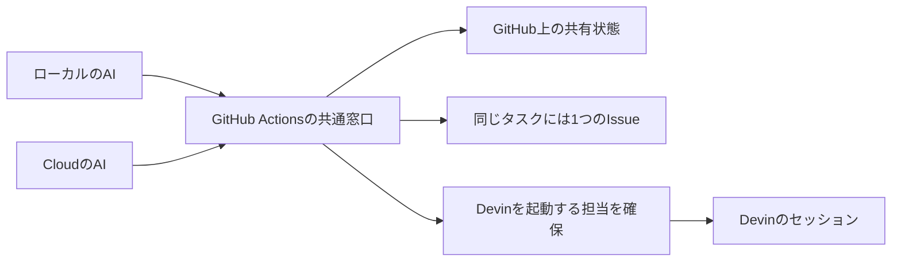

# 論点の記録: 委譲の重複防止と最終版のレビュー確認

- 機能名: delegation-review-reliability
- 確認のページ: （まだ無い）
- 進み具合: docs/discussions/delegation-review-reliability.progress.json

## 背景

ローカルとCloudで同じ範囲のIssueが作られ、Devinが同じものを2回実装した。直近12件のDevin作成PRでは、Codexの完了記録があったのは手動依頼した1件だけで、レビュー対象と最終コミットも異なっていた。委譲の状態をGitHubで共有し、最終版のレビューを確認する仕組みを設計する。

## 前提

- 変更レベルはL3。GitHubとの連携、委譲状態の正本、レビューの判定を変える。AGENTS.mdに従い、設計の承認後に実装する。
- 初回の対象は、起票と委譲の重複防止、Codexレビューの起動・完了・最終コミットの確認。後続Issueの完全自動起動とMerge Queueは後の改善にする。
- マージはユーザーが判断する。GitHub上の共有状態は、個々のAIの一時的な作業状態を保存するものではない。
- 根拠となる調査はlogs/2026-10-09.md。元の作業場所にある他の作業の委譲記録には触れない。
- このブラウザはChatGPTに未ログインで、実際のCodexレビュー設定は確認できていない。Devin作成PRの手動依頼の成功と、人のアカウントが作ったPRの自動レビューはGitHubの記録で確認できている。
- mainのルールセットProtect-mainは有効。必須チェックはquality・build・api-dbで、レビューを判定するチェックはまだ無い。2026-10-09にAPIで読み取った。

## 論点

### 最終版のレビューが揃わないPRは通常のマージを止めるか

<!-- id: required-review-gate -->

- 工程: 要件
- 種類: アプリの決まり
- 優先度: 高
- 状態: 決定
- なぜ今: レビューが未完了、古いコミットまでしか確認していない、または指摘が残るときの受け入れ条件が変わる。
- 根拠: logs/2026-10-09.md「PR #159のレビュー対象と最終head」、AGENTS.md「人が止まって判断するゲート」、GitHubのProtect-mainの必須チェック。
- 選択肢:
  - A) 必要なレビューとCIが揃うまで、必須チェックで通常のマージを止める
    - 利点: 未確認の版を、レビュー済みとしてマージすることを防げる。
    - 欠点: レビューのサービスが使えない間は、通常のマージも待つ必要がある。
  - B) 未完了の状態を表示し、マージするかはユーザーが毎回判断する
    - 利点: レビューのサービスが使えないときも作業を進められる。
    - 欠点: 状態の見落としを仕組みだけでは防げない。
- 推奨: A（今回の品質保証の目的を受け入れ条件として固定できるため）
- 決定: A
- 推奨と同じか: 同じ
- 理由:
- 選ばなかった理由: B（毎回の見落としを防ぐため、状態を表示するだけではなく必須チェックにする）
- 反映先: docs/requirements/delegation-review-reliability.md「受け入れ条件」、docs/designs/delegation-review-reliability.md「レビューの判定」
- 決めた日: 2026-10-09

### Issueの作成とDevinへの委譲受付を共通の窓口に集約するか

<!-- id: single-delegation-entry -->

- 工程: 設計
- 種類: 設計
- 優先度: 高
- 状態: 決定
- なぜ今: ローカルとCloudが直接作成する経路を残すかで、排他の保証範囲と既存CLIへの接続方法が変わる。
- 根拠: logs/2026-10-08.md「Issue #170・#172の重複」、.claude/skills/review-devin-pr/SKILL.md「委譲」のgh issue createとDevinの起動。
- 選択肢:
  - A) GitHub Actionsの共通窓口に起票と委譲受付を集約する
    - 利点: ローカルとCloudからの同じ要求を、共通の排他と記録で扱える。
    - 欠点: 今の直接起票と起動の手順を、新しい受付に合わせる必要がある。
  - B) 直接作成も残し、重複を検知して知らせる
    - 利点: 今の起票と起動の手順をそのまま使える。
    - 欠点: 検知した時点でIssueやセッションが2つ作られている場合がある。
- 推奨: A（起票前の検索だけでは防げない、同時の要求を扱うため）
- 決定: A
- 推奨と同じか: 同じ
- 理由:
- 選ばなかった理由: B（作成後の検知では二重のIssueとセッションが残るため、入口から集約する）
- 反映先: docs/designs/delegation-review-reliability.md「共通窓口と起票・起動の流れ」
- 決めた日: 2026-10-09

### 共有する状態をGitHubのどこに保存するか

<!-- id: shared-state-store -->

- 工程: 設計
- 種類: 設計
- 優先度: 高
- 状態: 決定
- なぜ今: 状態の保存先を決めると、Actionsに必要な権限、更新競合を防ぐ方法、状態を読む方法が決まる。
- 根拠: .claude/scripts/delegation.mjs「記録の正と写し」、docs/designs/devin-delegation-status.md。
- 選択肢:
  - A) 固定の管理用Issueのbotコメントに集約し、Actionsだけが更新する
    - 利点: GitHubの画面から読め、状態用のブランチを増やさずに導入できる。
    - 欠点: 更新の排他をActionsに依存し、コメントの編集・削除を検出して止める扱いが必要になる。
  - B) 専用ブランチにタスクごとのJSONを保存する
    - 利点: 先に更新したコミットを親としてrefを更新することで、同時更新の競合を検出できる。
    - 欠点: contentsへの書き込み権限と、状態用のブランチの初期化・履歴の運用が増える。
- 推奨: A（現在の7PR程度の規模では、画面から読めることと導入の小ささを優先するため）
- 決定: A
- 推奨と同じか: 同じ
- 理由:
- 選ばなかった理由: B（現在の規模では、状態用のブランチとcontentsへの書き込み権限の運用を増やさずに導入するため）
- 反映先: docs/designs/delegation-review-reliability.md「共有状態の保存先」
- 決めた日: 2026-10-09

### レビュー完了の証拠を誰から受け取るか

<!-- id: trusted-review-evidence -->

- 工程: 設計
- 種類: 設計
- 優先度: 中
- 状態: 仮決定
- なぜ今: コメントの印だけを読むと、書いた人や対象コミットを確かめられない。レビュー判定を作るときに、信頼する作者と対象SHAを決める。
- 根拠: .claude/scripts/wait-for-devin-pr.mjsのhasReviewMarker、.claude/skills/review-devin-pr/SKILL.md「レビュー完了のコメント」、PR #159のCodex Review Summary。
- 選択肢:
  - A) 現在レビューに使うGitHubアカウントとCodexのbotを、固定した作者IDで確かめる
    - 利点: 現在のレビューの担当を保ち、別の作者が書いた印を完了証拠にしない。
    - 欠点: レビューに使うアカウントを変えたら、設定の更新が必要になる。
  - B) コメントの印と本文だけで判断する
    - 利点: 既存のコメントをそのまま読みやすい。
    - 欠点: 別の作者が書いた印や引用を、レビュー完了と取り違える可能性がある。
- 推奨: A（コメントの印だけを信頼する判定を、必須チェックに持ち込まないため）

### タスクのキーを波の組み替えで変わらない形にするか

<!-- id: stable-task-key -->

- 工程: 設計
- 種類: API
- 優先度: 中
- 状態: 仮決定
- なぜ今: 同じ仕事を識別するキーが変わると、起票と起動の重複防止が効かなくなる。
- 根拠: docs/implementation-plans/push-notifications.md「委譲は4つの波」、ユーザーのtask_keyの提案。
- 選択肢:
  - A) 機能名と安定したタスク名をキーにし、波と計画の版を別に持つ
    - 利点: 波を組み替えても、同じ仕事として照合できる。
    - 欠点: 実装計画に、変えないタスク名を付ける必要がある。
  - B) 波の番号をキーに含める
    - 利点: 今の実装計画の波からキーを作りやすい。
    - 欠点: 波を組み替えると、同じ仕事が新しいタスクとして扱われる。
- 推奨: A（同じ要求を再送したときの識別を、計画の並び方から切り離せるため）

### 起動結果が不明のときは新しいセッションを自動で作るか

<!-- id: ambiguous-launch-result -->

- 工程: 設計
- 種類: API
- 優先度: 中
- 状態: 仮決定
- なぜ今: 起動の要求が届いたあとに応答だけを失うと、再試行で二重に起動する可能性がある。
- 根拠: ユーザーの重複防止の提案、.claude/skills/review-devin-pr/SKILL.md「止まっていないかの見張り」。
- 選択肢:
  - A) 結果不明として止め、既存セッションを照合してから再試行する
    - 利点: 応答を失ったときに、同じ仕事を二重に始めない。
    - 欠点: セッションを照合できないときは、ユーザーの判断を待つ。
  - B) 応答が無ければ自動で起動し直す
    - 利点: 一時的な失敗から早く再開できる。
    - 欠点: 最初の起動が成功していると、同じ仕事を二重に始める。
- 推奨: A（起動側に同じ要求を一度だけ処理する保証が確認できるまで、二重開発を避けるため）

### 初回は共有の受付を経て、既存のCLIからDevinを起動するか

<!-- id: launch-integration-scope -->

- 工程: 設計
- 種類: 設計
- 優先度: 中
- 状態: 仮決定
- なぜ今: 二重起動を防ぐ受付と、Devinを実際に起動する処理の分担を決める。
- 根拠: .claude/skills/review-devin-pr/SKILL.md「委譲」、ユーザーの完全自動起動は後にする提案。
- 選択肢:
  - A) 共通窓口で担当を確保し、その担当のラッパーから既存CLIを1回だけ起動する
    - 利点: 現在のCLIを使い、DevinのAPI認証を追加せずに導入できる。
    - 欠点: 担当を確保したあとに呼び出し元が終了すると、起動したかの照合待ちが残る。
  - B) 明示した起動要求をActionsからDevinのAPIへ送る
    - 利点: 受付と起動の間の手渡しを減らせる。
    - 欠点: DevinのAPI認証と起動の仕組みを追加し、実環境での可用性も確認する必要がある。
- 推奨: A（初回は現在の開発体験を保ち、結果不明を止めて照合する扱いで重複を防ぐため）

## 設計に引き継ぐ調査

- 保存先の比較は、GitHubの[REST APIの推奨事項](https://docs.github.com/en/rest/using-the-rest-api/best-practices-for-using-the-rest-api)と[Git refの更新](https://docs.github.com/en/rest/git/refs)を根拠にする。Issueの本文やコメントに条件付きの書き込みを付ければ、更新競合を防げるとは扱わない。専用ブランチの案では、読んだコミットを親にして、forceを使わずrefを更新する。
- Actionsの[concurrency](https://docs.github.com/en/actions/how-tos/write-workflows/choose-when-workflows-run/control-workflow-concurrency)にはqueueの設定がある。既定では保留中の実行が置き換えられる。管理用Issueの案では、受付の要求を消えない記録として残し、短い更新だけを直列に処理する。Devinが実装している間は、Actionsの実行を占有しない。
- [Devinのセッション作成API](https://docs.devin.ai/api-reference/v3/sessions/post-organizations-sessions)は、tags・title・session_linksとセッションIDを提供する。ただし、確認した資料では起動要求の冪等性を保証していない。API方式でも、結果不明の要求をそのまま起動し直せるとは扱わない。
- Claudeの新しいレビュー証拠は、信頼する作者、完全なSHA、判定、元のコメントかレビューのURLを含める。現在の短いSHAやコメントの印だけを、新しい必須チェックの成功証拠にしない。
- Codexは指摘なしで完了した回も数える。依頼のコメントや開始の反応だけでは完了としない。完了のコメントに短いSHAしか無いときは、完全なSHAを一意に照合できる証拠が要る。
- CIのSHAとPRのheadは単純比較しない。現行CIはpull_requestのmerge refをチェックアウトする。レビュー対象はPRのhead、CIはそのheadに対応するPRのチェックとして確かめる。
- レビューの判定チェック自身を、CIの「全件成功」の対象に含めない。自己依存で完了できなくなるため。
- Actionsのbotから投稿したレビュー依頼がCodexを起動できるかは未確認。ユーザーの手動依頼の成功を、その保証として扱わない。
- 導入時は、現在進行中のIssueとセッションを先に共有状態へ登録する。記録が無いという理由だけで、同じ実装計画のタスクを新しく起票しない。
- 必須チェックをGitHubのルールセットに足すのは、実装のマージと動作確認のあとにする。まだ使えないチェックを先に必須にして、導入自体を止めない。
