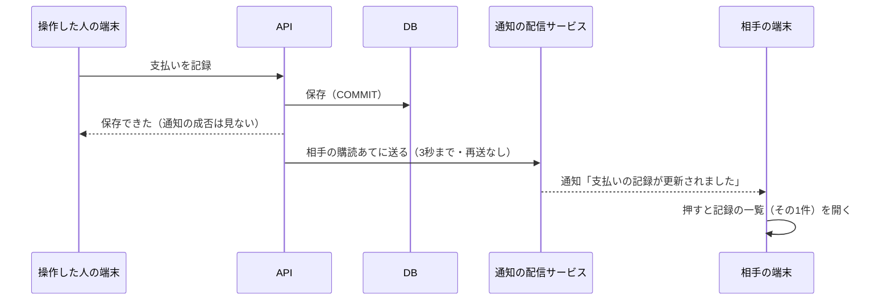

# 論点の記録: 相手の操作を知らせる通知

- 機能名: push-notifications
- 確認のページ: https://claude.ai/artifact/HA4jgAQqUCRtki6Q6ifhGQ
- 進み具合: docs/discussions/push-notifications.progress.json
- v3の版: 9db5634a

## 背景

記録と4画面ができたので、設計資料（docs/旅行アプリ設計 3）の作る順番で次にあたる「通知」に入る。
相手が予定を足したり支払いを記録したりしたとき、アプリを開いていなくても、自分のスマートフォンに通知が届くようにする。
詳細設計「Web Push通知」に、方式・DB・API・送る操作・通知から開く画面・ログアウトのときの止め方まで書いてある。ただ、通知の設定の画面はv3の画面一式に無く（第4弾の予定）、精算の通知から開く画面もまだ無い。
要件定義書を書く前に、設計資料だけでは決まらないことと、今のアプリと食い違うところを聞く。

## 前提

- 通知の方式は設計資料のとおり、ブラウザ標準のWeb Push（Service Workerが受け取り、APIがVAPIDの鍵で署名して送る）にする。有料の通知サービスは使わない。
- 通知する操作は、設計資料の合意どおり11種類（予定の追加・取りやめ・日の移動、達成・予約・支払いの記録と取り消し、精算の完了と取り消し）。名前やメモの編集、旅行の作成・開始・終了は通知しない。
- 通知は保存が済んだあとに送る。届かないことは許し、再送はしない。通知に失敗しても、保存した操作は成功のまま返す。
- 通知は操作した人の相手にだけ送る。操作した人の別の端末には送らない。
- ロック画面に金額・場所・予定名は出さない。
- 記録を1件に絞って開くURLは、今の記録の一覧にある`?recordType=&recordId=`を使う（設計資料の案は`?type=`だが、記録と4画面で`recordType`にした）。
- 電波がないときのしおり（Service Workerでの画面の保存）は今回は作らない。Service Workerは通知のためだけに置く。
- 公開用の環境（Vercel・Neon）はまだ無い。iPhoneのWeb Pushは、HTTPSで公開したアプリをホーム画面に追加したときだけ使える。

## 論点

### 今回どこまで作るか

<!-- id: scope -->

- 工程: 要件
- 種類: 設計
- 優先度: 高
- 状態: 回答待ち
- なぜ今: どこまで作るかで、要件定義書の大きさと、Devinに渡すIssueの数が変わる。
- 根拠: 詳細設計「Web Push通知」の10節は、VAPIDの鍵をkeyIdで管理し、入れ替えるときは古い鍵を移行の期間だけ残して購読ごとに使い分ける案を書いている。秘密鍵が漏れたときは古い鍵を止め、利用者に登録し直してもらうとも書いている。実装順序（詳細設計10）の通知の回は、Service Worker・購読API・VAPID・保存後の送信・ログアウトで止める仕組み・通知から開く画面を挙げている。
- 選択肢:
  - A) 設計資料のとおり全部（購読の登録・一覧・停止のAPI、通知の設定の画面、Service Workerとホーム画面に追加するための設定、11種類の操作の保存後の送信、ログアウトで止める仕組み、通知から開く画面、古い鍵を残して使い分ける鍵の入れ替え）
    - 利点: 設計資料の範囲を一度に終えられる
    - 欠点: 鍵の入れ替えは二人で使うあいだほぼ起きず、そのための作りと試験が増える
  - B) Aから「古い鍵を残して使い分ける」を外し、使う鍵は1つにする（購読にkeyIdは記録し、鍵を変えたら登録し直してもらう）
    - 利点: 送る処理が鍵を選ばずに済み、今回が小さくなる。漏れたときの手順は設計資料と同じ
    - 欠点: 鍵を変えると、二人とも通知の設定から登録し直す手間がかかる
  - C) 2回に分ける（先に購読・設定の画面・送信・通知から開く画面、後でログアウトで止める仕組みと鍵の入れ替え）
    - 利点: 1回のレビューが小さくなる
    - 欠点: 先の回のあいだは、ログアウトした端末にも通知が届き続ける
- 推奨: B（鍵を変えるのは漏れたときくらいで、そのときは設計資料でも登録し直しになる。ログアウトで止める仕組みは、ログアウトした端末に届かないために同じ回で要る）

### iPhone・Androidの実機で通知を確かめるのはいつか

<!-- id: device-check -->

- 工程: 要件
- 種類: 設計
- 優先度: 高
- 状態: 回答待ち
- なぜ今: 実機で確かめるところまでを今回の完了条件に入れるかで、公開用の環境を今回作るかが決まる。
- 根拠: iPhoneのWeb Pushは、HTTPSで公開したアプリをホーム画面に追加したときだけ使える（詳細設計「Web Push通知」1節）。手元のPCのChrome（localhost）なら、HTTPSでなくても通知を受け取れる。実装順序（詳細設計10）は、実機と通知の確認を次の「結合検証の環境」の回に置き、小さな結合検証を前倒ししてもよいとしている。
- 選択肢:
  - A) 今回は手元のPCのChromeで、登録・受け取り・押して開くまでを確かめる。iPhone・Androidの実機は結合検証の環境を作る回で確かめ、`docs/tests/final-acceptance.md`に行を足す
    - 利点: 今回は公開用の環境を作らずに済む
    - 欠点: iPhoneのホーム画面に追加したアプリでの動きは、次の回まで分からない
  - B) 今回、小さな結合検証の環境（Vercel・Neonの試験用）を前倒しで作り、実機で確かめてから締める
    - 利点: iPhoneでの動きを今回のうちに確かめられる
    - 欠点: 環境づくり（Vercel・Neon・Googleログインの設定）はユーザーの操作と判断が要り、今回が大きくなる
  - C) 手元のPCをトンネル（ngrokなど）でHTTPSにして、スマートフォンから確かめる
    - 利点: 公開用の環境を作らずに実機で試せる
    - 欠点: 外部のサービスを通すうえ、Googleログインの戻り先とCookieの設定を一時的に変える必要がある
- 推奨: A（作る順番どおり、実機の確認は環境を作る回にまとめる。手元のChromeでも、送る・受け取る・押して開くの流れは確かめられる）

### 通知の設定の画面を、どこから開くか

<!-- id: settings-entry -->

- 工程: 要件
- 種類: 画面
- 優先度: 高
- 状態: 回答待ち
- 画面: v3 16, v3 03
- なぜ今: 入口の置き場所で、手を入れる画面と、設定の画面の見本の描き方が変わる。
- 根拠: 詳細設計「画面状態と入力操作」は通知の設定を`/settings/notifications`としているが、そこへの入口を書いていない。v3の画面一式は通知の設定を「第4弾」に回していて、画面が無い。今のアプリで設定に近い操作は、ホームの右上「…」から開く旅行のメニュー（旅行の開始・終了、ログアウト）だけ。
- 選択肢:
  - A) 旅行のメニュー（右上の「…」）に「この端末の通知」の行を足し、設定の画面を開く
    - 利点: ログアウトと同じ場所にまとまり、新しいボタンを画面に増やさない
    - 欠点: 旅行のメニューに、旅行と関係ない行が増える
  - B) 旅行一覧の画面の上部に「設定」を置き、そこから開く
    - 利点: 旅行と関係ない設定を、旅行の外に置ける
    - 欠点: 旅行一覧は「切り替え」から開く画面で、ふだん通らない
- 推奨: A（ログアウトも同じメニューにあり、二人が迷わない。設定の画面の見本は、設計の承認を頼むときにv3の部品で描いて見せる）

### 通知を有効にするよう、アプリから勧めるか

<!-- id: prompt-card -->

- 工程: 要件
- 種類: 画面
- 優先度: 高
- 状態: 回答待ち
- 画面: v3 03
- なぜ今: 勧めないと、設定の画面を開かない限り通知が届かない。勧める場合はホームに手を入れる。
- 根拠: 設計方針の合意事項（2026-09-05「アプリを開いていない間の通知」）は、iPhoneのホーム画面への追加と通知の許可を「初回設定の導線」に含めることを推奨している。詳細設計「Web Push通知」2節は、許可を求めるのは本人が押したときだけで、断られたら毎回は聞かないとしている。
- 選択肢:
  - A) この端末で通知が有効でなければ、ホームの上部に案内のカード（「通知を有効にする」と「閉じる」）を出す。閉じたらその端末では出さない
    - 利点: 二人とも設定の画面を探さずに有効にできる
    - 欠点: ホームに1枚カードが増え、閉じた記録を端末に持つ
  - B) 勧めない。設定の画面からだけ有効にする
    - 利点: ホームを変えずに済む
    - 欠点: 片方が設定を開き忘れると、その人には届かない
- 推奨: A（二人のどちらかが有効にし忘れると通知の意味が薄れる。許可を求めるのはカードを押したときなので、設計資料の決まりと合う）

### 通知の本文に、相手の名前や旅行の名前を入れるか

<!-- id: body-text -->

- 工程: 要件
- 種類: アプリの決まり
- 優先度: 高
- 状態: 回答待ち
- なぜ今: 名前を入れると、通知に載せる中身（payload）と、ロック画面に出してよいものの決まりが変わる。
- 根拠: 詳細設計「Web Push通知」9節の文面案は「予定が追加されました」「支払いの記録が更新されました」「精算の記録が更新されました」で、payloadには操作の種類とIDだけを入れ、金額・場所・予定名はロック画面に出さないとしている。使うのは二人だけなので、通知を送ってくるのは必ず相手。
- 選択肢:
  - A) 設計資料のとおり、操作ごとの決まった文（「予定が追加されました」など）だけにする
    - 利点: ロック画面に人の名前も旅行の名前も出ない。payloadが今の設計資料のまま
    - 欠点: 旅行を2つ並べて使っているとき、どの旅行の話かは開くまで分からない
  - B) 旅行の名前を入れる（「沖縄旅行：予定が追加されました」）
    - 利点: どの旅行の話かがロック画面で分かる
    - 欠点: 旅行の名前がロック画面に出る。payloadに名前を足す
  - C) 相手の名前と旅行の名前を入れる（「あおいが沖縄旅行に予定を追加しました」）
    - 利点: 誰が何をしたかが一目で分かる
    - 欠点: 送ってくるのは必ず相手なので名前は情報が増えにくい。ロック画面に出るものが一番多い
- 推奨: A（二人で使い、同時に進む旅行はほぼ1つなので、決まった文で足りる。ロック画面に出すものを設計資料より増やさない）

### 精算の通知を押したとき、どの画面を開くか

<!-- id: settlement-link -->

- 工程: 要件
- 種類: 画面
- 優先度: 高
- 状態: 回答待ち
- 画面: v3 14
- なぜ今: 開く先が無い画面なら、今回その画面を作る必要がある。
- 根拠: 詳細設計「Web Push通知」9節は、精算の通知の行き先を`/trips/{tripId}/settlements/{targetId}`（精算の履歴の詳細）としている。今のアプリには精算の履歴の詳細の画面が無く、精算の画面（`apps/web/src/app/trips/[tripId]/settlement/page.tsx`）の「精算の履歴」に、日時・向き・金額・取り消しの印を並べているだけ（`apps/web/src/features/settlement/ui/settlement-history.tsx`）。v3の画面一式にも精算の履歴の詳細は無い。
- 選択肢:
  - A) 精算の画面を開き、精算の履歴のその1件を目立たせる（URLに精算のIDを付ける）
    - 利点: 新しい画面を作らずに済み、残額と履歴が一緒に見える
    - 欠点: 履歴の行に出ていない中身（対象の明細）は見られない
  - B) 精算の履歴の詳細の画面を新しく作る（設計資料の行き先どおり）
    - 利点: 設計資料のURLどおりで、1件の中身を全部見られる
    - 欠点: v3に無い画面を1つ描いて作る分、今回が大きくなる
- 推奨: A（通知で知りたいのは「精算が完了した／取り消された」ことで、履歴の行で分かる。詳細の画面が要るとわかったら、そのとき足す）

### 通知のタイトルに出すアプリの名前を何にするか

<!-- id: title-name -->

- 工程: 要件
- 優先度: 中
- 状態: 仮決定
- なぜ今: 通知とホーム画面に追加したときのアイコンの名前に出る。
- 根拠: 詳細設計「Web Push通知」9節のタイトル案は「旅行アプリ」で、アプリの名前が決まる前に書かれた。今のアプリはログイン画面とアイコンで「tomotabi」を使っている。
- 選択肢:
  - A) tomotabi
    - 利点: ログイン画面・アイコンと同じ名前になる
    - 欠点: 設計資料の文面案と違う
  - B) 旅行アプリ
    - 利点: 設計資料の文面案どおり
    - 欠点: アプリの名前と合わない
- 推奨: A（アプリの名前はtomotabiに決まっている）

### アプリを開いているときに通知が来たら、どうするか

<!-- id: foreground -->

- 工程: 要件
- 優先度: 中
- 状態: 仮決定
- なぜ今: 開いている画面を自動で読み直すかで、Service Workerと画面のやり取りが要るかが変わる。
- 根拠: 詳細設計「Web Push通知」9節は、Service Workerが通知を受け取るたびにAPIを読んだり状態を変えたりしないとしている。開いているときの扱いは書いていない。
- 選択肢:
  - A) 開いていても同じ通知を出すだけ。画面は読み直さない（タブの切り替えや再表示で読み直す今の動きのまま）
    - 利点: Service Workerと画面のやり取りを作らずに済む
    - 欠点: 開いている画面には、自分で読み直すまで相手の操作が出ない
  - B) 開いている画面に知らせて、そのデータを読み直す
    - 利点: 開いている画面がすぐ新しくなる
    - 欠点: Service Workerから画面へ知らせる仕組みと、その試験が増える
- 推奨: A（通知は届かないこともある前提で、画面は読み直したときに正しければよい）

### 送る処理を、保存の応答のあとにどう走らせるか

<!-- id: send-runtime -->

- 工程: 設計
- 優先度: 中
- 状態: 後の工程へ
- なぜ今: 設計書で、Vercelの`waitUntil`と手元のNestJSの両方で動く送り方を決める。
- 根拠: 詳細設計「Web Push通知」7節。公開用の環境はまだ無く、今のAPIは`apps/api/src/main.ts`でNestJSのサーバーとして動いている。

### VAPIDの連絡先（subject）に何を設定するか

<!-- id: vapid-subject -->

- 工程: 運用
- 優先度: 低
- 状態: 後の工程へ
- なぜ今: 鍵を作って公開用の環境に置くときに、運用者の連絡先（mailtoかHTTPSのURL）が要る。
- 根拠: 詳細設計「Web Push通知」11節は、実在する値を実装のときに設定し、資料の検証用の値を本番に使わないとしている。
