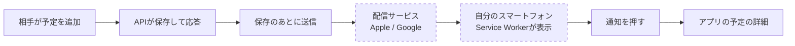

# 論点の記録: プッシュ通知

- 機能名: push-notifications
- 確認のページ: https://claude.ai/artifact/Sq2Q8KK7Kp5TqbzwLohjzc
- 進み具合: docs/discussions/push-notifications.progress.json
- v3の版: 9db5634a

## 背景

記録と4画面ができたので、設計資料の作る順番で次にあたる「通知」に入る。
相手が予定・記録・支払い・精算を追加したり取り消したりしたとき、アプリを開いていなくてもスマートフォンに通知を届ける。
方式（Web Push・Service Worker・VAPID）、DBの表、購読のAPI、通知する操作、通知が届かなくても保存は失敗にしないことは、詳細設計「Web Push通知」と設計方針の合意事項で決まっている。
この記録では、設計資料を書いたあとに作った画面とずれたところと、v3の画面一式にまだ無い通知の設定の画面まわりを聞く。

## 前提

- 通知する操作は合意どおり、予定の追加・取りやめ・日の移動、達成・予約・支払いの追加と取り消し、精算の完了と取り消しの11種類。予定の名前・時刻・メモの編集、旅行の作成・開始・終了、受け渡しの確認の作成は通知しない。
- 操作した本人には送らない（本人の別の端末にも送らない）。送るのは相手の端末だけ。
- 通知は保存が終わってから送る。届かなくても保存したデータは残り、アプリで確かめられる。届かなかった通知を送り直す仕組みは作らない（合意どおり）。
- 通知の文に金額・場所・予定の名前は出さない（ロック画面に出るため）。
- 方式は詳細設計のとおり、標準のWeb Pushとweb-pushの部品で送る。有料の通知サービスは使わない。
- iPhoneはiOS 16.4以降で、ホーム画面に追加したアプリからだけ通知を受け取れる。そのためアプリをホーム画面に追加できるようにする（manifestとアイコン）。
- 公開して実機で確かめる段階（結合検証環境）はこの次。今回、配信サービスへ本当に送ることと、スマートフォンの実機で受け取ることは確かめられない。
- v3の画面一式に、通知の設定の画面は無い（README「第4弾：通知設定」）。作る画面は、設計書を書くときに見本を描いて見せる。

## 論点

### 今回どこまで作り、何を確かめたら終わりにするか

<!-- id: scope -->

- 工程: 要件
- 種類: 設計
- 優先度: 高
- 状態: 回答待ち
- なぜ今: 実機で受け取れるかは公開した環境でないと確かめられない。何を確かめたら今回を終わりにするかで、要件定義書の受け入れ条件と、Devinに渡すIssueの数が変わる。
- 根拠: 詳細設計「作る順番」は、通知の段階の完了を「通知の失敗で保存を失わないことと、通知が重ならないことの試験（T-15・T-16）、手元で送り先を差し替えた確認」とし、実機での受信は次の結合検証環境に置いている。詳細設計「Web Push通知」12節も、実機の確認は実装のあとに必要と書いている。
- 選択肢:
  - A) 設計資料のとおり全部作る（通知の設定の画面、購読のAPI、保存のあとの送信、通知から開く画面、ログアウトで止める、ホーム画面に追加できるようにする）。確かめるのは、手元のブラウザ（パソコンのChrome）での購読と、送り先を差し替えた試験まで。実機は結合検証環境で確かめる
    - 利点: 設計資料の作る順番どおりで、公開の環境が無くても今回を終えられる
    - 欠点: iPhoneで本当に届くかは、次の段階まで分からない
  - B) Aに加えて、今回のうちに手元の開発環境を一時的に外へ出して（トンネル）、実機で受け取れるかも確かめる
    - 利点: iPhoneのホーム画面への追加と受信の食い違いに早く気づける
    - 欠点: 一時的な公開の手順と後片づけが増え、手元のDBやログイン情報を外に出す心配がある
  - C) 2回に分ける（先に購読と送信のサーバー側、後で設定の画面と通知から開く画面）
    - 利点: 1回のレビューが小さくなる
    - 欠点: サーバーだけでは手元で通知を見られず、確かめ方が試験だけになる
- 推奨: A（公開した環境での確認は結合検証環境にまとめてあり、手元を一時的に外に出す心配を増やさずに済む）

### 通知の設定の画面を、どこから開けるようにするか

<!-- id: settings-entry -->

- 工程: 要件
- 種類: 画面
- 優先度: 高
- 状態: 回答待ち
- 画面: v3 16, v3 15
- なぜ今: 今のアプリには設定の画面が無く、v3にも通知の設定の画面が無い。どこから開くかで、作る画面と画面の流れが決まる。
- 根拠: 詳細設計「画面状態と入力操作」は通知の設定のURLを`/settings/notifications`としている。今のアプリで旅行をまたぐ操作（旅行の切り替え・ログアウト）は旅行のメニューにある（`apps/web/src/features/trips/ui/trip-menu.tsx:224`）。
- 選択肢:
  - A) 旅行のメニューに「この端末の通知」の行を足し、通知の設定の画面（`/settings/notifications`）を開く
    - 利点: 旅行の切り替え・ログアウトと同じ場所で、今ある画面の形を変えずに済む
    - 欠点: メニューの行が1つ増え、旅行を開いていないと入れない
  - B) 旅行の一覧（旅行の切り替え）の画面に入口を置く
    - 利点: 旅行に関係しない設定だと分かりやすい
    - 欠点: ふだんホームから使うと、一覧まで戻らないと見つからない
  - C) 下のタブに「設定」を足す
    - 利点: いつでも1回で開ける
    - 欠点: v3の4つのタブの形が変わり、通知のためだけにタブが増える
- 推奨: A（ログアウトなど端末に関わる操作と同じ場所にまとまり、v3の形を変えずに済む）

### 通知を有効にする案内を、設定の画面のほかにも出すか

<!-- id: onboarding-prompt -->

- 工程: 要件
- 種類: 画面
- 優先度: 高
- 状態: 回答待ち
- 画面: v3 03, v3 04
- なぜ今: 設定の画面に入らないと通知が有効にならないなら、二人が気づかずに使い続けるおそれがある。案内を出すなら、どこに・いつ・何回出すかを要件に書く。
- 根拠: 設計方針の合意事項（アプリを開いていない間の通知）は「iPhoneはホーム画面への追加と通知許可を初回設定の導線に含める設計を推奨する」としている。詳細設計「Web Push通知」2節は、許可の要求は本人の操作のあとに出し、拒否された人に毎回求めないとしている。
- 選択肢:
  - A) 設定の画面だけ。案内は出さない
    - 利点: 画面が増えず、うるさくない
    - 欠点: 通知の設定があることに気づかないまま使うかもしれない
  - B) ホームの上に「この端末で通知を受け取る」の案内を出す。押すと設定の画面へ。閉じたらその端末では出さない（通知を有効にしたら出さない）
    - 利点: 二人が最初に開くホームで気づける。閉じれば二度と出ない
    - 欠点: ホームに出す欄が1つ増える
  - C) ログインのすぐあとに、通知の設定の画面を一度だけ出す
    - 利点: 最初の1回で確実に設定へ進む
    - 欠点: 旅行を作る前に設定の画面をはさみ、最初の流れが長くなる
- 推奨: B（気づかずに使い続けることを防ぎつつ、許可の要求は本人が押したあとにだけ出せる）

### 通知の文に、相手の名前や旅行の名前を入れるか

<!-- id: message-text -->

- 工程: 要件
- 種類: アプリの決まり
- 優先度: 高
- 状態: 回答待ち
- なぜ今: 文に入れるものが通知の中身（サーバーが送るデータ）を決める。旅行の名前を入れるなら、送るデータに旅行の名前を足す必要がある。
- 根拠: 詳細設計「Web Push通知」9節は、タイトル「旅行アプリ」、本文「予定が追加されました」などとし、金額・場所・予定名はロック画面に出さないとしている。送るデータは操作の種類・旅行のID・対象のIDだけ。通知は相手にしか送らないので、操作した人は必ず相手になる。
- 選択肢:
  - A) 設計資料のとおり、操作の種類だけ。タイトル「tomotabi」、本文「予定が追加されました」「支払いの記録が取り消されました」など
    - 利点: ロック画面に出る情報が一番少なく、送るデータも設計資料のまま
    - 欠点: 旅行を2つ以上持っていると、どの旅行の話か開くまで分からない
  - B) Aに相手の名前を足す（「あおいが予定を追加しました」）
    - 利点: 二人で使うと分かっていても、読んだときに自然に伝わる
    - 欠点: 名前は表示名で、送るデータに名前を足す（相手は1人なので、情報としては増えない）
  - C) Bに旅行の名前を足す（本文の上に「京都 2 泊」）
    - 利点: どの旅行の話かが開く前に分かる
    - 欠点: 旅行の名前に地名が入るとロック画面に場所が出て、設計資料の「場所を出さない」とずれる
- 推奨: A（設計資料の「ロック画面に出す情報を絞る」に合い、二人で使うので誰の操作かは文がなくても分かる）

### 支払いと精算の通知を押したとき、どの画面を開くか

<!-- id: tap-target -->

- 工程: 要件
- 種類: 画面
- 優先度: 高
- 状態: 回答待ち
- 画面: v3 10, v3 14
- なぜ今: 詳細設計を書いたあとに、支払いの詳細の画面ができ、精算の履歴は精算の画面の中に出す形になった。通知から開く先が、今ある画面とずれている。
- 根拠: 詳細設計「Web Push通知」9節は、支払いは記録の一覧（`/records?type=payment&recordId=`）、精算は精算の詳細（`/settlements/{id}`）を開くとしている。今のアプリには支払いの詳細（`apps/web/src/app/trips/[tripId]/payments/[paymentId]/page.tsx`）があり、精算の詳細の画面は無い（精算の履歴は精算の画面の中。`apps/web/src/features/settlement/ui/settlement-history.tsx`）。
- 選択肢:
  - A) 支払いは支払いの詳細、精算は精算の画面（履歴が見える）を開く
    - 利点: 今ある画面だけで足り、取り消された支払いも詳細で取り消しの印つきで見られる
    - 欠点: 精算の通知では、どの精算の話かを履歴の中から探す
  - B) 設計資料のとおり、支払いは記録の一覧をその支払いだけに絞って開く。精算は精算の詳細の画面を新しく作る
    - 利点: 設計資料のとおりで、精算の通知からその精算だけを見られる
    - 欠点: 精算の詳細の画面が1つ増え、v3にも無いので見本から描く
  - C) 支払いは支払いの詳細、精算は精算の画面を開き、その精算の行を目立たせる
    - 利点: 新しい画面を作らずに、どの精算の話かが分かる
    - 欠点: 履歴の行を目立たせる表示の分だけ、精算の画面に手が入る
- 推奨: A（今ある画面で足りる。精算は二人で1回か2回なので、履歴の中で迷わない）

### ログアウトのとき、この端末の通知を止められなかったらどうするか

<!-- id: logout-stop -->

- 工程: 要件
- 種類: アプリの決まり
- 優先度: 高
- 状態: 回答待ち
- 画面: v3 16
- なぜ今: 今のログアウトは電波が無くてもできる。設計資料のとおりにすると、通知を止められないあいだはログアウトできなくなり、今の振る舞いが変わる。
- 根拠: 詳細設計「Web Push通知」10節は、ログアウトの前にサーバーで、この端末の通知を止めてから、ログアウトするとしている。止められなかったときは「ログアウトの完了と出さず、やり直す」。今のログアウトは`apps/web/src/features/auth/model/use-sign-out.ts`で、通知のことは扱っていない。
- 選択肢:
  - A) 設計資料のとおり。サーバーで止められなかったら、ログアウトせずに「通知を止められませんでした。電波のあるところでやり直してください」と出す
    - 利点: ログアウトしたのに通知が届き続けることが起きない
    - 欠点: 電波が無いとログアウトできない
  - B) ログアウトは進める。端末の側で通知の受け取りをやめ（ブラウザの購読を解除）、サーバーの側は次に送ろうとしたときに失効として止まるのに任せる
    - 利点: 電波が無くてもログアウトできる
    - 欠点: 端末の側の解除にも失敗すると、ログアウトしたあとも通知が届くことがある
  - C) 「通知を止めずにログアウトする」を選べるようにする（Aで失敗したときだけ出す）
    - 利点: ふだんはAの安全さで、困ったときだけ進められる
    - 欠点: ボタンと文が増え、どちらを押すか迷う
- 推奨: A（二人で端末を貸し借りしたときに、ログアウトしたのに相手の操作が見え続けることを防げる。旅行中に急いでログアウトする場面は少ない）

### 同じ人の通知を受け取る端末を、何台まで登録できるか

<!-- id: device-limit -->

- 工程: 要件
- 種類: アプリの決まり
- 優先度: 中
- 状態: 仮決定
- なぜ今: 上限を超えたときの画面の文が要件に入る。
- 根拠: 詳細設計「Web Push通知」3節は、有効な購読を1人3件までとしている。
- 選択肢:
  - A) 設計資料のとおり3台
    - 利点: スマートフォン・タブレット・パソコンで足りる
    - 欠点: 機種変更のときに古い端末を止め忘れると、上限に当たることがある
  - B) 上限を設けない
    - 利点: 上限の文が要らない
    - 欠点: 古い購読が溜まり、送る数が増える
- 推奨: A（二人の使い方で3台を超える場面は少ない。超えたら設定の画面で古い端末を止められるようにする）

### 通知を種類ごとにオフにできるようにするか

<!-- id: per-type-setting -->

- 工程: 要件
- 種類: アプリの決まり
- 優先度: 中
- 状態: 仮決定
- なぜ今: 種類ごとに選べるなら、設定の画面とDBに選んだ種類を持つ。
- 根拠: 詳細設計「Web Push通知」2節は、端末ごとの有効・無効だけを持つ。通知する操作は合意で11種類に絞ってある。
- 選択肢:
  - A) 選べない。端末ごとに有効・無効だけ
    - 利点: 設定の画面とDBが設計資料のままで済む
    - 欠点: 支払いの通知だけ要らない、といった使い方はできない
  - B) 予定・記録・精算の3つに分けて選べる
    - 利点: 要らない通知を止められる
    - 欠点: 画面とDBが増える
- 推奨: A（通知する操作は合意で絞ってあり、通常の編集は通知しない）

### 旅行が終わったあとの操作も通知するか

<!-- id: after-finish -->

- 工程: 要件
- 種類: アプリの決まり
- 優先度: 中
- 状態: 仮決定
- なぜ今: 旅行の状態で送るかどうかを変えるなら、送る先を選ぶ条件に入る。
- 根拠: 詳細設計「Web Push通知」6節は、旅行の状態で送り分けない。終了後も記録・支払い・精算はできる（詳細設計「画面状態と入力操作」）。
- 選択肢:
  - A) 終わったあとも同じように通知する
    - 利点: 帰ってから支払いや精算をしたことが相手に伝わる
    - 欠点: 特になし
  - B) 終わったあとは通知しない
    - 利点: 旅行が終わったあとに通知が来ない
    - 欠点: 精算の完了が相手に伝わらない
- 推奨: A（終わったあとの精算こそ相手に伝えたい）

### Androidで確かめるブラウザをChromeだけにするか

<!-- id: android-browser -->

- 工程: 要件
- 種類: アプリの決まり
- 優先度: 中
- 状態: 仮決定
- なぜ今: 受け入れ条件に、確かめるブラウザを書く。
- 根拠: 詳細設計「Web Push通知」1節は、Androidの初めの確認先をChromeとし、送り先のホストもChromeの配信サービス（fcm.googleapis.com）とAppleだけを許すとしている。
- 選択肢:
  - A) Chromeだけ。ほかのブラウザで「この環境では通知を使えません」と出るのは受け入れる
    - 利点: 許す送り先が2つで済み、確かめる組み合わせが少ない
    - 欠点: Firefoxなどでは通知を使えない
  - B) Firefoxの配信サービスも許す
    - 利点: 使えるブラウザが増える
    - 欠点: 許す送り先と確かめる組み合わせが増える
- 推奨: A（二人が使うのはiPhoneのSafariかAndroidのChromeで足りる）

### 通知の送信を、APIの応答の前に待つか、応答のあとに回すか

<!-- id: send-timing -->

- 工程: 設計
- 優先度: 高
- 状態: 後の工程へ
- なぜ今: 保存の応答が通知の送信の分だけ遅くなるかが変わる。どこで動かすか（Vercelの`waitUntil`）にもよる。
- 根拠: 詳細設計「Web Push通知」7節は、Vercelの`waitUntil`に渡す案と、応答の前に上限つきで待つ代わりの案を挙げている。

### VAPIDの鍵をどこに置き、どう作るか

<!-- id: vapid-keys -->

- 工程: 設計
- 優先度: 中
- 状態: 後の工程へ
- なぜ今: 手元・試験・本番で鍵を分ける手順が要る。
- 根拠: 詳細設計「Web Push通知」10節・11節。鍵はデプロイのたびに作り直さず、keyIdで管理する。
