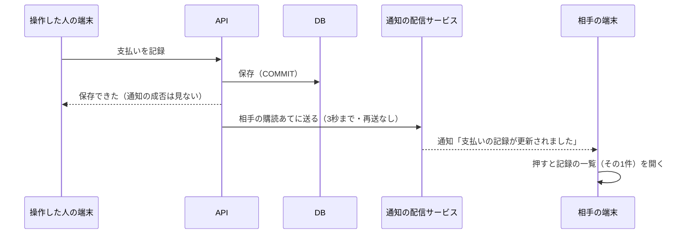
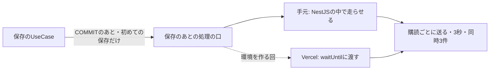

# 論点の記録: 相手の操作を知らせる通知

- 機能名: push-notifications
- 確認のページ: https://claude.ai/artifact/HA4jgAQqUCRtki6Q6ifhGQ
- 進み具合: docs/discussions/push-notifications.progress.json
- v3の版: 9db5634a

## 背景

記録と4画面ができたので、設計資料（docs/旅行アプリ設計 3）の作る順番で次にあたる「通知」に入る。
相手が予定を足したり支払いを記録したりしたとき、アプリを開いていなくても、自分のスマートフォンに通知が届くようにする。
詳細設計「Web Push通知」に、方式・DB・API・送る操作・通知から開く画面・ログアウトのときの止め方まで書いてある。ただ、通知の設定の画面はv3の画面一式に無く（第4弾の予定）、精算の通知から開く画面もまだ無い。
要件定義書を書く前に、設計資料だけでは決まらないことと、今のアプリと食い違うところを聞く。

## 前提

- 通知の方式は設計資料のとおり、ブラウザ標準のWeb Push（Service Workerが受け取り、APIがVAPIDの鍵で署名して送る）にする。有料の通知サービスは使わない。
- 通知する操作は、設計資料の合意どおり11種類（予定の追加・取りやめ・日の移動、達成・予約・支払いの記録と取り消し、精算の完了と取り消し）。名前やメモの編集、旅行の作成・開始・終了は通知しない。
- 通知は保存が済んだあとに送る。届かないことは許し、再送はしない。通知に失敗しても、保存した操作は成功のまま返す。
- 通知は操作した人の相手にだけ送る。操作した人の別の端末には送らない。
- ロック画面に金額・場所・予定名は出さない。
- 記録を1件に絞って開くURLは、今の記録の一覧にある`?recordType=&recordId=`を使う（設計資料の案は`?type=`だが、記録と4画面で`recordType`にした）。
- 電波がないときのしおり（Service Workerでの画面の保存）は今回は作らない。Service Workerは通知のためだけに置く。
- 公開用の環境（Vercel・Neon）はまだ無い。iPhoneのWeb Pushは、HTTPSで公開したアプリをホーム画面に追加したときだけ使える。

## 論点

### 今回どこまで作るか

<!-- id: scope -->

- 工程: 要件
- 種類: 設計
- 優先度: 高
- 状態: 決定
- なぜ今: どこまで作るかで、要件定義書の大きさと、Devinに渡すIssueの数が変わる。
- 根拠: 詳細設計「Web Push通知」の10節は、VAPIDの鍵をkeyIdで管理し、入れ替えるときは古い鍵を移行の期間だけ残して購読ごとに使い分ける案を書いている。秘密鍵が漏れたときは古い鍵を止め、利用者に登録し直してもらうとも書いている。実装順序（詳細設計10）の通知の回は、Service Worker・購読API・VAPID・保存後の送信・ログアウトで止める仕組み・通知から開く画面を挙げている。
- 選択肢:
  - A) 設計資料のとおり全部（購読の登録・一覧・停止のAPI、通知の設定の画面、Service Workerとホーム画面に追加するための設定、11種類の操作の保存後の送信、ログアウトで止める仕組み、通知から開く画面、古い鍵を残して使い分ける鍵の入れ替え）
    - 利点: 設計資料の範囲を一度に終えられる
    - 欠点: 鍵の入れ替えは二人で使うあいだほぼ起きず、そのための作りと試験が増える
  - B) Aから「古い鍵を残して使い分ける」を外し、使う鍵は1つにする（購読にkeyIdは記録し、鍵を変えたら登録し直してもらう）
    - 利点: 送る処理が鍵を選ばずに済み、今回が小さくなる。漏れたときの手順は設計資料と同じ
    - 欠点: 鍵を変えると、二人とも通知の設定から登録し直す手間がかかる
  - C) 2回に分ける（先に購読・設定の画面・送信・通知から開く画面、後でログアウトで止める仕組みと鍵の入れ替え）
    - 利点: 1回のレビューが小さくなる
    - 欠点: 先の回のあいだは、ログアウトした端末にも通知が届き続ける
- 推奨: B（鍵を変えるのは漏れたときくらいで、そのときは設計資料でも登録し直しになる。ログアウトで止める仕組みは、ログアウトした端末に届かないために同じ回で要る）
- 決定: A
- 推奨と同じか: 違う
- 理由:
- 選ばなかった理由: B（理由は聞いていない）。C（先の回のあいだ、ログアウトした端末にも通知が届き続けるため）
- 反映先: docs/requirements/push-notifications.md「対象範囲」「VAPIDの鍵の入れ替え」(F-70〜F-73)
- 決めた日: 2026-10-07

### iPhone・Androidの実機で通知を確かめるのはいつか

<!-- id: device-check -->

- 工程: 要件
- 種類: 設計
- 優先度: 高
- 状態: 決定
- なぜ今: 実機で確かめるところまでを今回の完了条件に入れるかで、公開用の環境を今回作るかが決まる。
- 根拠: iPhoneのWeb Pushは、HTTPSで公開したアプリをホーム画面に追加したときだけ使える（詳細設計「Web Push通知」1節）。手元のPCのChrome（localhost）なら、HTTPSでなくても通知を受け取れる。実装順序（詳細設計10）は、実機と通知の確認を次の「結合検証の環境」の回に置き、小さな結合検証を前倒ししてもよいとしている。
- 選択肢:
  - A) 今回は手元のPCのChromeで、登録・受け取り・押して開くまでを確かめる。iPhone・Androidの実機は結合検証の環境を作る回で確かめ、`docs/tests/final-acceptance.md`に行を足す
    - 利点: 今回は公開用の環境を作らずに済む
    - 欠点: iPhoneのホーム画面に追加したアプリでの動きは、次の回まで分からない
  - B) 今回、小さな結合検証の環境（Vercel・Neonの試験用）を前倒しで作り、実機で確かめてから締める
    - 利点: iPhoneでの動きを今回のうちに確かめられる
    - 欠点: 環境づくり（Vercel・Neon・Googleログインの設定）はユーザーの操作と判断が要り、今回が大きくなる
  - C) 手元のPCをトンネル（ngrokなど）でHTTPSにして、スマートフォンから確かめる
    - 利点: 公開用の環境を作らずに実機で試せる
    - 欠点: 外部のサービスを通すうえ、Googleログインの戻り先とCookieの設定を一時的に変える必要がある
- 推奨: A（作る順番どおり、実機の確認は環境を作る回にまとめる。手元のChromeでも、送る・受け取る・押して開くの流れは確かめられる）
- 決定: A
- 推奨と同じか: 同じ
- 理由:
- 選ばなかった理由: B（環境づくりにユーザーの操作と判断が要り、今回が大きくなるため。実機の確認は作る順番どおり環境を作る回にまとめる）。C（外部のサービスを通し、Googleログインの戻り先とCookieの設定を一時的に変える必要があるため）
- 反映先: docs/requirements/push-notifications.md「制約」「対象外」「受け入れ条件」
- 決めた日: 2026-10-07

### 通知の設定の画面を、どこから開くか

<!-- id: settings-entry -->

- 工程: 要件
- 種類: 画面
- 優先度: 高
- 状態: 決定
- 画面: v3 16, v3 03
- なぜ今: 入口の置き場所で、手を入れる画面と、設定の画面の見本の描き方が変わる。
- 根拠: 詳細設計「画面状態と入力操作」は通知の設定を`/settings/notifications`としているが、そこへの入口を書いていない。v3の画面一式は通知の設定を「第4弾」に回していて、画面が無い。今のアプリで設定に近い操作は、ホームの右上「…」から開く旅行のメニュー（旅行の開始・終了、ログアウト）だけ。
- 選択肢:
  - A) 旅行のメニュー（右上の「…」）に「この端末の通知」の行を足し、設定の画面を開く
    - 利点: ログアウトと同じ場所にまとまり、新しいボタンを画面に増やさない
    - 欠点: 旅行のメニューに、旅行と関係ない行が増える
  - B) 旅行一覧の画面の上部に「設定」を置き、そこから開く
    - 利点: 旅行と関係ない設定を、旅行の外に置ける
    - 欠点: 旅行一覧は「切り替え」から開く画面で、ふだん通らない
- 推奨: A（ログアウトも同じメニューにあり、二人が迷わない。設定の画面の見本は、設計の承認を頼むときにv3の部品で描いて見せる）
- 決定: A
- 推奨と同じか: 同じ
- 理由:
- 選ばなかった理由: B（旅行一覧は「切り替え」から開く画面でふだん通らず、ログアウトと離れて二人が迷うため）
- 反映先: docs/requirements/push-notifications.md「通知の設定」(F-01)、docs/designs/push-notifications.md「画面と経路」
- 決めた日: 2026-10-07

### 通知を有効にするよう、アプリから勧めるか

<!-- id: prompt-card -->

- 工程: 要件
- 種類: 画面
- 優先度: 高
- 状態: 決定
- 画面: v3 03
- なぜ今: 勧めないと、設定の画面を開かない限り通知が届かない。勧める場合はホームに手を入れる。
- 根拠: 設計方針の合意事項（2026-09-05「アプリを開いていない間の通知」）は、iPhoneのホーム画面への追加と通知の許可を「初回設定の導線」に含めることを推奨している。詳細設計「Web Push通知」2節は、許可を求めるのは本人が押したときだけで、断られたら毎回は聞かないとしている。
- 選択肢:
  - A) この端末で通知が有効でなければ、ホームの上部に案内のカード（「通知を有効にする」と「閉じる」）を出す。閉じたらその端末では出さない
    - 利点: 二人とも設定の画面を探さずに有効にできる
    - 欠点: ホームに1枚カードが増え、閉じた記録を端末に持つ
  - B) 勧めない。設定の画面からだけ有効にする
    - 利点: ホームを変えずに済む
    - 欠点: 片方が設定を開き忘れると、その人には届かない
- 推奨: A（二人のどちらかが有効にし忘れると通知の意味が薄れる。許可を求めるのはカードを押したときなので、設計資料の決まりと合う）
- 決定: A
- 推奨と同じか: 同じ
- 理由:
- 選ばなかった理由: B（片方が設定を開き忘れると、その人に通知が届かないため）
- 反映先: docs/requirements/push-notifications.md「ホームの案内のカード」(F-15〜F-18)
- 決めた日: 2026-10-07

### 通知の本文に、相手の名前や旅行の名前を入れるか

<!-- id: body-text -->

- 工程: 要件
- 種類: アプリの決まり
- 優先度: 高
- 状態: 決定
- なぜ今: 名前を入れると、通知に載せる中身（payload）と、ロック画面に出してよいものの決まりが変わる。
- 根拠: 詳細設計「Web Push通知」9節の文面案は「予定が追加されました」「支払いの記録が更新されました」「精算の記録が更新されました」で、payloadには操作の種類とIDだけを入れ、金額・場所・予定名はロック画面に出さないとしている。使うのは二人だけなので、通知を送ってくるのは必ず相手。
- 選択肢:
  - A) 設計資料のとおり、操作ごとの決まった文（「予定が追加されました」など）だけにする
    - 利点: ロック画面に人の名前も旅行の名前も出ない。payloadが今の設計資料のまま
    - 欠点: 旅行を2つ並べて使っているとき、どの旅行の話かは開くまで分からない
  - B) 旅行の名前を入れる（「沖縄旅行：予定が追加されました」）
    - 利点: どの旅行の話かがロック画面で分かる
    - 欠点: 旅行の名前がロック画面に出る。payloadに名前を足す
  - C) 相手の名前と旅行の名前を入れる（「あおいが沖縄旅行に予定を追加しました」）
    - 利点: 誰が何をしたかが一目で分かる
    - 欠点: 送ってくるのは必ず相手なので名前は情報が増えにくい。ロック画面に出るものが一番多い
- 推奨: A（二人で使い、同時に進む旅行はほぼ1つなので、決まった文で足りる。ロック画面に出すものを設計資料より増やさない）
- 決定: C
- 推奨と同じか: 違う
- 理由:
- 選ばなかった理由: A（理由は聞いていない）。B（理由は聞いていない）
- 反映先: docs/requirements/push-notifications.md「通知の中身」(F-40〜F-44)
- 決めた日: 2026-10-07

### 精算の通知を押したとき、どの画面を開くか

<!-- id: settlement-link -->

- 工程: 要件
- 種類: 画面
- 優先度: 高
- 状態: 決定
- 画面: v3 14
- なぜ今: 開く先が無い画面なら、今回その画面を作る必要がある。
- 根拠: 詳細設計「Web Push通知」9節は、精算の通知の行き先を`/trips/{tripId}/settlements/{targetId}`（精算の履歴の詳細）としている。今のアプリには精算の履歴の詳細の画面が無く、精算の画面（`apps/web/src/app/trips/[tripId]/settlement/page.tsx`）の「精算の履歴」に、日時・向き・金額・取り消しの印を並べているだけ（`apps/web/src/features/settlement/ui/settlement-history.tsx`）。v3の画面一式にも精算の履歴の詳細は無い。
- 選択肢:
  - A) 精算の画面を開き、精算の履歴のその1件を目立たせる（URLに精算のIDを付ける）
    - 利点: 新しい画面を作らずに済み、残額と履歴が一緒に見える
    - 欠点: 履歴の行に出ていない中身（対象の明細）は見られない
  - B) 精算の履歴の詳細の画面を新しく作る（設計資料の行き先どおり）
    - 利点: 設計資料のURLどおりで、1件の中身を全部見られる
    - 欠点: v3に無い画面を1つ描いて作る分、今回が大きくなる
- 推奨: A（通知で知りたいのは「精算が完了した／取り消された」ことで、履歴の行で分かる。詳細の画面が要るとわかったら、そのとき足す）
- 決定: A
- 推奨と同じか: 同じ
- 理由:
- 選ばなかった理由: B（v3に無い画面を描いて作る分、今回が大きくなり、通知で知りたい「完了した／取り消された」は履歴の行で分かるため）
- 反映先: docs/requirements/push-notifications.md「通知から開く画面」(F-52)、「API」(F-85)
- 決めた日: 2026-10-07

### 通知のタイトルに出すアプリの名前を何にするか

<!-- id: title-name -->

- 工程: 要件
- 優先度: 中
- 状態: 決定
- なぜ今: 通知とホーム画面に追加したときのアイコンの名前に出る。
- 根拠: 詳細設計「Web Push通知」9節のタイトル案は「旅行アプリ」で、アプリの名前が決まる前に書かれた。今のアプリはログイン画面とアイコンで「tomotabi」を使っている。
- 選択肢:
  - A) tomotabi
    - 利点: ログイン画面・アイコンと同じ名前になる
    - 欠点: 設計資料の文面案と違う
  - B) 旅行アプリ
    - 利点: 設計資料の文面案どおり
    - 欠点: アプリの名前と合わない
- 推奨: A（アプリの名前はtomotabiに決まっている）
- 決定: A
- 推奨と同じか: 同じ
- 理由:
- 選ばなかった理由: B（推奨の理由: アプリの名前はtomotabiに決まっている）
- 反映先: docs/requirements/push-notifications.md「通知の中身」(F-40)
- 決めた日: 2026-10-07

### アプリを開いているときに通知が来たら、どうするか

<!-- id: foreground -->

- 工程: 要件
- 優先度: 中
- 状態: 決定
- なぜ今: 開いている画面を自動で読み直すかで、Service Workerと画面のやり取りが要るかが変わる。
- 根拠: 詳細設計「Web Push通知」9節は、Service Workerが通知を受け取るたびにAPIを読んだり状態を変えたりしないとしている。開いているときの扱いは書いていない。
- 選択肢:
  - A) 開いていても同じ通知を出すだけ。画面は読み直さない（タブの切り替えや再表示で読み直す今の動きのまま）
    - 利点: Service Workerと画面のやり取りを作らずに済む
    - 欠点: 開いている画面には、自分で読み直すまで相手の操作が出ない
  - B) 開いている画面に知らせて、そのデータを読み直す
    - 利点: 開いている画面がすぐ新しくなる
    - 欠点: Service Workerから画面へ知らせる仕組みと、その試験が増える
- 推奨: A（通知は届かないこともある前提で、画面は読み直したときに正しければよい）
- 決定: A
- 推奨と同じか: 同じ
- 理由:
- 選ばなかった理由: B（推奨の理由: 通知は届かないこともある前提で、画面は読み直したときに正しければよい）
- 反映先: docs/requirements/push-notifications.md「通知の中身」(F-47)
- 決めた日: 2026-10-07

### 送る処理を、保存の応答のあとにどう走らせるか

<!-- id: send-runtime -->

- 工程: 設計
- 種類: 設計
- 優先度: 高
- 状態: 決定
- なぜ今: 走らせ方で、保存の応答の速さと、公開用の環境（Vercel）に移したときに作り直す範囲が決まる。
- 根拠: 詳細設計「Web Push通知」7節は、Vercelの`waitUntil`に送る処理を渡す案で、うまくいかなければ応答の前に待つ代わりの案も試すとしている。今のAPIは`apps/api/src/main.ts`でNestJSのサーバーとして動き、公開用の環境はまだ無い。保存の流れは`apps/api/src/modules/record/usecase/finance-write-flow.ts`の`executeFinanceWrite`で、保存のあとに「初めての保存か再送か」（`replayed`）が分かる。
- 選択肢:
  - A) 応答を返してから、同じプロセスの中で送る。送る処理は「保存のあとの処理」の口（port）に渡し、手元ではNestJSの中で走らせ、Vercelに移すときは`waitUntil`に渡す実装に差し替える
    - 利点: 保存の応答が通知に待たされない。Vercelに移すときは口の実装を1つ足すだけ
    - 欠点: 応答のあとに走る処理を試験で待つ仕組み（試験だけで使う「走っている処理を待つ」口）が要る
  - B) 応答の前に送り終えるまで待つ（購読あたり3秒まで）
    - 利点: 作りが一番単純で、Vercelでもそのまま動く
    - 欠点: 配信サービスが遅いと、保存の応答が最大3秒ほど遅れる
  - C) 今は応答のあとに投げっぱなしで送り、Vercelでの走らせ方は環境を作る回で決める
    - 利点: 今回が一番小さい
    - 欠点: 投げっぱなしは設計資料が使わないとした書き方で、環境を作る回に作り直しが残る
- 推奨: A（保存の速さを通知に左右させず、Vercelへの移し替えも口の差し替えで済む）
- 決定: A
- 推奨と同じか: 同じ
- 理由:
- 選ばなかった理由: B（配信サービスが遅いと、保存の応答が最大3秒ほど遅れるため）。C（投げっぱなしは設計資料が使わないとした書き方で、環境を作る回に作り直しが残るため）
- 反映先: docs/designs/push-notifications.md「変更後構成」「データフロー」
- 決めた日: 2026-10-07

### 手元と試験で、通知を送るところまでをどう確かめるか

<!-- id: local-transport -->

- 工程: 設計
- 種類: 設計
- 優先度: 高
- 状態: 決定
- なぜ今: 宛先は許したホスト（FCM・Apple）だけに絞る決まりなので、試験で手元の偽の配信サービスに送るには、その決まりに試験用の抜け道を作るかを決める必要がある。セキュリティに関わる。
- 根拠: 要件定義書の非機能要件N-01（宛先は許したホストだけ、登録と送信の両方で確かめる）。実装順序（詳細設計10）の通知の回は「ローカルtransport検証」を挙げている。手元のChromeの購読の宛先は`fcm.googleapis.com`なので、手動の確認は抜け道なしでできる。
- 選択肢:
  - A) 試験の中だけ、送る部品（HTTPで送るところ）を偽物に差し替える。宛先の決まりは変えない。暗号化と署名は本物を通し、偽物が受け取った要求を確かめる
    - 利点: 本番のコードに抜け道が入らない
    - 欠点: HTTPで本当に送るところ（3秒の打ち切り・転送を追わない）は、別に小さな試験を書く
  - B) 環境変数で許すホストに`localhost`を足せるようにし、E2Eで手元の偽の配信サービスに本当に送る
    - 利点: APIからHTTPで送るところまで通しで確かめられる
    - 欠点: 本番で環境変数を間違えると、任意の宛先へ送れる抜け道になる
- 推奨: A（宛先の決まりは本番と試験で同じにしておく。HTTPの打ち切りは、送る部品だけを手元のHTTPサーバーに向けた試験で確かめられる）
- 決定: A
- 推奨と同じか: 同じ
- 理由:
- 選ばなかった理由: B（本番で環境変数を間違えると、任意の宛先へ送れる抜け道になるため）
- 反映先: docs/designs/push-notifications.md「セキュリティ」「テスト方針」
- 決めた日: 2026-10-07

### 通知の設定の画面に、自分のほかの端末の一覧を出すか

<!-- id: device-list -->

- 工程: 設計
- 種類: 画面
- 優先度: 高
- 状態: 決定
- 画面: v3 16
- なぜ今: 画面の見本と、一覧のAPI（`GET /api/me/push-subscriptions`）を画面で使うかが決まる。
- 根拠: 要件定義書のF-11（4台目は、ほかの端末で止める案内）とF-65（ログインが切れたログアウトでは、もう一度ログインして設定の画面から止める）。詳細設計「画面状態と入力操作」は、設定の画面で購読の一覧を取得するとしている。v3に設定の画面は無い。見本はこのページの上の説明に描いた。
- 選択肢:
  - A) この端末の状態の下に、自分の有効な端末の一覧（端末の名前・更新日・「止める」）を出す
    - 利点: 4台目を断られたときや、ログアウトで止めきれなかった端末を、その場で止められる
    - 欠点: 一覧と「止める」の分、画面と試験が増える
  - B) この端末の状態だけを出す
    - 利点: 画面が小さい
    - 欠点: 4台目を断られたら、止めたい端末を手に取って止めるしかない
- 推奨: A（要件のF-11とF-65の「止める」場所が要る）
- 決定: A
- 推奨と同じか: 同じ
- 理由:
- 選ばなかった理由: B（4台目を断られたときと、ログアウトで止めきれなかったときに、止める場所が無くなるため）
- 反映先: docs/designs/push-notifications.md「通知の設定の画面」
- 決めた日: 2026-10-07

### 端末の名前をどう決めるか

<!-- id: device-label -->

- 工程: 設計
- 優先度: 中
- 状態: 決定
- なぜ今: 一覧に出す端末の名前を、登録のときに送る。
- 根拠: 詳細設計「Web Push通知」4節は登録に`deviceLabel`を含めるが、決め方を書いていない。
- 選択肢:
  - A) ブラウザの情報から自動で付ける（「iPhone · Safari」「Mac · Chrome」）
    - 利点: 入力が要らない
    - 欠点: 同じ種類の端末が2台あると見分けにくい（更新日で見分ける）
  - B) 有効にするときに名前を入れてもらう
    - 利点: 見分けやすい
    - 欠点: 有効にする手順が1つ増える
- 推奨: A（二人で使い、端末は1人1〜2台がふつう）
- 決定: A
- 推奨と同じか: 同じ
- 理由:
- 選ばなかった理由: B（推奨の理由: 二人で使い、端末は1人1〜2台がふつう）
- 反映先: docs/designs/push-notifications.md「通知の設定の画面」
- 決めた日: 2026-10-07

### ログアウトの前に通知を止める処理を、どこに置くか

<!-- id: signout-hook -->

- 工程: 設計
- 優先度: 中
- 状態: 決定
- なぜ今: ログアウトの要求を1回にするか2回にするかで、画面とAPIの作りが変わる。
- 根拠: 設計資料の`openapi.auth.json`は、`POST /api/auth/sign-out`の中で通知を止めてからBetter Authでログアウトし、止められなければ503で未完了とする。今は`apps/api/src/bootstrap/configure-app.ts`でBetter Authの処理を`/api/auth/*splat`に載せているだけ。
- 選択肢:
  - A) `POST /api/auth/sign-out`の前に、APIの中で通知を止める処理を挟む（Better Authの処理の手前）
    - 利点: 設計資料の契約どおり1回の要求で済み、画面は今のサインアウトのまま
    - 欠点: Better Authの経路の手前に、NestJSの処理を呼ぶ口が要る
  - B) 画面が先に「通知を止める」APIを呼び、成功したらサインアウトを呼ぶ
    - 利点: Better Authの経路に手を入れない
    - 欠点: 古い画面や直接の呼び出しでは止めずにログアウトできてしまう
- 推奨: A（どこからログアウトしても止まる）
- 決定: A
- 推奨と同じか: 同じ
- 理由:
- 選ばなかった理由: B（推奨の理由: どこからログアウトしても止まる）
- 反映先: docs/designs/push-notifications.md「ログアウト」
- 決めた日: 2026-10-07

### VAPIDの鍵を、どの形でAPIに渡すか

<!-- id: vapid-config -->

- 工程: 設計
- 優先度: 中
- 状態: 決定
- なぜ今: 鍵の入れ替え（要件F-70〜F-73）で、今の鍵・残す鍵・止めた鍵を見分ける必要がある。
- 根拠: 詳細設計「Web Push通知」10節（keyIdで管理）。秘密鍵はAPIの環境変数だけに置く（要件N-04）。
- 選択肢:
  - A) 環境変数1つにJSONで並べる（`keyId`・公開鍵・秘密鍵・状態「今の鍵／残す鍵／止めた鍵」）。止めた鍵は秘密鍵を消してkeyIdだけ残す
    - 利点: 入れ替えが環境変数の書き換えだけで済み、DBに秘密鍵を置かない
    - 欠点: JSONを手で書くので、起動時に形を確かめる処理が要る
  - B) 鍵をDBの表に置き、環境変数には暗号化の鍵だけを置く
    - 利点: 入れ替えをコマンドでできる
    - 欠点: 秘密鍵がDBに入り、バックアップにも入る
- 推奨: A（秘密鍵をDBやバックアップに置かない）
- 決定: A
- 推奨と同じか: 同じ
- 理由:
- 選ばなかった理由: B（推奨の理由: 秘密鍵をDBやバックアップに置かない）
- 反映先: docs/designs/push-notifications.md「VAPIDの鍵」
- 決めた日: 2026-10-07

### 通知に入れる名前を、何文字で切り詰めるか

<!-- id: name-trim -->

- 工程: 設計
- 優先度: 中
- 状態: 決定
- なぜ今: 要件F-44・B-03で、APIが送る前に切り詰める長さを決める。
- 根拠: 旅行の名前は100文字まで、相手の名前（`identity.users.name`）は上限なし。通知の中身は2KBまで。
- 選択肢:
  - A) 相手の名前は20文字、旅行の名前は30文字で切り、超えたら末尾を「…」にする
    - 利点: ロック画面の1〜2行に収まり、2KBにも十分な余裕がある
    - 欠点: 長い旅行の名前は後ろが見えない
  - B) 2KBに収まる限り切らない
    - 利点: 名前が全部出る
    - 欠点: 長いとロック画面で本文が切れ、操作の言葉が見えなくなる
- 推奨: A（操作の言葉まで見えることを優先する）
- 決定: A
- 推奨と同じか: 同じ
- 理由:
- 選ばなかった理由: B（推奨の理由: 操作の言葉まで見えることを優先する）
- 反映先: docs/designs/push-notifications.md「保存のあとに送る流れ」
- 決めた日: 2026-10-07

### VAPIDの連絡先（subject）に何を設定するか

<!-- id: vapid-subject -->

- 工程: 運用
- 優先度: 低
- 状態: 後の工程へ
- なぜ今: 鍵を作って公開用の環境に置くときに、運用者の連絡先（mailtoかHTTPSのURL）が要る。
- 根拠: 詳細設計「Web Push通知」11節は、実在する値を実装のときに設定し、資料の検証用の値を本番に使わないとしている。

### ログインが期限切れになった端末にも通知を送るか

<!-- id: expired-session-delivery -->

- 工程: 実装
- 優先度: 中
- 状態: 決定
- なぜ今: ログアウトのガード（PR #183）のレビューで見つかった。ログアウトを押せばその端末の購読は止まるが、押さずにログインが期限切れになった端末は、サーバー側で止まらない。
- 根拠: 停止の記録はガードが`authenticated`のときだけ入る。送る相手の条件にセッションの期限が無い。PD-13の試験も、期限切れのセッションでログアウトすると購読が有効のまま残ることを確かめている。
- 選択肢:
  - A) 送る相手の条件に「登録したログインがまだ残っていて期限が切れていない」を足し、期限切れの端末には送らない
    - 利点: ログインしていない端末の画面に、相手の名前と旅行の名前が出続けない
    - 欠点: 送る処理の読み取りが`identity.sessions`も見る
  - B) 今のまま。止めたい人は、別の端末の設定の画面からその端末を止める
    - 利点: 変更が要らない
    - 欠点: 共用の端末に通知が出続ける
- 推奨: A（ログインしていない端末に通知を出し続けない）
- 決定: A
- 推奨と同じか: 同じ
- 理由:
- 選ばなかった理由: B（ログインしていない端末に通知が出続ける）
- 反映先: docs/designs/push-notifications.md「保存のあとに送る流れ」、docs/tests/push-notifications.md PD-15、Issue #198
- 決めた日: 2026-10-10

### ログアウトに失敗したとき、この端末の通知が止まってしまう件をどうするか

<!-- id: signout-failure-browser-unsubscribed -->

- 工程: 実装
- 優先度: 低
- 状態: 決定
- なぜ今: 通知の画面のPR（PR #185）のレビューで見つかった。ログアウトは、ブラウザの購読を解除してからサーバーに頼む順番なので、サーバーが503で失敗すると、ログインしたままこの端末に通知が届かなくなる。
- 根拠: 設計書「ログアウト」は、サインアウトの前にブラウザの購読を解除する（失敗しても続ける）と決めている。設定の画面は「まだ有効にしていない」と出るので、有効にし直せば戻る。
- 選択肢:
  - A) 順番は今のまま。失敗の文に「この端末に通知が届かなくなった場合は、設定から有効にし直してください」を足す
    - 利点: 設計の順番を変えずに、戻し方が分かる
    - 欠点: 失敗のたびに有効にし直す手間がある
  - B) 順番を入れ替え、サーバーが成功してからブラウザの購読を解除する
    - 利点: 失敗しても通知が止まらない
    - 欠点: 設計の変更が要り、サーバーの成功のあとにブラウザの解除が失敗する場合を別に扱う
- 推奨: A（設計の順番を保ち、戻し方を伝える）
- 決定: A
- 推奨と同じか: 同じ
- 理由:
- 選ばなかった理由: B（設計の変更が要る）
- 反映先: docs/designs/push-notifications.md「ログアウト」、PR #185
- 決めた日: 2026-10-10

### ログインが期限切れになった端末の購読を、端末の上限の数から外すか

<!-- id: expired-session-limit -->

- 工程: 実装
- 優先度: 中
- 状態: 決定
- なぜ今: 期限切れのログインの端末に送らない直し（PR #201）のCodexのレビューで見つかった。送る相手から外すだけだと、購読は有効のまま残る。
- 根拠: 端末の上限（3台）は有効な購読の数で数える。3台のログインが期限切れになると、新しい端末の登録が409 `PUSH_LIMIT_REACHED`になる。設定の画面の一覧にも、届かない端末が有効と出続ける。
- 選択肢:
  - A) 登録のとき、数える前に、登録したログインが期限切れか消えた購読を無効にする（期限の過ぎた購読の整理と同じ場所）。一覧でも有効として出さない
    - 利点: 届かない端末で上限が埋まらない。一覧が実際に届く端末と合う
    - 欠点: 登録の処理と一覧の読み取りが`identity.sessions`も見る
  - B) 今のまま。上限に当たったら、設定の画面の一覧から古い端末を自分で止める
    - 利点: 変更が要らない
    - 欠点: 届かない端末が有効と出て、どれを止めればよいか分かりにくい
- 推奨: A（届かない端末で上限を埋めない）
- 決定: A
- 推奨と同じか: 同じ
- 理由:
- 選ばなかった理由: B（届かない端末が有効と出続ける）
- 反映先: docs/designs/push-notifications.md「保存のあとに送る流れ」、PR #201
- 決めた日: 2026-10-10
