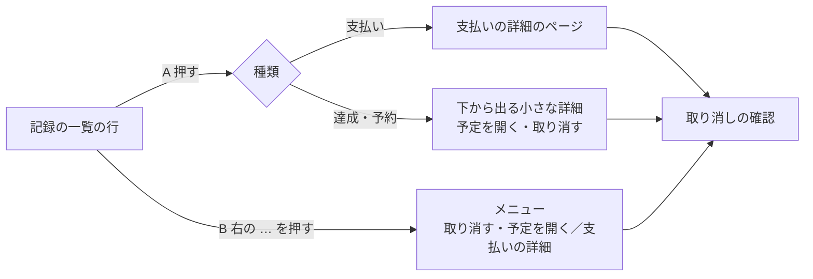

# 論点の記録: 記録と4画面の完成

- 機能名: records-and-home
- 確認のページ: https://claude.ai/artifact/NiFNawTJgXsPcD4yZrV18k
- 進み具合: docs/discussions/records-and-home.progress.json
- v3の版: 9db5634a

## 背景

支払いと精算ができたので、設計資料（docs/旅行アプリ設計 3）の作る順番で次にあたる「記録と4画面の完成」に入る。
作るのは、予定の達成・予約の記録と取り消し、記録の一覧、ホーム（今日の予定・精算・最近の記録をまとめて出す画面）、精算の確認のあとに支払いが変わったときの画面、それらをつなぐ下の4つのタブ。
達成・予約を入れるDBの表は旅行・予定を作ったときに用意してあり、予定の詳細には達成・予約の表示だけがある。追加・取り消しのAPIと画面、記録の一覧、ホームはまだ無い。
要件定義書を書く前に、設計資料だけでは決まらないことと、v3の画面一式と設計資料が食い違うところを聞く。画面の画像はv3の画面一式から撮った。

## 前提

- アプリの決まりは設計資料（詳細設計の「予定・達成・予約」「旅行の作成・選択・開始／終了とホーム」「画面状態と入力操作」）に従う。達成は場所・食べ処・買い物、予約は食べ処・宿・移動に付けられ、同じ予定に同じ種類は1件だけ付く。
- 持ち物・思い出・電波がないときのしおり・ダークモードは、今回は作らない（設計資料で別に扱う）。
- 達成・予約を相手に知らせる通知は、通知を作るときに作る。
- 旅行の開始・終了の画面（旅行のメニューと終了の確認）はすでにある。
- ログイン後に前回の旅行を開く仕組みはある（今はしおりを開く）。ホームができたらホームを開くように変える。
- 確認のあとに支払いが取り消されたときの了承の画面は、v3の画面一式に無い。作る場合は、設計書を書くときに見本の画面を描いて見せる。

## 論点

### 今回どこまで作るか

<!-- id: scope -->

- 工程: 要件
- 優先度: 高
- 状態: 決定
- なぜ今: どこまで作るかで、要件定義書の大きさと、Devinに渡すIssueの数（支払い・精算では8つ）が変わる。
- 根拠: 設計資料の作る順番（詳細設計10）は、この回に、達成・予約とその取り消し、記録の一覧、ホーム、精算の確認のあとに支払いが変わったときの画面、保存できたか分からなくなった操作を端末に残す仕組みを挙げている。支払い・精算のときの決定（ADR-0006）は、旅行・予定の保存にもこの仕組みを次の回で使う、と書いている。
- 選択肢:
  - A) 設計資料のとおり全部（達成・予約、記録の一覧、支払いの詳細と取り消し、精算の確認のあとに支払いが変わったときの画面、ホーム、4つのタブ。旅行・予定・達成・予約の保存も、保存できたか分からなくなったら端末に残して再読み込みのあとに確かめられるようにする）
    - 利点: 設計資料の作る順番と、ADR-0006に書いた予定のとおりに終わる
    - 欠点: 支払い・精算と同じくらい大きく、Issueが8〜10になる
  - B) 全部作るが、旅行・予定の保存を端末に残すのは後にする（新しく作る達成・予約・支払いの取り消しは端末に残す）
    - 利点: 今ある旅行・予定の保存を書き直さずに済み、今回が小さくなる
    - 欠点: 旅行・予定は、再読み込みすると保存できたかを確かめられないまま残る。ADR-0006の予定からずれる
  - C) 2回に分ける（先に達成・予約・記録の一覧・支払いの詳細と取り消し・精算の確認のあとの画面、後でホームと4つのタブ）
    - 利点: 1回のレビューが小さくなる
    - 欠点: ホームが無い期間が延び、ログイン後は今のまましおりを開く
- 推奨: A（大きくても、要件定義と設計を一度にした方が、ホームと記録の一覧の食い違いを防げる。旅行・予定の保存を端末に残すのは、ADR-0006で今回と決めてある）
- 決定: A
- 推奨と同じか: 同じ
- 理由:
- 選ばなかった理由: B（旅行・予定が再読み込みのあとに保存できたかを確かめられないまま残り、ADR-0006の予定からずれるため）。C（ホームが無い期間が延び、ホームと記録の一覧を別々に決めると食い違いやすいため）
- 反映先: docs/requirements/records-and-home.md「対象範囲」「端末に残す仕組みの広げ方」(F-70〜F-73)
- 決めた日: 2026-10-04

### 達成・予約の取り消しを、どの画面からできるようにするか

<!-- id: cancel-entry -->

- 工程: 要件
- 優先度: 高
- 状態: 決定
- なぜ今: 予定の詳細の画面に取り消しのボタンを置くかで、画面と試験の範囲が変わる。
- 根拠: 詳細設計「画面状態と入力操作」の予定の詳細の表は、有効な達成・予約があれば追加のボタンを「状態と記録へのリンク」に置き換えるとだけ書き、取り消しは記録のカードの取り消しの確認で扱っている。v3の予定の詳細は「予約済み・誰がいつ記録したか」の行だけで、取り消しのボタンも記録へのリンクも無い。v3の記録の一覧には取り消しの確認がある。
- 選択肢:
  - A) 記録の一覧（記録のカード）からだけ。予定の詳細には記録へのリンクを置く
    - 利点: 設計資料どおり。取り消しの確認が1か所にまとまる
    - 欠点: 押し間違えた達成を戻すのに、記録の一覧まで1回移る
  - B) 予定の詳細と記録の一覧の両方から
    - 利点: 押し間違えたその場で戻せる
    - 欠点: 取り消しの確認が2か所になり、画面と試験が増える
- 推奨: A（取り消しは「元の記録を消さずに取り消しの記録を足す」操作で、確認の文言を1か所で保ちたい。予定の詳細から記録へは1回で移れる）
- 決定: A
- 推奨と同じか: 同じ
- 理由:
- 選ばなかった理由: B（取り消しの確認が2か所になり、確認の文言を1か所で保てず、画面と試験も増えるため）
- 反映先: docs/requirements/records-and-home.md「予定の詳細」(F-11)「記録の一覧」(F-25)
- 決めた日: 2026-10-04

### 旅行を終えたあとのホームに、最終日の予定を出すか

<!-- id: home-mode -->

- 工程: 要件
- 優先度: 高
- 状態: 決定
- なぜ今: ホームの予定の欄の出し方と、ホームのAPIが返す形（表示の種類）が決まる。
- 根拠: v3の終了後のホームは、最終日の予定・精算・最近の記録の順に出している。詳細設計「旅行の作成・選択・開始／終了とホーム」の「日付と旅行状態が食い違う場合」は、終わった旅行では予定の欄を出さず、精算と最近の記録を先に出すとしている（設計資料でも「案」のままで、まだ決めていない）。期間が過ぎたのに終了していないときのホームは、v3に無い。
- 選択肢:
  - A) v3のとおり、終わった旅行でも最終日の予定を上に出す。期間が過ぎて終わっていないときは、最終日の予定の上に「旅行を終了する」への案内を足す
    - 利点: 2026-09-23のデザインレビューで見た画面のままで、ホームの形が旅行中と同じ
    - 欠点: 帰ったあとにいちばん要る精算が、画面の下のほうになる
  - B) 設計資料の案のとおり、終わった旅行では予定の欄を出さず、精算と最近の記録を上に出す（しおりへの案内は残す）。期間が過ぎて終わっていないときは、期間が終わったことと終了への案内を出す
    - 利点: 帰ったあとの精算がすぐ目に入る
    - 欠点: v3の終了後の画面を描き直す
- 推奨: B（帰ったあとに精算を済ませる流れが二人の使い方の中心で、終わった旅行の予定を見返すことは少ない。しおりへは1回で移れる）
- 決定: B
- 推奨と同じか: 同じ
- 理由:
- 選ばなかった理由: A（帰ったあとにいちばん要る精算が画面の下のほうになるため）
- 反映先: docs/requirements/records-and-home.md「ホーム」(F-41〜F-43)
- 決めた日: 2026-10-04

### 記録の一覧の絞り込みに「予約」を足すか

<!-- id: records-filter -->

- 工程: 要件
- 優先度: 高
- 状態: 決定
- なぜ今: 記録の一覧の絞り込みのボタンと、APIに渡す種類の値が決まる。
- 根拠: v3の記録の一覧の絞り込みは「すべて・支払い・達成」の3つ。詳細設計「予定・達成・予約」の記録の一覧のAPIは、種類（達成・予約・支払い）で絞り込める。
- 選択肢:
  - A) 「すべて・支払い・達成・予約」の4つにする
    - 利点: 予約だけを見返せる。APIで絞り込める種類と画面のボタンがそろう
    - 欠点: ボタンが1つ増え、小さい画面で横にはみ出しやすい
  - B) v3のとおり3つ。予約は「すべて」でだけ見る
    - 利点: 画面がv3のまま
    - 欠点: 予約を探すとき、支払いと達成の中から探す
- 推奨: A（予約はチェックインや食事の前に見返すことがあり、絞り込めた方が早い）
- 決定: A
- 推奨と同じか: 同じ
- 理由:
- 選ばなかった理由: B（予約を探すとき、支払いと達成の中から探すことになるため）
- 反映先: docs/requirements/records-and-home.md「記録の一覧」(F-21)
- 決めた日: 2026-10-04

### v3の終了後のホームで宿・移動に付いている「達成」を、出さないでよいか

<!-- id: badge-rule -->

- 工程: 要件
- 優先度: 中
- 状態: 決定
- なぜ今: ホームの予定の欄に何を出すかが決まる。
- 根拠: v3の終了後のホームは「旅館をチェックアウト（宿）」「京都駅から帰る（移動）」に「達成」を付けている。アプリの決まりでは、達成は場所・食べ処・買い物にしか付けられない（詳細設計「予定・達成・予約」の達成・予約の追加）。
- 選択肢:
  - A) 決まりどおり、宿・移動には「達成」を出さない（予約があれば「予約」を出す）
    - 利点: 保存できない状態を画面に出さない
    - 欠点: v3の見た目と少し違う
  - B) 宿・移動にも達成を付けられるよう、決まりを変える
    - 利点: v3の見た目どおり
    - 欠点: DBの制約・API・試験を作り直す
- 推奨: A（v3の描き間違いとみて、決まりに合わせる）
- 決定: A
- 推奨と同じか: 同じ
- 理由: 仮決定のまま、要件定義書の承認（PR #136のマージ）まで異議が無かった
- 選ばなかった理由: B（推奨の理由: v3の描き間違いとみて、決まりに合わせる）
- 反映先: docs/requirements/records-and-home.md
- 決めた日: 2026-10-04

### 支払いを取り消したあと「正しい内容で支払いを記録」に進むとき、取り消した内容を初めから入れておくか

<!-- id: correction-prefill -->

- 工程: 要件
- 優先度: 中
- 状態: 決定
- なぜ今: 支払いを記録する画面の初期値の決め方が変わる。
- 根拠: 詳細設計「画面状態と入力操作」の記録の一覧と訂正の節は「正しい内容で支払いを記録」へ進めるとだけ書き、初期値を決めていない。
- 選択肢:
  - A) 取り消した支払いの金額・支払った人・負担の分け方・用途・関連する予定を入れておく
    - 利点: 一部だけ違うときの打ち直しが少ない
    - 欠点: 直さずに保存すると、同じ内容の支払いがもう一度できる
  - B) 空の状態から入力する
    - 利点: 同じ内容をそのまま保存する事故が起きない
    - 欠点: 全部打ち直す
- 推奨: A（訂正は金額や負担の分け方の一部だけを直すことが多い。取り消しと新しい記録は別に保存されると画面に出す）
- 決定: A
- 推奨と同じか: 同じ
- 理由: 仮決定のまま、要件定義書の承認（PR #136のマージ）まで異議が無かった
- 選ばなかった理由: B（推奨の理由: 訂正は金額や負担の分け方の一部だけを直すことが多い。取り消しと新しい記録は別に保存されると画面に出す）
- 反映先: docs/requirements/records-and-home.md
- 決めた日: 2026-10-04

### ホームの今日の予定（最大3件）を、どの順で並べるか

<!-- id: home-schedule-order -->

- 工程: 要件
- 優先度: 中
- 状態: 決定
- なぜ今: ホームのAPIの並び順が決まる。
- 根拠: 詳細設計「旅行の作成・選択・開始／終了とホーム」は「未達成を先、各グループ内で時刻順」を案として書いている。しおりは時刻順だけ。
- 選択肢:
  - A) 未達成を先に、その中で時刻順（設計資料の案）
    - 利点: これから行く場所が上に来る
    - 欠点: しおりと順番が違う
  - B) しおりと同じ時刻順
    - 利点: しおりと順番がそろう
    - 欠点: 午前に達成した予定が3件の枠を使い、午後の予定が隠れる
- 推奨: A（3件しか出ないので、済んだ予定より次の予定を出したい）
- 決定: A
- 推奨と同じか: 同じ
- 理由: 仮決定のまま、要件定義書の承認（PR #136のマージ）まで異議が無かった
- 選ばなかった理由: B（推奨の理由: 3件しか出ないので、済んだ予定より次の予定を出したい）
- 反映先: docs/requirements/records-and-home.md
- 決めた日: 2026-10-04

### ホームの一部の欄だけ取得に失敗したとき、残りの欄を出すか

<!-- id: home-partial-failure -->

- 工程: 要件
- 優先度: 中
- 状態: 決定
- なぜ今: ホームのAPIが欄ごとに失敗を返すかどうかで、APIの形とDBの読み方が変わる。
- 根拠: 詳細設計「旅行の作成・選択・開始／終了とホーム」の失敗・キャッシュの節は、欄ごとに「取得できない」を返す案。v3の画面一式は精算の欄の「精算額を取得できませんでした」を示している。
- 選択肢:
  - A) 欄ごとに失敗を出し、ほかの欄は出す（精算額の失敗を0円にしない）
    - 利点: 精算の計算だけが失敗しても、今日の予定は見られる
    - 欠点: APIとDBの読み方が少し複雑になる
  - B) どれか1つでも失敗したらホーム全体を「取得できませんでした」にする
    - 利点: 単純
    - 欠点: 1つの欄の失敗で、今日の予定まで見られなくなる
- 推奨: A（旅行中にいちばん見たい今日の予定を、ほかの欄の失敗で隠したくない）
- 決定: A
- 推奨と同じか: 同じ
- 理由: 仮決定のまま、要件定義書の承認（PR #136のマージ）まで異議が無かった
- 選ばなかった理由: B（推奨の理由: 旅行中にいちばん見たい今日の予定を、ほかの欄の失敗で隠したくない）
- 反映先: docs/requirements/records-and-home.md
- 決めた日: 2026-10-04

### 今回作る中で、どの流れをE2E（ブラウザを動かす自動の試験）にするか

<!-- id: e2e-scope -->

- 工程: 要件
- 優先度: 中
- 状態: 決定
- なぜ今: 要件定義の受け入れ条件と、試験計画の大きさが決まる。
- 根拠: 詳細設計「テストと監視・CI」は、旅行を終えたあとも編集・精算できることと、保存できたか分からなくなった操作を再読み込みのあとに確かめられることを、E2Eで確かめるとしている。支払い・精算では、ふつうの精算・0円・確認の金額が変わらないこと・保存できたか分からないときをE2Eにした。
- 選択肢:
  - A) ホームから達成を記録して記録の一覧で取り消す流れ、旅行を終了したあとの精算、精算の確認のあとに支払いを取り消したときの了承、保存できたか分からなくなった操作を再読み込みのあとに確かめる流れ
    - 利点: 二人で使うときに困る流れを、ブラウザごと毎回確かめられる
    - 欠点: E2Eの実行時間が延びる
  - B) ホームが開けることだけ。ほかは自動の単体・APIの試験に任せる
    - 利点: 速い
    - 欠点: 画面どうしのつながりの崩れに気づきにくい
- 推奨: A（設計資料がE2Eで確かめるとしている流れを外さない）
- 決定: A
- 推奨と同じか: 同じ
- 理由: 仮決定のまま、要件定義書の承認（PR #136のマージ）まで異議が無かった
- 選ばなかった理由: B（推奨の理由: 設計資料がE2Eで確かめるとしている流れを外さない）
- 反映先: docs/requirements/records-and-home.md
- 決めた日: 2026-10-04

### 記録の一覧を1回に何件ずつ読むか

<!-- id: records-page-size -->

- 工程: 設計
- 優先度: 低
- 状態: 取り下げ
- 理由: 設計資料の契約（`openapi.planning.json`の記録の一覧）で、1回の件数は既定20件・最大100件と決まっている。画面は件数を送らず既定を使う。問いにせず設計書に書く

### ホームのAPIで、各欄を同じ時点のデータで読む方法

<!-- id: home-snapshot -->

- 工程: 設計
- 優先度: 中
- 状態: 取り下げ
- 理由: 設計資料で決まっている。詳細設計「旅行とホーム」はplanning・record・settlementの読み取りを共通の短いスナップショットで実行するとし、詳細設計「フロントとバックのアーキテクチャ」は複数schemaのJOINを読み取り専用の実装に限って認めている。問いにせず設計書に書く

### 記録の一覧で、取り消しをどこから始めるか

<!-- id: cancel-trigger -->

- 工程: 設計
- 種類: 画面
- 優先度: 高
- 状態: 回答待ち
- 画面: v3 10, v3 12
- なぜ今: 記録の一覧の行の作りと、達成・予約を押したときに開くもの（新しい部品が要るか）が決まる。
- 根拠: v3には記録の一覧と取り消しの確認はあるが、一覧から確認へどう進むかが描かれていない。達成・予約の取り消しは記録の一覧からだけと決めた。支払いには詳細のページ（詳細設計「画面状態と入力操作」）があるが、達成・予約には詳細のページが無い。

- 選択肢:
  - A) 行を押すと中身を開く。支払いは支払いの詳細のページ、達成・予約は下から出る小さな詳細（誰がいつ記録したか・予定を開く・取り消す）。取り消しはそこから
    - 利点: どの行も「押すと中身」で同じ。取り消しを押し間違えにくい
    - 欠点: 下から出る詳細の部品を新しく作る
  - B) 行の右に「…」のボタンを置き、メニューから取り消す・予定を開く・支払いの詳細を選ぶ
    - 利点: 新しい部品が要らず、取り消しまでの手数が少ない
    - 欠点: v3の行に無いボタンが全部の行に増え、行が詰まる
- 推奨: A（v3の行の見た目を変えずに済み、取り消しの前に中身を見られる）

### 予定の詳細に「関連する支払い」を出すか

<!-- id: plan-related-payments -->

- 工程: 設計
- 種類: 画面
- 優先度: 高
- 状態: 回答待ち
- 画面: v3 09
- なぜ今: 予定の詳細の画面と、試験の範囲が変わる。
- 根拠: v3の予定の詳細には「関連する支払い」の欄（無ければ「まだありません」）があるが、承認した要件定義書には入っていない。支払いと予定の結びつき（支払いの「関連する予定」）は作ってあり、記録の一覧のAPIは支払いだけ・予定で絞り込める（設計資料の契約）ので、APIを足さずに出せる。
- 選択肢:
  - A) 出す。記録の一覧のAPIで、その予定に結びついた支払いを読み、新しい順に最大3件と「記録で見る」（その予定で絞った記録の一覧）を出す
    - 利点: v3どおりになる。新しいAPIは要らない
    - 欠点: 予定の詳細を開くたびに読み取りが1回増える。要件定義書に1行足す
  - B) 今回は出さない。予定の詳細は達成・予約だけにする
    - 利点: 作る範囲が承認した要件のまま
    - 欠点: v3と違う。どの支払いがその予定のものか、記録の一覧で探すことになる
- 推奨: A（APIを足さずにv3どおりにでき、支払いを予定から確かめられる）

### 記録の一覧の絞り込みが、狭い画面で横に収まらないとき

<!-- id: filter-overflow -->

- 工程: 設計
- 種類: 画面
- 優先度: 中
- 状態: 仮決定
- 画面: v3 10
- なぜ今: 絞り込みに「予約」を足して4つにすると決めたので、幅の狭い端末での並べ方が要る。
- 根拠: v3は「すべて・支払い・達成」の3つで、幅375pxにちょうど収まっている。
- 選択肢:
  - A) 横に並べたまま、収まらない分は横にずらして見る（端が少し切れて、続きがあると分かる）
    - 利点: v3の見た目のまま。ボタンの大きさを変えない
    - 欠点: 狭い端末では「予約」が初めは隠れることがある
  - B) 4つを均等の幅で1行に詰める
    - 利点: 全部が常に見える
    - 欠点: 文字とアイコンが小さくなり、押しにくい
- 推奨: A（押しやすさを保ち、v3の見た目から変えない）

### 達成・予約を相手に知らせるか

<!-- id: record-notification -->

- 工程: 要件
- 優先度: 低
- 状態: 後の工程へ
