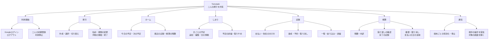
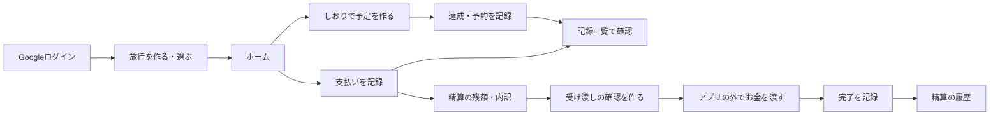

# Tomotabi Feature Map

Tomotabiは、本人とパートナーの二人で旅行の予定・記録・立て替えを共有するWebアプリ。
このマップは、利用者ができること、画面のつながり、実装と検証の状況をまとめる。

確認日: 2026-10-11。確認対象は作成時の`origin/main`のコードと設計資料。
参照コミット: `fd3b9ac01f91de6af857579f60656ad02d3fcd82`。
開発用のAI委譲・レビュー管理は、アプリの機能には含めない。

## 機能は旅行を中心につながる

ホーム・しおり・記録・精算は、選んだ旅行に共通の下のタブで移動する。
「支払いを記録」は共通の主操作。通知の設定とログアウトは旅行のメニューから開く。

## 利用者ができることと実装状況

「コードあり」は、対応する画面・APIなどの実装を確認したという意味。
今回の作業ではアプリを起動していないため、動作確認済み・公開済みとは扱わない。
管理者の操作は画面ではなくCLIから行う。

| 領域 | 機能 | 利用者の操作・表示 | 主な画面・操作場所 | 状況 |
| --- | --- | --- | --- | --- |
| 利用開始 | Googleログイン | 登録された二人だけがログインする | ログイン | コードあり |
| 利用開始 | ログアウト | 通知を止めてログアウトする。停止に失敗した場合は案内を出す | 旅行のメニュー | コードあり |
| 利用開始 | 初期登録・利用停止 | 管理者が二人のGoogleアカウントを登録し、利用を停止する | 管理CLI | コードあり |
| 旅行 | 作成・選択・切り替え | 名前と期間を登録し、使う旅行を選ぶ。前回の旅行を覚える | 旅行一覧・作成 | コードあり |
| 旅行 | 名前・期間の変更 | 旅行名と開始日・終了日を変更する | 旅行のメニュー | コードあり |
| 旅行 | 手動の開始・終了 | 出発前から旅行中、旅行中から終了へ進める | 旅行のメニュー | コードあり |
| ホーム | 今日の予定・次の予定 | 今日の予定を最大3件表示し、次の予定を確認する | ホーム | コードあり |
| ホーム | 最近の記録 | 最近の記録を最大3件表示し、一覧を開く | ホーム | コードあり |
| ホーム | 精算の残額 | 渡す向きと金額、対象の有無を確認する | ホーム | コードあり |
| しおり | 日ごとの予定 | 日付を選び、その日の予定を見る | しおり | コードあり |
| しおり | 予定の追加・編集 | 名前・種類・日付・時刻・メモを登録する。時刻未定にも対応する | 予定の追加・編集 | コードあり |
| しおり | 日の移動 | 予定を旅行期間内の別の日へ移す | しおり・予定の詳細 | コードあり |
| しおり | 詳細・取りやめ | 予定の内容と関連する記録を確認し、予定を取りやめる | 予定の詳細 | コードあり |
| 記録 | 支払いの登録 | 金額・払った人・負担の分け方・用途・関連予定を記録する | 支払いを記録 | コードあり |
| 記録 | 負担の分け方 | 折半、払った人が全額、もう一人が全額、割合から選ぶ | 支払いを記録 | コードあり |
| 記録 | 支払いの詳細・訂正 | 内容を確認し、誤った支払いを取り消して入れ直す | 支払いの詳細 | コードあり |
| 記録 | 達成・予約 | 対応する種類の予定に達成・予約を付ける。誰がいつ記録したかを見る | 予定の詳細 | コードあり |
| 記録 | 達成・予約の取り消し | 元の記録を残し、取り消しを記録する | 予定の詳細・記録 | コードあり |
| 記録 | 一覧・絞り込み | 支払い・達成・予約と取り消しを確認し、種類や予定で絞る | 記録 | コードあり |
| 精算 | 残額・内訳 | 二人の支払った額・負担額・差と、精算の対象を見る | 精算・内訳 | コードあり |
| 精算 | 受け渡しの確認 | 作成した時点の対象・向き・金額を固定して確認する | 受け渡しの確認 | コードあり |
| 精算 | 完了の記録 | アプリの外で全額を渡したあと、確認して記録する | 受け渡しの確認 | コードあり |
| 精算 | 対象0件・0円 | 対象なしと受け渡し不要を分ける。0円でも対象を精算できる | 精算・受け渡しの確認 | コードあり |
| 精算 | 対象の変化への対応 | 確認後の追加を案内し、取り消された対象の了承や対象変更の再確認を求める | 受け渡しの確認 | コードあり |
| 精算 | 履歴・取り消し | 完了した精算を確認し、誤った精算を取り消す | 精算の履歴 | コードあり |
| 精算 | 精算後の支払い訂正 | 精算済みの支払いを取り消した分を、次の精算へ反映する | 支払いの詳細・精算 | コードあり |
| 通知 | 有効化・停止 | この端末の通知を有効にし、自分の登録端末を確認・停止する | 通知の設定・ホーム | コードあり |
| 通知 | 相手の操作の受信 | 相手が保存した予定・記録・精算の操作を受け取る | OSの通知 | コードあり。実配信・実機の合格は未確認 |
| 通知 | 対象を開く | 通知を押すと予定の詳細、記録、精算を開く | 通知から各画面へ | コードあり。実機の合格は未確認 |

通知の対象は、予定の追加・取りやめ・日の移動、達成・予約・支払いの記録と取り消し、精算の完了と取り消しの11種類。
対応する組み合わせは[通知の契約](../packages/contracts/src/push-payload.ts)に定義されている。

## 通常の利用と機能の関係

予定への支払いの関連付けは任意。予定を作らずに支払いを記録できる。
旅行の終了後も、編集・記録・精算ができる。
通知は保存のあとに送る。通知の失敗で保存した予定や記録を取り消さない。

## 全画面に関わる機能

| 機能 | 利用者から見た振る舞い | 状況 |
| --- | --- | --- |
| 読み込み・取得失敗・再取得失敗 | 読み込み中や失敗を表示し、再試行できる。古い表示が残る場合は案内を出す | コードあり |
| ログイン切れ | 業務データを隠し、再ログインを案内する | コードあり |
| 開けない旅行・項目 | 権限がない場合と存在しない場合で、他の旅行の情報を出さずに案内する | コードあり |
| オフラインの案内 | 通信できないことを表示し、保存につながる操作を止める | コードあり |
| 保存結果が不明なときの確認 | 入力を固定し、同じ内容とキーで確認する。再読み込み後も保留した要求を確認できる | コードあり |
| 端末に要求を残せない場合 | 保存を始める前に案内し、結果不明の要求を失わないようにする | コードあり |
| 相手の変更との競合 | 最新の内容と自分の入力を見比べて、保存し直す | コードあり |
| 二重保存の防止 | 同じ要求を送り直しても、同じ記録を二重に作らない | コードあり |

オフラインの案内と、オフラインでしおりを開ける機能は別。
保存結果が不明な要求の保管も、オフラインで編集して後から同期する機能ではない。

## 初期版の決まりと後続の候補

初期版は二人専用、国内旅行・日本円を前提にする。
参加者の招待・追加、旅行の削除、終了した旅行を旅行中に戻す操作は対象外。
精算は全額の受け渡しを記録する。アプリからの送金と部分額の受け渡しは対象外。
予約は「予約済み」の記録であり、宿や店へ予約を申し込む機能ではない。

| 項目 | 現在の扱い | 根拠 |
| --- | --- | --- |
| オフラインでのしおり閲覧 | 後続の対象。閲覧用のキャッシュと画面の保存は、このマップでは実装済みと扱わない | [設計方針の合意事項](旅行アプリ設計%203/設計方針の合意事項.md)・[実装順序](旅行アプリ設計%203/詳細設計/10_Cursor実装順序.md) |
| 持ち物・思い出 | 現在の4画面の実装範囲外。今回のマップでは機能の詳細を決めない | [記録と4画面の要件](requirements/records-and-home.md)・[実装順序](旅行アプリ設計%203/詳細設計/10_Cursor実装順序.md) |
| ダークモード | 現在の4画面の実装範囲外 | [記録と4画面の要件](requirements/records-and-home.md) |
| 外貨・為替換算・海外の時差 | 将来候補。初期版には含めない | [設計方針の合意事項](旅行アプリ設計%203/設計方針の合意事項.md) |
| 結合検証環境・公開準備・初回公開 | 計画にある。外部サービスの設定、実機検証、復元、公開の完了は今回未確認 | [実装順序](旅行アプリ設計%203/詳細設計/10_Cursor実装順序.md)・[公開チェック](旅行アプリ設計%203/詳細設計/運用設定と公開チェック.md) |

## 実装と試験の参照先

設計資料は機能の意味を確認するため、コードは実装の存在を確認するために使う。
下表の試験ファイルがあることは、今回その試験が通ったという意味ではない。

| 領域 | 設計資料 | 主な実装 | 試験・確認資料 |
| --- | --- | --- | --- |
| 利用開始 | [DB・認証](designs/m1-auth-onboarding.md) | [ログイン画面](../apps/web/src/screens/sign-in/sign-in-screen.tsx)・[認証API](../apps/api/src/modules/identity/)・[管理CLI](../apps/api/src/cli/) | [認証の試験計画](tests/m1-auth-onboarding.md) |
| 旅行・しおり | [旅行・予定](designs/m2-trips-and-plans.md) | [旅行の操作](../apps/web/src/features/trips/)・[しおり画面](../apps/web/src/screens/itinerary/itinerary-screen.tsx)・[旅行・予定API](../apps/api/src/modules/planning/) | [旅行・予定の試験計画](tests/m2-trips-and-plans.md)・[二人の操作のE2E](../e2e/tests/m02-two-people.spec.ts) |
| ホーム・達成・予約・記録 | [記録と4画面](designs/records-and-home.md) | [ホーム画面](../apps/web/src/screens/home/home-screen.tsx)・[記録画面](../apps/web/src/screens/records/records-screen.tsx)・[記録API](../apps/api/src/modules/record/) | [記録とホームのE2E](../e2e/tests/records-and-home.spec.ts) |
| 支払い・精算 | [支払い・精算](designs/payments-and-settlement.md) | [支払い画面](../apps/web/src/screens/payment-form/payment-form-screen.tsx)・[精算画面](../apps/web/src/screens/settlement/settlement-screen.tsx)・[精算API](../apps/api/src/modules/settlement/) | [支払いと精算のE2E](../e2e/tests/payment-and-settlement.spec.ts)・[結果不明の支払いのE2E](../e2e/tests/unknown-payment.spec.ts) |
| 通知 | [相手の操作を知らせる通知](designs/push-notifications.md) | [通知設定画面](../apps/web/src/screens/notification-settings/notification-settings-screen.tsx)・[通知API](../apps/api/src/modules/notification/)・[Service Worker](../apps/web/src/service-worker/) | [通知の試験計画](tests/push-notifications.md) |
| 共通の画面状態 | [画面状態と入力操作](旅行アプリ設計%203/詳細設計/07_画面状態と入力操作.md) | [状態表示](../apps/web/src/shared/ui/state/)・[保留した要求の保存](../apps/web/src/shared/browser/pending-requests.ts) | [保存結果が不明な場合のE2E](../e2e/tests/m04-unknown-result.spec.ts) |

二人の実端末での表示・残額の確認は、[最後の受け入れ](tests/final-acceptance.md)に「まだ」と記録されている。
通知の実配信とiPhone・Androidでの確認は、[通知の試験計画](tests/push-notifications.md)に確認項目がある。今回、合格した記録は確認していない。

READMEとAGENTS.mdの「開発基盤まで・業務機能は未実装」という記載は、現在のコードと一致していない。
設計書にも作成時点の状態が残るため、資料の見出しだけで現在の実装・検証の状況を判断しない。

## 機能が変わったら更新する

機能の追加・変更時は、階層図、機能一覧、参照先を一緒に更新する。
実機検証や公開が済んだら、結果の記録へリンクし、確認日を更新する。
新しい要件や優先順位の決定は、該当する要件・設計・論点の記録に残してからこのマップへ反映する。
