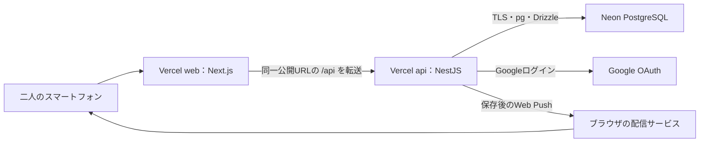

# 詳細設計08：Vercel＋Neonのデプロイと無料枠運用

作成・公式情報確認日：2026-09-09
状態：実装前の運用設計。サービス利用契約・アカウント作成・DB接続・デプロイ・バックアップ取得は行っていない。構成、リージョン、タイムアウト、運用頻度は詳細設計上の選択であり、個別のユーザー承認記録とは区別する。

## 1. 採用構成

本番はVercel Hobby＋Neon Free。独自ドメイン、有料アドオン、AWS常時環境は追加しない。利用量超過時は縮小・停止を選び、課金プランへ自動的に移行する構成を作らない。無料プランの条件変更や実使用量まで含めて、将来も必ず0円で稼働できるという保証ではない。

リポジトリは1つ、apps/webとapps/apiをVercelの別プロジェクトへ関連付ける。共有契約はpackages/contractsの案。詳細01〜07のモジュラーモノリスをNestJS内で維持し、業務領域ごとにクラウドサービスを分割しない。Next.jsには業務DB接続情報を渡さない。

NestJSはVercel公式の対応エントリーポイントを使い、1つのNode.js Functionとして配置する。Dockerイメージを常駐させる方式ではない。公式のNestJS対応を採用するが、Better Authのraw body処理やwaitUntilが自動的に検証済みになるわけではない。[Vercel：NestJS](https://vercel.com/docs/frameworks/backend/nestjs)

## 2. 無料枠の確認値と停止方針

| サービス | 確認できた主な無料枠 | 今回の管理方法 |
|---|---|---|
| Vercel Hobby | Active CPU 4 CPU時間、Provisioned Memory 360 GB時間、Function呼出100万回 | web／apiと同アカウントの他プロジェクトも含むUsageを確認 |
| Neon Free | 各プロジェクト100 CU時間／月、ストレージ0.5GB、外向き転送5GBの掲載値 | 本番と検証を分離し、それぞれ容量・計算量・転送を確認 |
| GitHub Freeのprivateリポジトリ | Actions月2,000分、artifactストレージ500MB | 標準Linux runner、短期artifact保持、従量課金の停止設定 |

Vercel Hobbyは個人の非商用利用向け。上限超過では、多くの場合再利用まで30日待つ必要がある旨が案内されている。日付や復帰条件を一律に「翌月1日」と決めつけず、管理画面に従う。本アプリは二人の個人利用を前提とし、将来の販売・業務提供は条件を再確認する。[Vercel：Hobby](https://vercel.com/docs/plans/hobby)

Neonは無操作5分後の停止、Freeの復元履歴は最大6時間または変更量1GBまでと掲載。復元履歴は長期バックアップとは別物。数値は現時点の掲載条件であり、作成するアカウントの画面でも確認する。[Neon：料金](https://neon.com/pricing)

Neonの外向き転送超過はFreeではcompute停止になる旨がある。DBダンプのダウンロードも転送を消費する。[Neon：転送量](https://neon.com/docs/introduction/network-transfer)

GitHubでは無料枠を超える利用に課金の可能性があるため、従量利用を停止する予算設定を確認する。larger runnerは採用しない。リポジトリを無料枠のためだけに公開する必要はない。[GitHub：利用枠](https://docs.github.com/en/billing/reference/product-usage-included)、[Actions課金](https://docs.github.com/en/billing/concepts/product-billing/github-actions)

今回の初期ルール：週1回と旅行前にUsageを確認、70％到達で要因確認、90％で不要な検証デプロイ・実行を停止する。これらはサービスの自動通知閾値ではなく、運用上の目安。超過が見込まれる場合、追加の課金ではなく公開・更新を一時停止する。履歴・receiptを場当たり的に削除して容量を空けない。

簡単な目安として、平均0.25 CUで1日2時間稼働なら月約15 CU時間、24時間なら約180 CU時間となる。実際の自動スケール・休止待ち・認証・バックアップ等は別途積み上がる。二人利用という人数だけで無料枠内を保証しない。

## 3. 環境とリージョン

| 環境 | アプリ・DB | データと公開条件 |
|---|---|---|
| local／CI | ローカルNext＋Nest、Docker PostgreSQL | 検証用データ。実Google接続時は開発用OAuth設定 |
| PR Preview | 画面確認用。DB接続・実通知なしを初期値とする | 架空データ。Vercelの保護を利用し、本番秘密情報を渡さない |
| 固定の結合検証環境 | web-test／api-testの2プロジェクト、独立したNeon testプロジェクト | 実機・Google経路の確認時に作成。二人限定。テスト用の予定・金額 |
| production | web／apiの2プロジェクト、独立したNeon productionプロジェクト | 本人とパートナーの実データ |

固定の結合検証環境もVercel上では各プロジェクトのProduction環境を使って安定したURLを持たせるが、アプリのAPP_ENVはstaging。Vercelの「Production」という名前を本番DBへ接続する根拠にしない。検証環境は必要時のみデプロイ・利用し、常時アクセスしない。プロジェクトを増やしてもVercelの同一アカウントの枠は増えない。

PRの未信頼コードやforkへ本番・検証DBの秘密を渡さない。本番から分岐したNeon branchをPRへ配布しない。検証用branchを使う場合は、架空データのtestプロジェクトの中だけで作成し、不要後に削除する。公開ポートフォリオ用デモが必要になっても、本番データの閲覧権限は付けない。

初期配置案はNestJSとNext.jsのサーバー実行をVercel sin1、NeonをAWS Singapore（ap-southeast-1）へ揃える。国内からの体感速度は実機で測る。日本語の日付表示はAsia/Tokyoのままで、サーバーの地理配置とは別。[Vercel：リージョン](https://vercel.com/docs/regions)、[Neon：地域別接続例](https://neon.com/demos/regional-latency)

HobbyのFunctionsは単一リージョンのため、アプリ側の複数リージョン自動切替を前提にしない。作成画面で対象リージョンが選べない場合はDB作成前に近接した組合せを見直す。データ作成後にリージョンを無言で変更しない。[Vercel：リージョン制限](https://vercel.com/docs/functions/configuring-functions/region)

## 4. 公開URL・転送・Cookie

実URLはデプロイ時に取得する。以下の変数は実在URLではなく設定名。

- PUBLIC_APP_ORIGIN：利用者が使うwebプロジェクトの固定HTTPS origin。
- API_ORIGIN：apiプロジェクトの固定Production HTTPS origin。
- ブラウザはPUBLIC_APP_ORIGIN/api/...へ要求し、webの外部rewriteがAPI_ORIGIN/api/...へ転送する。Nestのルートも/apiを含む構成に統一し、二重付与／欠落をテストする。
- originは末尾スラッシュ・path・queryのない固定値として検証する。転送先は環境変数の固定ホストのみで、クライアントのURLパラメーターを宛先に使わない。

外部rewriteはVercel公式のリバースプロキシ方式。URLはブラウザ上で変わらない。[Vercel：Rewrites](https://vercel.com/docs/routing/rewrites)

/apiのCache-Controlはprivate, no-store、CDN-Cache-ControlとVercel-CDN-Cache-Controlもno-store。外部rewriteのキャッシュ無効設定を併用する。エラー・認証callback・Set-Cookieを含む全経路へ適用し、二人の応答が共有キャッシュされないことを実測する。同じCookieに依存するNext.jsのHTML／RSCも静的生成・共有キャッシュしない。

転送でCookie、複数Set-Cookie、Origin、Content-Type、Idempotency-Key、If-Match、クエリ、本文、ステータスを保持する。Set-Cookieをカンマで結合しない。Better AuthのbaseURLはPUBLIC_APP_ORIGIN、basePathは/api/auth。Googleのredirect URIはPUBLIC_APP_ORIGIN/api/auth/callback/googleへ完全一致で登録する。[Google：WebサーバーOAuth](https://developers.google.com/identity/protocols/oauth2/web-server)

trustedOriginsはその環境のPUBLIC_APP_ORIGINだけ。*.vercel.appを許可しない。Cookieは03のSecure・HttpOnly・SameSite=Lax・Path=/・Domainなし。HostやX-Forwarded-Hostから認証URLを組み立てない。API側URLへCookieのDomainを書き換えない。

API_ORIGIN自体はインターネット到達可能と扱う。CORSやURLの秘匿は認可の代わりにならない。直接要求にも03の認証・二人の利用許可・旅行参加者・Origin検査を適用する。公開auth経路以外のBetter Auth APIを露出させない。

VercelのDeployment ProtectionとアプリのGoogleログインは別。固定Production URLでパートナーにVercelアカウントのログインを要求しない設定にし、Preview・固有deployment URLは利用可能な保護設定を確認する。APIの固定URLに保護画面が挟まるとrewriteがHTMLを受け取るため、公開前に必ず確認する。本番Googleログインを通すためにPreview全体を無条件公開しない。[Vercel：Deployment Protection](https://vercel.com/docs/deployment-protection/methods-to-protect-deployments/vercel-authentication)

初期の業務データ取得はブラウザから同一originのAPIで行い、RSCに二重取得を追加しない。将来RSCで取得する場合も固定API_ORIGINに必要なCookieだけを転送し、no-store・認可を維持する。

## 5. 実行時間とDB接続

Node.jsは22.xを両Vercelプロジェクトで明示。ローカル検証は22.23.2だったが、Vercelはmajor単位指定でminor／patchが更新されるため完全一致を保証しない。ビルド時と実行時のversionを記録する。[Vercel：Node.js](https://vercel.com/docs/functions/runtimes/node-js/node-js-versions)

HobbyのFluid Compute掲載上限は300秒。本アプリの初期maxDurationは60秒に抑える案とし、上限いっぱいにDBロックを待たない。設定方法はNestの実際のビルド出力で確認し、Next.js向けのroute設定をNestへそのまま置かない。[Vercel：Functions制限](https://vercel.com/docs/functions/limitations)

| 設定 | 初期案 | 意図 |
|---|---|---|
| pg.Pool max | 2／実行インスタンス | 既存02を維持。全体接続上限ではない |
| idleTimeoutMillis | 5,000ms | 非稼働時に解放 |
| connectionTimeoutMillis | 10,000ms | Neon復帰・pool待ちを有限化 |
| lock_timeout | 3秒 | 他操作の長い待ちを避ける |
| statement_timeout | 10秒 | SQL単位の上限 |
| idle_in_transaction_session_timeout | 10秒 | 放置トランザクションの終了 |
| 業務UseCase全体 | 目標20秒以内 | SQLが多い場合も無制限に待たない |
| ブラウザAPI待ち | 30秒の初期案 | 超過した書き込みは07の結果不明へ |
| Web Push | 宛先ごと全体3秒、最大3件並列、TTL 300秒 | 06を維持 |

SQL単位timeoutを足しただけでは処理全体の上限にならない。UseCaseは残り時間を監視し、期限後に次SQLを開始せずロールバックする。処理中のSQL／COMMITで接続が切れた場合は結果不明として扱い、クライアントへ確定失敗を装わない。新しいキーで自動再送しない。

DBはNeonのpooled URL＋pg＋Drizzle。同じトランザクション内は同じクライアントを使用する。TLSの証明書・ホスト検証を有効とし、検証を無効化して接続問題を回避しない。URLのsslmodeとpgのsslオプションが上書きし合わないことを実装で検証する。

poolをモジュールで再利用し、全経路のfinallyでclientを解放。attachDatabasePoolでFunction休止時のidle接続解放を接続し、リクエストごとにpool.endしない。認証Adapterと業務処理が意図せず別々のpoolを量産しない。[Vercel：Pool管理](https://vercel.com/kb/guide/connection-pooling-with-functions)

トランザクション用timeoutはSET LOCALで設定する。トランザクション外で動く認証クエリ等はDBロール／DB単位のデフォルトtimeoutを別途適用し、新接続で効くことを確認する。PgBouncer上のセッション状態を前提にしない。マイグレーション・pg_dumpは管理専用の直接接続を使う。[Neon：Pooling](https://neon.com/docs/connect/connection-pooling)

初期版ではDBエラーへのサーバー側自動再試行を追加しない。確定したロールバックは一時エラー、曖昧な結果は同じIdempotency-Keyで利用者が確認する。COMMIT後の通知処理は例外を回収してwaitUntilへ渡し、通知失敗を保存失敗に変えない。waitUntilもFunctionの期限内でしか動かない。[Vercel：Functions API](https://vercel.com/docs/functions/functions-api-reference/vercel-functions-package)

## 6. 秘密情報とDB権限

設定一覧は「運用設定と公開チェック.md」を参照。Google secret、Better Auth secret、DB接続URL、VAPID秘密鍵をNEXT_PUBLIC_*や公開JSONに含めない。VAPID公開鍵は認証済みの設定APIから配布する。Vercel／Neon／GitHubのログに値を出さない。

DBロールは管理用migratorと実行用app_runtimeを分ける。app_runtimeにテーブル所有・DDL・TRUNCATE・トリガー無効化を与えない。public schemaへの不要なCREATE権限を整理し、必要schemaのUSAGEと個別表の権限だけを付与する。

| 表の分類 | app_runtimeの必要権限案 |
|---|---|
| planning.trips、planning.plans | SELECT／INSERT／UPDATE |
| planning.trip_participants | SELECT／INSERT。運用途中の参加者変更なし |
| record.payments、payment_cancellations、plan_events、plan_event_cancellations | SELECT／INSERTのみ |
| settlement.previews、preview_items、settlements、items、cancellations | SELECT／INSERTのみ |
| record.active_plan_events、settlement.active_claims | SELECT／INSERT／DELETE |
| infra.trip_finance_guards | SELECT／INSERT／UPDATE |
| infra.command_receipts | SELECT／INSERT |
| settlement.pending_items | SELECT（参照先の権限も設計と照合） |
| notification.push_subscriptions | SELECT／INSERT／UPDATE |
| notification.closed_push_sessions | SELECT／INSERT |
| identity.allowed_google_accounts | SELECTのみ |
| Better Auth標準表 | 生成スキーマ／Adapterの動作に必要なDMLを個別付与。ユーザー行ロックのUPDATE権限も確認 |

全表へ一括でALLを与えない。履歴変更禁止トリガーも維持する。Better Auth標準表はまだ未生成なので、実行可能な最終GRANT SQLを作成済みとは扱わない。管理者の二人初期登録・許可停止・セッション失効は公開APIから分離する。

## 7. 公開と変更の流れ

1. Cursorでアプリ、認証スキーマ、マイグレーション、CIを実装。既存sql/00は検証専用のためそのまま本番へ適用しない。
2. CIで型・静的検査、ユニット、実PostgreSQLでのDB検証、ビルドを行う。ツール製品と網羅範囲は次の設計で具体化する。
3. 固定結合検証環境でマイグレーション、Google認証、二人の認可、rewrite、実機操作、通知とDB復帰を確認する。架空データを使用する。
4. リリース対象のcommitを固定。成功CI、web/apiのbuild、マイグレーション番号を公開記録へ残す。
5. 本番変更前にバックアップ取得と復元確認の有無を確認。DB更新は管理接続で一度だけ、直列に実行する。アプリ起動時やweb/api双方のbuildで実行しない。
6. 後方互換のDB追加 → API → webの順に公開。別プロジェクトなので原子的な同時公開ではない。必要時は更新を停止する時間帯を設ける。
7. 固定公開URLから本人・相手のログイン、既存データ閲覧、メンテナンス表示解除を確認。検証のために実際の金銭受け渡しを作らない。

Git連携はビルド・Previewに使えるが、mainへpushしただけでDB準備前に本番URLを切り替えない。初期は管理者がCI成功commitを指定して本番リリースする方式とする。Vercel側の自動本番公開は無効化または自動割当停止が実際に設定できていることを確認する。成立しない場合はGit自動本番デプロイを使わず、同じcommitからCLIによる手動リリースに統一する。[Vercel：公開への昇格](https://vercel.com/docs/deployments/promoting-a-deployment)

本番DBの秘密はPRのCIへ渡さない。マイグレーションは初期版では管理者端末から行い、将来Actionsへ移す場合に本番secretと実行条件を別途設計する。PR用のCIと本番変更を同じワークフローへ無条件にまとめない。

## 8. バックアップと復旧

無料枠内の手動運用案：利用中は週1回、旅行前・旅行終了後・DB変更前に、直接接続のpg_dumpでDB全体を取得する。圧縮custom形式、暗号化した管理者保管領域へ保存。直近4回と直近の変更前1回を保持する。同じPC障害にも備える場合は、利用者が既に持つ別媒体へ暗号化コピーする。保存先や暗号鍵を今回勝手に設定したことにはしない。

本番dumpをGit、ZIPの設計資料、Actions artifactへ入れない。認証・通知秘密情報を含むものとして取り扱う。pg_dumpの正常終了だけでなく隔離したDBへのpg_restoreと照合を初回公開前、以後DB変更時に確認する。[Neon：dump／restore](https://neon.com/docs/import/migrate-from-neon)

復旧手順：

1. API書き込み・新規ログイン・通知送信を停止。画面だけの停止で済ませず、旧deploymentや直接API経由も止まるよう、必要ならDB runtime権限／接続を管理者が停止し、処理中の要求が終わったか確認する。
2. 現在の障害状態も別途保全。復元時点とその後に失われ得る支払い・精算・receiptを把握する。
3. 復元可能時間内ならNeonの復元機能、範囲外なら暗号化dumpを使用し、まず隔離したDBへ復元する。元本番へ即上書きしない。
4. schema／migration番号、二人のIDとslot、履歴件数、負担和、精算合計、active_claimsと履歴からの再構築結果を照合する。
5. 古いセッションや無効化済みの許可が復活しないよう、復元DBの全セッションを失効、購読を無効化し、現在の二人の許可状態を管理者が再設定する。通知は検証中に送らない。
6. API/webとDBの対応を確認して接続先を切替。二人が再ログイン。端末に残る古い未確定要求は自動再送せず、現在の記録と照合する。
7. 復元時点以降に実際に行った受け渡し・支払いを確認してから更新を再開する。復元で消えたreceiptは二重実行を防げないため、再登録を自動化しない。

RPO（失われ得る範囲）は選んだ復元時点以降。週次dumpだけでは最大約1週間以上の欠落があり得る。Neonの短期復元が利用できるケースでも損失0とはしない。RTO（復旧時間）の保証は設けず、初期目標は管理者が着手した当日中。実測して見直す。より短い復旧点が必要になればバックアップ頻度・保存先を追加検討する。

アプリの不具合だけなら以前のweb/apiへ戻し、DBは安易に巻き戻さない。後方互換の追加マイグレーションを基本とし、列削除・名前変更は移行期間を分ける。コードのロールバックと金銭データの復元を同じ操作にしない。

## 9. 日常運用・停止時の表示

- 自動keep-alive、常時ポーリング、定期DB ping、常駐workerは置かない。Neon休止からの初回応答待ちは画面の読み込み状態で扱う。
- サービス側のUsage／エラーログを確認。記録するのはrequestId、operation、HTTP status、時間、必要な不透明ID。Cookie、Google token、通知endpoint／鍵、本文、SQL引数は記録しない。
- 無料枠超過・障害時は「現在利用できません。保存結果が不明な操作は、復旧後に確認してください」。エラーを精算額0円へ変えない。
- Vercelそのものが停止した場合、アプリから独自停止画面を返せる保証はない。旅行前に必要な情報を別途確認し、オフラインしおりの将来機能とは区別する。
- 通知失敗は06に従い欠落を許容。認証鍵・DB認証情報の漏えい時は対象鍵を更新し、新旧deploymentが使う秘密を点検する。VAPID鍵更新は購読再登録まで含めて扱う。
- 有料ログ転送、Sentry等の外部監視、Terraform、Cronバックアップはこの段階で導入しない。必要なテスト／監視ツールの選定は後続で行う。

## 10. 検証状態

公式資料の掲載条件と既存設計01〜07の契約を照合した。今回の成果物は設計書と設定・公開チェックであり、Vercel／Neonアカウントの実設定は確認していない。

未検証：実rewriteのヘッダー／Cookie、Google callback、Neon pooled接続とTLS、複数接続ロック、pool解放、waitUntil、maxDuration、無料枠消費、二人の実機受信、バックアップ復元、旧deployment停止、最終GRANT。公開前の条件は「運用設定と公開チェック.md」にまとめる。

## 後続設計（2026-09-10）

テスト／監視の初期選定とCIは09、実装順序は10で具体化した。Vercel／Neon標準機能とPinoを使用し、外部監視・ログ転送は初期導入しない。09のログ保持限界も運用判断に含める。
