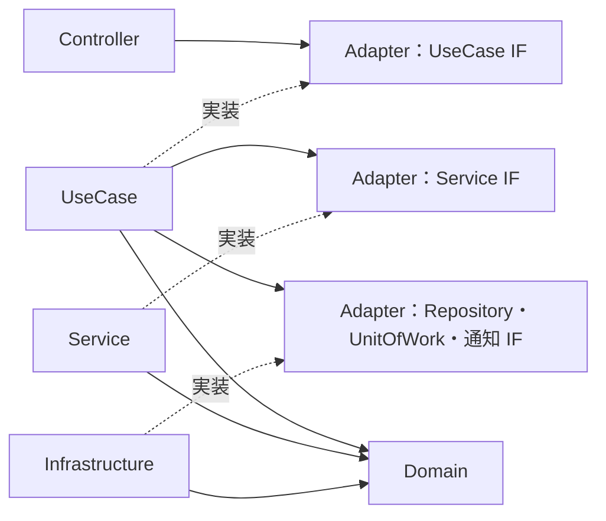
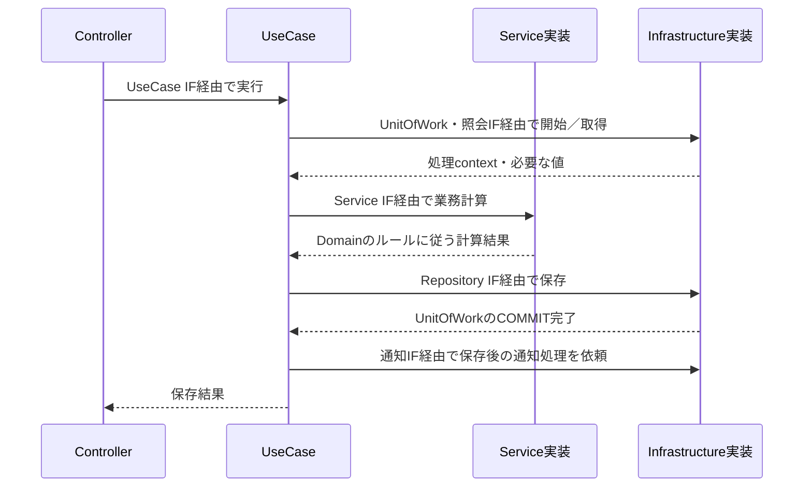
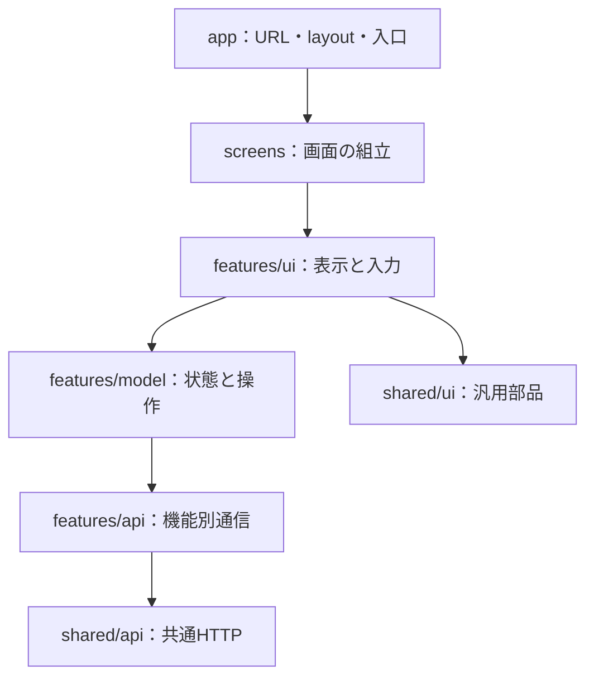

# 詳細設計11：フロントとバックエンドのアーキテクチャ

作成日：2026-09-10
状態：2026-09-10、ユーザー指定によりバックエンドはController／UseCase／Service／Domain／Infrastructure／Adapter（各層のIF定義）の6区分を採用。Serviceの具体的な責務・IF配置は本書での詳細設計。2026-09-11にフロントのFeature-based構成と表示・状態・API通信の責務分離もユーザー承認済み。既存01〜10の業務ルール・DB・API・無料枠を維持する。実装は未着手。

## 1. 推奨する組合せ

| 対象 | パターン | 本アプリでの意味 |
|---|---|---|
| フロントエンド | 機能単位の構成（Feature-based）＋表示・状態・通信の分離 | 予定、支払い、精算などの機能ごとにファイルをまとめ、その中で責務を分ける |
| バックエンド | モジュラーモノリス＋6区分の依存逆転構成 | 業務領域ごとにController／UseCase／Service／Domain／Infrastructure／Adapterを配置する |
| 業務モデル | DDDの境界・集約・値オブジェクトを必要箇所へ適用 | 旅行と予定の別集約、金額・負担配分・精算条件を明示する |
| 読み取り／更新 | 処理を分ける。単一DBのまま | 読み取りは画面向けDTO、更新はUseCaseと業務条件。別DBやイベント配信を要求しない |
| リポジトリ | monorepo：apps/web、apps/api、packages/contracts | 共有するのは公開API契約。DBモデルやサーバーの業務クラスをwebへ配らない |

フロントは完全なFeature-Sliced Designの層構成やバックエンドと同じ6区分を必須にしない。バックエンドも全ての処理にEntityクラス・Repository・Domain Serviceを機械的に作らず、複雑なルールがある箇所に使う。

この組合せは、画面変更と金銭ルールの変更を分離し、個人開発のファイル数を抑えながら、依存方向・境界・トランザクションを説明する練習になると判断した。採用率や求人市場での優位を保証する主張ではない。

## 2. 比較した選択肢

| 選択肢 | 今回の評価 |
|---|---|
| フロントをcomponents/hooks/apiだけの技術別フォルダにする | 小規模では簡単だが、支払い機能の変更箇所が全体に散るため機能単位を優先 |
| フロントに完全なClean Architectureを適用 | 外部サービス差替えを大量に想定していない。すべての通信にRepository interfaceを作る負担を避ける |
| バックをController→巨大Service→ORMにする | 初期は速いが、精算・取消・再送・排他が一つに集中しやすい |
| バックを業務モジュール＋内向き依存にする | 金銭ルールの単体テストと実DB検証を分けられるため推奨 |
| Microservices、Event Sourcing、別DBのCQRS | 二人運用で分散整合性・追加運用を増やす理由がないため初期採用しない |

追記履歴を残す既存設計は、それだけでEvent Sourcingを採用する意味ではない。通知も業務データの正本や領域間同期の手段にしない。

## 3. フロントの配置

```text
apps/web/src/
  app/                         Next.jsのルート・layout・エラー境界
  screens/
    home/                      複数機能を組み合わせる画面
    itinerary/
    records/
    settlements/
  features/
    trips/
    plans/
    records/                   達成・予約とタイムライン表示
    payments/
      ui/                      支払いフォーム・詳細
      model/                   入力状態・表示用配分・操作hook
      api/                     支払いAPI呼出し・DTO変換
      index.ts                 他層へ公開する入口
    settlements/
    auth/
    notifications/
  shared/
    ui/                        Button・Dialog・Field等の汎用部品
    api/                       共通HTTP処理・エラー・ヘッダー
    lib/                       日付・表示等の業務非依存処理
    browser/                   IndexedDB等のブラウザ基盤
```

階層は必要なものだけ作成する。3行程度の関数にも必ず別ファイルを作るルールにはしない。Next.jsのappはルーティングの入口として薄くし、screensが画面を構成する。Next.js公式はapp配下への配置と外部への分離を許容しており、この構成をフレームワーク必須の形式とは扱わない。[Next.js Project Structure](https://nextjs.org/docs/app/getting-started/project-structure)

依存の向き：app → screens → features → shared。上位から下位へ参照し、sharedからfeaturesやappを参照しない。別featureの内部ファイルを直接importしない。初期はfeature同士の依存を作らず、画面で必要なID・props・callbackを渡して組み合わせる。

支払いフォームの予定選択はscreens側でplansの公開部品とpaymentsを組み合わせる。ホームも専用の集約APIの結果をscreenの取得処理で受け、各機能の公開表示部品へ渡す。sharedへ業務判断を移して循環参照を隠さない。

### 表示・状態・通信

- ui：propsと入力イベントによる表示。DB・生のfetch・再送キー管理を埋め込まない。
- model：フォーム状態、保存中／結果不明、了承対象、画面向け変換を担当するhook／純粋関数。単純な部品の開閉状態はui内に置いてよい。
- api：共通HTTP clientを使い、API入力・出力を扱う。確定金額や参加権限を独自計算しない。
- shared/api：Cookie付き同一origin通信、JSON・ETag・Idempotency-Key・エラー変換。特定の精算エラーの画面分岐はfeature側。

サーバー取得状態、フォーム下書き、URL条件、未確定要求の復帰情報を別に扱う。全てを一つのグローバルstoreへ複製しない。取得ライブラリを後で選んでも、07の「保存成功前に金額を確定表示しない」「結果不明を同じ要求で確認する」を維持する。

未確定要求の永続化はshared/browserの保存アダプターを通すが、どの要求をいつ保存・再送するかはfeatureの操作処理が決める。authとの接続はappの組立箇所で行い、userId一致・ログアウト消去を共通に適用する。汎用オフライン同期機構へ拡大しない。

### Next.jsの境界

Server Componentはlayout・非対話部分に使い、入力やブラウザAPIは必要なClient Componentに限定する。app全体に一律use clientを付けない。初期の業務データ取得は08どおりブラウザ→同一originのNestJS。Server Actions／Route Handlersへ支払い・精算・Google認証の別実装を作らない。

ブラウザ内で表示する負担額の計算はプレビュー専用。API保存時はサーバーが再計算する。サーバーのdomainをそのままwebへimportせず、同じ具体例・境界値を両方のテストで確認する。

## 4. バックエンドの6区分

ユーザーが指定した6区分を、各業務モジュール内に置く。フォルダ表記は小文字に統一する。6区分すべてを順番に通過する直列構造ではなく、実行する処理と、その依存先を定めるIFの配置を分ける。

| 区分 | 責務 | 支払い・精算の例 |
|---|---|---|
| Controller | HTTP入力の検証・UseCase呼出し・HTTP応答への変換 | PaymentController |
| UseCase | 1つの利用者操作の進行、認可条件、transaction・ロック・再送・保存・通知の順序 | CreatePaymentUseCase、CompleteSettlementUseCase |
| Service | 複数のDomainの値やEntityを使う、再利用可能な業務計算・判定 | PaymentAllocationService、SettlementEligibilityService |
| Domain | Entity・値オブジェクトと、それ自身が常に守る条件 | Payment、Money、BurdenRatio、SettlementPreview |
| Infrastructure | DB、外部通知、時刻取得等の具体的な実装 | DrizzlePaymentRepository、PgUnitOfWork、WebPushSender |
| Adapter | 各層の境界IF・フレームワーク非依存の入出力型・DI token | CreatePaymentInputPort、PaymentRepository、PaymentAllocationPort、UnitOfWork |

ここでのServiceは業務ロジックのサービス（Domain Service相当）として定義する。DB検索・保存や他UseCaseの呼出し、transaction開始、HTTP応答の生成は担当しない。必要な支払い・履歴等はUseCaseがIF経由で取得し、Serviceへ値として渡す。これによりUseCaseとの役割を明確にする。

Domainに自然に置ける条件はDomain自身に持たせる。例：Moneyの整数・範囲、BurdenRatioの範囲。二人の金額を配分する等の複数の値にまたがる処理はServiceへ置く。単純なGET等はServiceを経由しなくてよく、委譲だけのServiceを作ることを必須にしない。

### Adapterの呼び方

このプロジェクトではユーザー指定どおりAdapterをIF定義の置き場とする。一般的なPorts and Adaptersの用語ではIFはPort、外部技術との接続実装をAdapterと呼ぶことが多いため、本資料のAdapterは「IF定義」というプロジェクト内の用語であるとREADMEに明記する。接続の実装はInfrastructureに置く。

```text
apps/api/src/
  main.ts
  app.module.ts
  modules/
    planning/
    record/
      controller/
        payment.controller.ts
      usecase/
        create-payment.usecase.ts
      service/
        payment-allocation.service.ts
      domain/
        payment.ts
        money.ts
        burden-ratio.ts
      adapter/
        inbound/                 UseCaseの呼出IF・入力／結果型
        service/                 業務ServiceのIF
        outbound/                Repository・他領域照会・通知等のIF
      infrastructure/
        drizzle-payment.repository.ts
      record.module.ts           NestのDI配線
    settlement/                  同じ6区分
    identity/
    notification/
  queries/                       横断読取。Controller／UseCase／IF／実装を分離
  composition/                   領域間IFと実装を結ぶ配線
  adapter/
    transaction/                 共通UnitOfWork等のIF
  infrastructure/
    database/                    pool・UnitOfWork実装・migration
    logging/
    config/
```

DomainのEntity／値オブジェクトに一律のIFは付けない。固有の値型そのものが契約になる。外部からControllerを呼ぶHTTP契約はOpenAPIで定義し、空のController interfaceは作らない。差替え・テスト・境界の意味があるIFをAdapterへ置く。各IFはどの消費側のための契約かを明記し、巨大な全領域共通adapterフォルダへ集約しない。

### 依存方向

- ControllerはAdapter/inboundのUseCase IFに依存し、NestのDIがUseCase実装を渡す。
- UseCaseはAdapterのService／Repository／UnitOfWork等のIFとDomainに依存する。ServiceやInfrastructureの具体クラスをimportしない。
- Serviceは自身のIFを実装し、Domainの値・Entityを使って計算する。副作用を持たずNestJS・Drizzleに依存しない。
- InfrastructureはAdapter/outboundや共通AdapterのIFを実装する。永続化行とDomain／結果DTOを変換する。
- Adapterは必要なDomain型を参照してよいが、Controller・UseCase・Service・Infrastructureの具体実装やDrizzle／Express／Nestの型を参照しない。
- Domainは他5区分へ依存せず、NestJS・DB・環境変数・HTTPに依存しない。
- Module／compositionだけがIFと各実装を知って配線する。ServiceからUseCase、InfrastructureからUseCaseを呼び戻さない。

実行時にはUseCaseからIFを介してServiceやInfrastructureが呼ばれるが、ソース上ではUseCaseから実装へ依存しない。interfaceは実行時に消えるため、Adapterに置いたSymbol等のtokenとModuleのfactory providerで結び付ける。[NestJS Modules](https://docs.nestjs.com/modules)、[Custom Providers](https://docs.nestjs.com/fundamentals/custom-providers)

Repository IFの場所は以前のapplication/portsからadapter/outboundへ変更する。UseCase／Serviceは純粋なTypeScriptクラスとし、NestのdecoratorはController・Module・必要な外側の実装へ限定する案。identityのBetter Auth接続等に無意味な空のDomain／Serviceを作る必要はない。

## 5. 集約・横断処理・DBの扱い

TripとPlanは別集約。旅行単位の金融guardは排他の境界であり、全支払いを抱える巨大なTrip集約をメモリへ読み込む指示ではない。金額・割合・対象状態などの不変条件をDomainの値オブジェクトとServiceの純粋な業務処理に置き、永続化の制約とUseCaseのロック検証を併用する。

業務上の依存はrecordがplanningの条件を参照し、settlementがrecordの支払いを参照する。別領域のテーブルへ直接書き込まない。依存先のRepository内部やDrizzle schemaをUseCaseからimportしない。

例：record側にPlanEligibilityPort、settlement側にPaymentFactsPortを定義し、各領域のadapter/outboundに配置し、Infrastructureの照会実装をcompositionで相手領域の公開照会へ接続する。相手Moduleを丸ごと相互importせず、読み取りの公開providerとcommand providerを必要に応じて分離する。

予定の種類変更は達成／予約の履歴存在を確認するため、planningにもRecordHistoryPortが必要。この事実上の相互照会を無視しない。消費側のportと、UseCaseに依存しないInfrastructureの読取実装をcompositionで配線し、planning→record→planningというModule循環を避ける。forwardRefを通常の依存解決手段にしない。ロック順序は04の旅行→予定を両操作で共有する。

### UnitOfWork

UseCaseがtransactionの範囲を決め、UnitOfWorkのportを通して実行する。Infrastructureが同じpg client／Drizzle txを確保し、その処理内で利用する各Repository／照会adapterを同じtxに束ねて渡す。

UseCaseに渡す処理contextは、型付きRepository・照会・ロック操作の限定集合とする。生のtx／SQL実行口を渡してDB非依存を名目だけにしない。HTTPや通知送信をtransaction内で行わず、COMMIT成功後に通知portへイベントを渡す。

この共通UnitOfWorkは同一DBを使うモジュラーモノリスの明示的な結合。将来そのままマイクロサービスへ分割可能とは主張しない。別領域の照会も別HTTP要求にしてtransactionを分断しない。

### 画面向け読み取り

ホーム・しおり・記録一覧はqueriesで組み立てる。集約をすべて復元せず、Infrastructureの読取専用実装から画面用DTOを返してよい。性能・スナップショット整合性のために複数schemaのJOINをする場合はこの読取実装に限定し、書き込みを混ぜない。

金額計算はsettlementの公開読取能力を利用し、ホーム専用の別計算式を作らない。単一DBでcommand／query処理を分ける方針であり、CQRSバス、別の読取DB、非同期同期は初期導入しない。05の同一snapshotとSAVEPOINT条件は維持する。

## 6. 支払い追加を例にした処理

1. 支払い画面がpaymentsのフォームを表示する。
2. modelが入力・表示配分を検証し、未確定要求とキーを保存する。
3. apiがNestJSのPOST paymentsを呼ぶ。
4. GuardとControllerが本人・旅行参加者・Origin・入力を確認し、HTTP型をUseCase入力へ変換する。
5. CreatePaymentUseCaseがUnitOfWork内で金融guard、receipt、参加者・予定の所属を確認する。AdapterのService IFを介してPaymentAllocationServiceへ計算を依頼する。ServiceはMoney・BurdenRatio等のDomain型で負担を確定し、UseCaseがRepository IFを通して支払い・receiptを保存する。
6. COMMIT後にnotification portへ渡し、Controllerが確定金額をHTTP DTOで返す。
7. フロントが成功を表示し、関連GETを更新する。応答消失時は07の同一要求による確認へ進む。

ControllerやReact Componentでtransactionを管理しない。Repositoryも呼出元に無断でCOMMITせず、UseCaseの処理単位に従う。

## 7. API契約と共有コード

packages/contractsに公開OpenAPI・生成したwire DTO型を置く案。APIの金額は文字列、domainではBigInt等の型へ変換する。Drizzle行型をレスポンス型として公開しない。認証secret・DB schema・domain Entityをcontractsへ入れない。

現在のOpenAPIを統合して参照仕様とし、生成物を手修正しない。ControllerのDTO宣言と二重管理になる部分はCIで差分・実応答を確認する。フロントの型が一致するだけで、バックの実行時入力検証を省略しない。

## 8. 依存ルールの確認

M0でESLintのimport制約とworkspaceの依存関係を設定する。少なくとも以下を検知する。別名aliasやbarrel経由も確認し、目視レビューを併用する。

- webからapps/api・Drizzle・pgへのimport。
- backend domainからNestJS／Drizzle／HTTPへのimport。
- UseCaseからService／Infrastructureの具体実装へのimport。
- Adapterから実装層・外部技術型へのimport、ServiceからDB／HTTPへの依存。
- feature内部への外部featureからの直接import、sharedからfeatureへの逆参照。
- 他業務領域の書き込みRepository／内部実装への直接import。

構成図だけで境界が守られたとはしない。VitestはDomain／Service／UseCase／model、SupertestはHTTP境界、TestcontainersはInfrastructure／UnitOfWork、Playwrightは全体を検証する。層ごとに同じテストを形式的に複製しない。

## 9. M0より前の判断と更新記録

バックエンドの6区分はユーザー指定として採用した。今回定義したServiceを純粋な業務処理とする責務、AdapterのIF配置、DI配線は詳細設計上の具体化。フロントのFeature-basedは引き続き推奨案であり、今回の指定だけで承認されたとは扱わない。

M0ではこの構成の最小接続例とimport制約を確認する。特に、IFを経由していても型にDrizzle txを漏らしていないこと、UseCaseとServiceで同じロジックを二重に持っていないことをレビューする。アプリ実装はまだ行っていない。


## 10. 依存方向の合意と図（2026-09-11）

ユーザー確認済み：バックエンドの6区分と、UseCaseがAdapterのIFに依存しInfrastructureがそのIFを実装する方向を採用する。設計図はコードの依存方向を基本にし、実行順の説明とは区別する。フロントのFeature-based案の承認とは分けて扱う。

### コードの依存関係

実線は参照、破線はIFの実装。UseCaseからInfrastructureの具体クラスへの直接参照は置かない。



Module／compositionがIFと実装を結び付ける。上図は主要な境界を示し、全ての型参照を列挙したものではない。

### 実行時の呼び出しの例



この実行図のUseCase→Infrastructureは、IFを通した実行時の呼び出しを表す。import方向を意味しない。通知失敗は保存結果を変えず、06の時間制限と欠落許容を維持する。


## 11. フロント構成の合意（2026-09-11）

ユーザー承認済み：app → screens → features → sharedを基本とし、機能内をui／model／apiへ分ける。バックの6区分をフロントへ一律適用しない。M-1のフロント・バックの構成判断は完了し、次はM0の実装・互換性検証へ進む。以前の節のフロント未承認表記は当時の記録として扱い、本節を優先する。

### コードの参照方向



表示専用部品はprops／callbackだけを使ってよく、全てのuiがmodelを直接参照する必要はない。別featureの内部をimportせず、screensで組み合わせる。

| 状態 | 管理場所 |
|---|---|
| 入力途中の金額・割合 | featureのmodel |
| サーバーから取得した予定・精算額 | featureの取得処理。横断ホームはscreenの集約取得 |
| 選択日・絞り込み | URL |
| ダイアログ開閉 | 使用するUIの近く |
| 送信済みで結果不明の要求 | modelが制御しshared/browserへ保存 |

フロントのIFは通信・ブラウザ保存など必要な差替え境界に絞る。フォームや取得管理の具体的なライブラリは10の実装判断の範囲とし、今回の承認で未選定製品を採用済みにしない。
